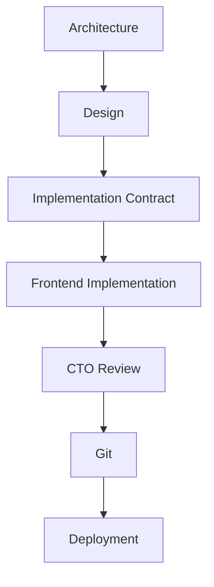

# AGENTS.md

Version: 2.0

Status: FROZEN

Last Updated: 2026-07-13

This document defines the official engineering workflow of MoroQuant.

Changes require CTO approval.

This document is considered part of the project architecture.

<!-- BEGIN:nextjs-agent-rules -->
# This is NOT the Next.js you know

This version has breaking changes — APIs, conventions, and file structure may all differ from your training data. Read the relevant guide in `node_modules/next/dist/docs/` before writing any code. Heed deprecation notices.
<!-- END:nextjs-agent-rules -->


# AI Collaboration & Responsibilities

This repository defines strict, non-overlapping roles for the CTO, AI agents (Claude Code and Antigravity), and design tools to maintain structural consistency and code quality.

For a full description, see the [AI Collaboration Standard](file:///home/zafka/trade-dashboard/docs/book/02-ai-collaboration.md).

## Engineering Workflow



---

## Division of Responsibilities

### 👑 CTO (Project Owner)
Responsible exclusively for:
- Git history
- Code review
- Commit approval
- Branch management
- Merge
- Release
- Deployment

### 🛸 Antigravity (Governance, Audits & Design)
Responsible for:
- Architecture
- ADR (Architecture Decision Records)
- Documentation
- Research
- Audits
- Implementation Packages
- Backend / API analysis
- Data flow analysis

> [!IMPORTANT]
> - Never implement frontend.
> - Never perform Git operations.

### 🎨 Google Stitch (Design Source of Truth)
Responsible for:
- UI Design
- UX Design
- MQDS (MoroQuant Design System)
- Visual Specifications

> [!NOTE]
> Design is the official UI source of truth.
> - Never redesign UI during implementation.
> - Implement pixel-perfect.
> - If UI conflicts with code, the design wins.
> - If architecture conflicts with design, architecture wins.
> - If design changes, update Stitch first, then implement.

### 💻 Claude Code (Implementation & Build Only)
Responsible ONLY for implementation.

**Responsibilities:**
- Implement frontend
- Edit files
- Refactor code
- Fix build errors
- Run `npm run build`
- Report completion

**Claude Code is NOT responsible for:**
- Architecture
- UI redesign
- Product decisions
- Git history

---

## Git Policy

Claude Code must **NEVER** execute Git commands.

Never run:
- `git status`
- `git diff`
- `git add`
- `git commit`
- `git push`
- `git pull`
- `git merge`
- `git rebase`
- `git checkout`
- `git restore`
- `git reset`
- `git stash`
- `git tag`

Git is managed exclusively by the CTO.

---

## Implementation Policy

For every task, Claude Code must:
1. Read the implementation guide.
2. Read the Stitch reference.
3. Implement only the requested screen.
4. Reuse existing MQDS components.
5. Reuse existing hooks.
6. Reuse existing API clients.
7. Connect READY APIs.
8. Preserve mock data for MISSING APIs.
9. Run `npm run build`.
10. Stop.

### Pattern-Driven Development & Workspace Inheritance

The MoroQuant frontend has entered the implementation phase.
- Architecture, ADRs, MQDS, UI specifications, and Visual Design are considered frozen.
- Claude Code must NOT redesign existing interfaces.
- Every new workspace must reuse the nearest existing implementation pattern (e.g., Experiment Workspace → Dataset Workspace, Dataset Workspace → Feature Workspace, etc.).
- Reuse existing page structure and only replace domain-specific content. Do not introduce new UI paradigms without an ADR.

---

## Completion Report

Instead of committing code, Claude Code must finish with a report containing:

```markdown
### Implementation Summary
<Summary of what was done>

### Files Modified
- <File path 1>
- <File path 2>

### Files Created
- <File path 1>

### Build Status
<Build status output/verification>

### Remaining TODOs
- <Remaining task 1>

### Known Limitations
- <Limitation 1>

### Ready for CTO Review
Yes/No
```

Before submitting an Implementation Report, the engineer MUST include `git diff -w` for every modified file.

The CTO review is performed using logical changes only. Whitespace and indentation must not be counted as implementation work.

Do NOT perform any Git operations.

---

## Commit Policy

One screen equals one implementation task.

The CTO is solely responsible for:
- Reviewing git diff
- Selecting staged files
- Writing commit messages
- Creating commits
- Pushing to GitHub


========================================================

ENGINEERING WORKFLOW STATUS

Architecture      : FROZEN
ADR               : FROZEN
MQDS              : FROZEN
Google Stitch     : FROZEN
AGENTS            : FROZEN

Only implementation changes are allowed.

========================================================

========================================================
EXISTING IMPLEMENTATION DISTRUST RULE
========================================================

Existing React code is NOT the source of truth.

Never assume an existing implementation is correct simply because it already exists.

Every existing page must be treated as a previous implementation attempt.

Before implementing any screen, always perform a Visual Audit against:

1. design/stitch/current/<screen>/screen.png
2. design/stitch/current/<screen>/code.html

The Visual Audit must compare the current React implementation with the Stitch design and list every visual difference before any code is written.

Examples of differences include (but are not limited to):

- Layout
- Grid
- Panel size
- Sidebar width
- Header height
- Typography
- Font size
- Font weight
- Colors
- Borders
- Radius
- Spacing
- Padding
- Margins
- Icons
- Charts
- Tables
- Alignment
- Empty states
- Inspector panels
- Navigation
- Responsive behavior

The engineer MUST NOT skip implementation because a page already exists.

The following statements are forbidden unless a Visual Audit has been completed:

- "The page is already implemented."
- "The component already exists."
- "The implementation already matches."
- "No changes are required."

Instead, the engineer must:

1. Read screen.png.
2. Read code.html.
3. Audit the existing implementation.
4. Produce a Visual Audit Report.
5. Implement ONLY the current HTML section.
6. Run npm run build.
7. STOP.
8. Wait for CTO visual review before continuing.

A section is COMPLETE only if:

✓ Matches Stitch screen.png
✓ Matches Stitch code.html structure
✓ Builds successfully
✓ Passes CTO visual review

Without all four conditions, the section is considered INCOMPLETE.

========================================================

========================================================
SECTION COMPLETENESS RULE
========================================================

A HTML section is atomic.

Once implementation of a section has started,
it must be completed before stopping.

The engineer must not leave a section partially implemented.

Examples:

Sidebar

✓ complete

Top Bar

✓ complete

KPI Cards

✗ 20% complete

This is NOT allowed.

========================================================

A section is complete only when:

- Structure matches Stitch HTML
- Visual layout matches screen.png
- Responsive behavior works
- Existing functionality is preserved
- npm run build succeeds

Only then may the engineer stop.

========================================================

Never stop because:

- context is getting large
- enough code has been written
- partial progress exists

Stop ONLY after the current HTML section is complete.

========================================================

If the engineer estimates the section cannot be completed within the remaining context,

STOP BEFORE WRITING CODE.

Report:

"This section should be split into smaller implementation tasks."

Do not begin implementation that cannot be finished.

========================================================

========================================================
EVIDENCE RULE
========================================================

1. The engineer may NEVER claim a section was not modified without evidence.
2. Every completion report must include the actual modified files.
3. Every modified file must report:
   - Added lines
   - Removed lines
   - Modified lines
4. If files outside the implementation scope were modified, they MUST appear in the report.
5. The engineer may NEVER hide modifications.
6. The completion report must match the actual git diff. The git diff becomes the source of truth.
7. False implementation reports are considered engineering failures.

========================================================

========================================================
AUDIT VALIDATION RULE
========================================================

Before implementing any Difference ID, the engineer MUST verify that:
• the audit
• the repository
• Graphify

describe the same repository state.

If they do not, the engineer must STOP, report "Audit Outdated", and do NOT implement anything.

========================================================

=======================================================
DIFFERENCE OWNERSHIP RULE
=======================================================

Only the Audit owns the status of a Difference ID.

The implementation engineer must NEVER declare a Difference ID COMPLETE unless the implementation for that Difference was performed in the current iteration.

If an engineer believes a Difference was already implemented, the report must state VERIFICATION REQUIRED instead of COMPLETE.

Only Antigravity may change Difference Status from OPEN to CLOSED.

=======================================================

========================================================
DATA SOURCE RULE
========================================================

1. UI components must NEVER access APIs directly.
2. READY APIs must be connected immediately through the Service Layer.
3. PARTIAL APIs must use the Service Layer combined with a temporary mock.
4. MISSING APIs must use the Service Layer combined with a dedicated mock provider.
5. UI components must NEVER import mock data directly.

========================================================

========================================================
SERVICE OWNERSHIP RULE
========================================================

1. UI owns presentation and layout only.
2. Services own data retrieval, caching, and business logic.
3. The API client owns transport (e.g., fetch, axios, network headers).
4. The Mock provider owns all temporary and simulation data.
5. Responsibilities must never be mixed.
6. The UI layer must NEVER:
   - Call `fetch()` or `axios()`
   - Import mock data files
   - Parse raw API responses

========================================================

========================================================
GRAPHIFY USAGE RULE
========================================================

1. For codebase or architecture queries, if `graphify-out/graph.json` exists, the developer must query it first using `graphify query` or `query_graph`.
2. After making any modification to codebase files, the engineer MUST run `graphify update .` to keep the AST graph current.
3. The graphify knowledge graph is the official structure index.

========================================================

========================================================
API INTEGRATION & MOCK REPLACEMENT POLICY
========================================================

1. When a backend API becomes READY, the mock data provider for that API must be completely removed and replaced with the Service Layer network client.
2. Transitioning from mock to live data must not alter the presentation or component hierarchy in the UI.
3. All dependencies added during implementation must be validated against allowed project packages before build.
4. Do not introduce new library dependencies for API transport or state management without CTO approval.

========================================================

========================================================
REGRESSION & BUILD VERIFICATION POLICY
========================================================

1. Build verification via `npm run build` is mandatory before requesting CTO review.
2. If a build fails, the implementation is considered INCOMPLETE.
3. Existing functionality of unmodified components in the workspace must be preserved and verified against regression.
4. Acceptance criteria validation must be explicitly listed in the final Completion Report.

========================================================

========================================================
STITCH & MQDS COMPLIANCE RULE
========================================================

1. All UI implementations must strictly adhere to the Stitch design specifications (colors, spacing, dimensions) and utilize MQDS components.
2. Custom styles should only be used if the specific element design is not provided by MQDS.
3. Any visual mismatch between UI implementation and Stitch/MQDS specifications will result in an immediate review rejection.

========================================================
