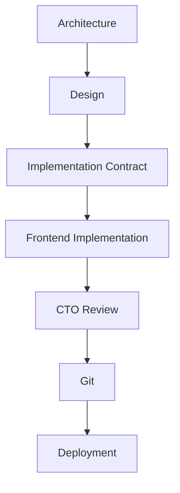

# AGENTS.md

Version: 2.0

Status: FROZEN

Last Updated: 2026-07-13

This document defines the official engineering workflow of MoroQuant.

Changes require CTO approval.

This document is considered part of the project architecture.

<!-- BEGIN:nextjs-agent-rules -->
# This is NOT the Next.js you know

This version has breaking changes — APIs, conventions, and file structure may all differ from your training data. Read the relevant guide in `node_modules/next/dist/docs/` before writing any code. Heed deprecation notices.
<!-- END:nextjs-agent-rules -->


# AI Collaboration & Responsibilities

This repository defines strict, non-overlapping roles for the CTO, AI agents (Claude Code and Antigravity), and design tools to maintain structural consistency and code quality.

For a full description, see the [AI Collaboration Standard](file:///home/zafka/trade-dashboard/docs/book/02-ai-collaboration.md).

## Engineering Workflow



---

## Division of Responsibilities

### 👑 CTO (Project Owner)
Responsible exclusively for:
- Git history
- Code review
- Commit approval
- Branch management
- Merge
- Release
- Deployment

### 🛸 Antigravity (Governance, Audits & Design)
Responsible for:
- Architecture
- ADR (Architecture Decision Records)
- Documentation
- Research
- Audits
- Implementation Packages
- Backend / API analysis
- Data flow analysis

> [!IMPORTANT]
> - Never implement frontend.
> - Never perform Git operations.

### 🎨 Google Stitch (Design Source of Truth)
Responsible for:
- UI Design
- UX Design
- MQDS (MoroQuant Design System)
- Visual Specifications

> [!NOTE]
> Design is the official UI source of truth.
> - Never redesign UI during implementation.
> - Implement pixel-perfect.
> - If UI conflicts with code, the design wins.
> - If architecture conflicts with design, architecture wins.
> - If design changes, update Stitch first, then implement.

### 💻 Claude Code (Implementation & Build Only)
Responsible ONLY for implementation.

**Responsibilities:**
- Implement frontend
- Edit files
- Refactor code
- Fix build errors
- Run `npm run build`
- Report completion

**Claude Code is NOT responsible for:**
- Architecture
- UI redesign
- Product decisions
- Git history

---

## Git Policy

Claude Code must **NEVER** execute Git commands.

Never run:
- `git status`
- `git diff`
- `git add`
- `git commit`
- `git push`
- `git pull`
- `git merge`
- `git rebase`
- `git checkout`
- `git restore`
- `git reset`
- `git stash`
- `git tag`

Git is managed exclusively by the CTO.

---

## Implementation Policy

For every task, Claude Code must:
1. Read the implementation guide.
2. Read the Stitch reference.
3. Implement only the requested screen.
4. Reuse existing MQDS components.
5. Reuse existing hooks.
6. Reuse existing API clients.
7. Connect READY APIs.
8. Preserve mock data for MISSING APIs.
9. Run `npm run build`.
10. Stop.

### Pattern-Driven Development & Workspace Inheritance

The MoroQuant frontend has entered the implementation phase.
- Architecture, ADRs, MQDS, UI specifications, and Visual Design are considered frozen.
- Claude Code must NOT redesign existing interfaces.
- Every new workspace must reuse the nearest existing implementation pattern (e.g., Experiment Workspace → Dataset Workspace, Dataset Workspace → Feature Workspace, etc.).
- Reuse existing page structure and only replace domain-specific content. Do not introduce new UI paradigms without an ADR.

---

## Completion Report

Instead of committing code, Claude Code must finish with a report containing:

```markdown
### Implementation Summary
<Summary of what was done>

### Files Modified
- <File path 1>
- <File path 2>

### Files Created
- <File path 1>

### Build Status
<Build status output/verification>

### Remaining TODOs
- <Remaining task 1>

### Known Limitations
- <Limitation 1>

### Ready for CTO Review
Yes/No
```

Do NOT perform any Git operations.

---

## Commit Policy

One screen equals one implementation task.

The CTO is solely responsible for:
- Reviewing git diff
- Selecting staged files
- Writing commit messages
- Creating commits
- Pushing to GitHub


========================================================

ENGINEERING WORKFLOW STATUS

Architecture      : FROZEN
ADR               : FROZEN
MQDS              : FROZEN
Google Stitch     : FROZEN
AGENTS            : FROZEN

Only implementation changes are allowed.

========================================================
