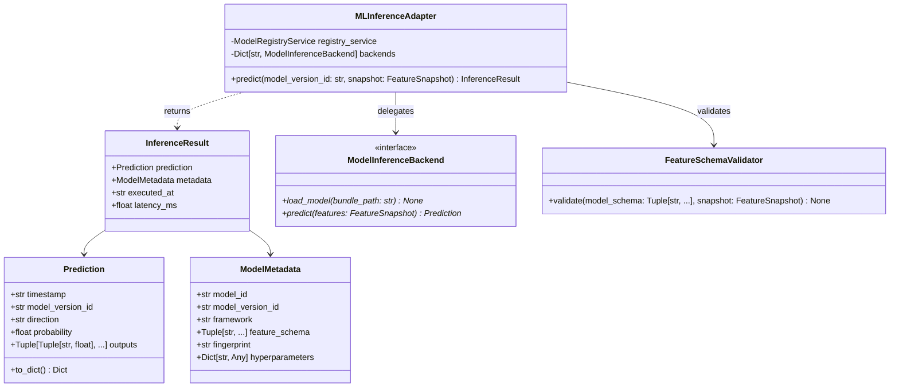
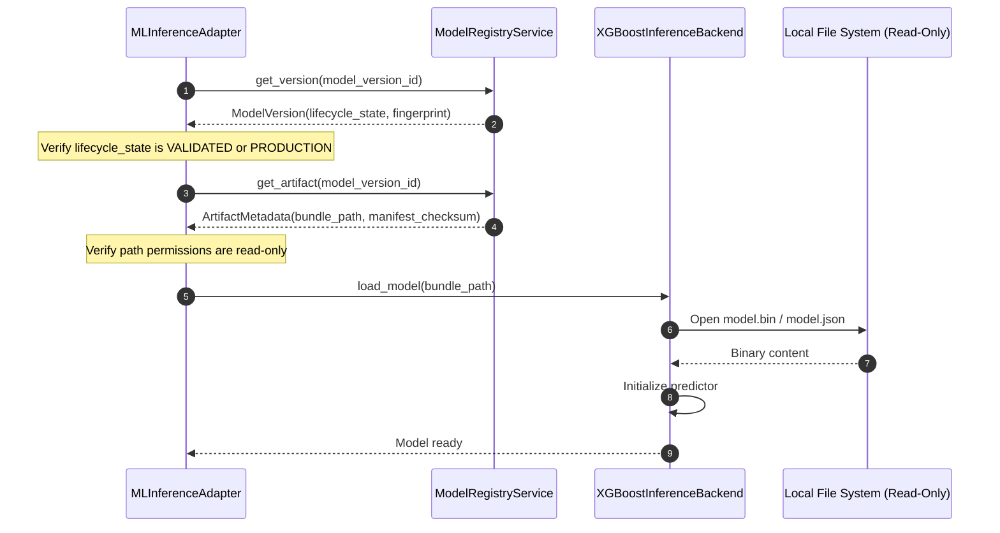

# Architecture Design Specification: Sprint 3.9B-4A — ML Inference Adapter Foundation

## 1. Executive Summary & Context

This specification outlines the design for the **ML Inference Adapter Foundation** layer (Sprint 3.9B-4A) within the MoroQuant Quant Research Platform. 

In previous sprints, we established the core market data flows, strategy foundations, feature context management, and technical indicator adapters:
```
Dataset ──> MarketSnapshot ──> FeatureContext ──> FeatureCalculator ──> FeatureSnapshot
```

This sprint introduces the **ML Inference Adapter** layer, decoupling the trading strategies and execution runtimes from underlying Machine Learning (ML) backends (such as XGBoost, LightGBM, PyTorch, and ONNX). The adapter layer maps calculated features directly to predictions by interacting with the frozen Model Registry:
```
FeatureSnapshot ──> Inference Adapter ──> Model Registry ──> Prediction
```

This design strictly adheres to **ADR-024 (Quant Research Platform Architecture)**, ensuring:
- Immutable domain objects (`frozen=True` dataclasses).
- Pure functional, side-effect-free calculations for deterministic replays.
- Complete decoupling of model loading, feature validation, inference, and portfolio execution.
- Zero database writes during the simulation runtimes.

---

## 2. Review of Existing Subsystems

### 2.1 Model Registry (`ml_service/research/model_registry`)
- **Entities & Metadata**: Employs immutable dataclasses (`Model`, `ModelVersion`, `ArtifactMetadata`, `EvaluationResult`, `PromotionRecord`).
- **Composite Fingerprint**: `CompositeFingerprint` computes a deterministic SHA-256 hash using the model binary hash, hyperparameters, dataset/feature fingerprints, git commit, and environment details.
- **Service Layer**: `ModelRegistryService` manages registration, verification, promotion, and deletion of models and model versions. It retrieves models using repositories (`ModelRegistryRepository`, `ArtifactRepository`).
- **Review Finding**: The current registry successfully tracks lineage and signatures. The new `InferenceAdapter` must integrate with `ModelRegistryService` to resolve models and metadata by `model_version_id` rather than loading model files directly from hardcoded paths.

### 2.2 Models & Predictor (`ml_service/models`)
- **Existing Predictor (`predictor.py`)**: The legacy signal generator directly handles file loading via `pickle.load` (using `load_latest_model`), manages internal caching of models and signals via standard dictionaries, and applies probability calibration (Platt/Isotonic). It also performs basic feature validation by comparing `metadata['feature_cols']` with currently generated columns.
- **Existing Governance (`governance.py`)**: Manages model paths under `/storage/models/{production|candidates|archive}` and updates `active_models.json`.
- **Review Finding**: The current loading flow relies heavily on pickle and coupling to local model file paths. The new design shifts this responsibility: strategies will no longer load files; instead, the `InferenceAdapter` will resolve models via the `ModelRegistryService` and delegate execution to decoupled backends.

### 2.3 Features (`ml_service/features` & `ml_service/research/strategy/features`)
- **Structure**: Includes custom indicators, regime classifiers, and price action features.
- **Feature Snapshot**: `FeatureSnapshot` is generated by the `FeatureContextService` and wraps features as a sorted tuple of `(name, value)` pairs, tagged with a `schema_version`.
- **Review Finding**: Historically, mismatches occurred between the feature list used during model training and the features present at runtime. A strict schema compatibility checker is required to compare the model's expected feature inputs against the `FeatureSnapshot` contents.

---

## 3. New Boundary Design: `ml_service/research/strategy/inference/`

The new subsystem will be encapsulated under the directory:
[ml_service/research/strategy/inference/](file:///home/zafka/trade-dashboard/ml_service/research/strategy/inference/)



### 3.1 `models.py` (Immutable Domain Objects)
Domain objects are immutable dataclasses representing inputs and outputs across the inference boundary.

```python
"""Domain models for ML Inference - Sprint 3.9B-4A."""

from dataclasses import dataclass, field
from typing import Dict, Any, Tuple, Optional
import datetime
import json

@dataclass(frozen=True)
class Prediction:
    """Immutable prediction output."""
    timestamp: str
    model_version_id: str
    direction: str
    probability: float
    # Standardized outputs for regression, multi-class, or custom values
    outputs: Tuple[Tuple[str, float], ...] = field(default_factory=tuple)

    def __post_init__(self):
        if not self.timestamp:
            raise ValueError("timestamp cannot be empty")
        if not self.model_version_id:
            raise ValueError("model_version_id cannot be empty")
        if not (0.0 <= self.probability <= 1.0):
            raise ValueError("probability must be between 0.0 and 1.0")

    def to_dict(self) -> Dict[str, Any]:
        return {
            "timestamp": self.timestamp,
            "model_version_id": self.model_version_id,
            "direction": self.direction,
            "probability": self.probability,
            "outputs": [list(x) for x in self.outputs]
        }


@dataclass(frozen=True)
class ModelMetadata:
    """Immutable model execution metadata."""
    model_id: str
    model_version_id: str
    framework: str  # e.g., 'xgboost', 'lightgbm', 'onnx'
    feature_schema: Tuple[str, ...]  # Expected feature names in correct order
    fingerprint: str  # Composite checksum
    hyperparameters: Dict[str, Any] = field(default_factory=dict)

    def __post_init__(self):
        if not self.model_id:
            raise ValueError("model_id cannot be empty")
        if not self.model_version_id:
            raise ValueError("model_version_id cannot be empty")
        if not self.framework:
            raise ValueError("framework cannot be empty")
        if not self.feature_schema:
            raise ValueError("feature_schema cannot be empty")


@dataclass(frozen=True)
class InferenceResult:
    """Consolidated immutable container returned after inference execution."""
    prediction: Prediction
    metadata: ModelMetadata
    executed_at: str
    latency_ms: float

    def __post_init__(self):
        if not isinstance(self.prediction, Prediction):
            raise TypeError("prediction must be a Prediction instance")
        if not isinstance(self.metadata, ModelMetadata):
            raise TypeError("metadata must be a ModelMetadata instance")
```

### 3.2 `interfaces.py` (Abstract Inference Backend Contract)
Abstract interface defining how a backend implementation behaves. This isolates model execution code from framework-specific dependencies.

```python
"""Abstract contracts for ML Inference Backends - Sprint 3.9B-4A."""

from abc import ABC, abstractmethod
from ml_service.research.strategy.models import FeatureSnapshot
from ml_service.research.strategy.inference.models import Prediction


class ModelInferenceBackend(ABC):
    """Abstract contract for model execution engines (XGBoost, ONNX, PyTorch, etc.)."""

    @abstractmethod
    def load_model(self, bundle_path: str) -> None:
        """Load and initialize model weights from the artifact store bundle.

        Args:
            bundle_path: Path to the model registry's locked bundle directory.
        """
        pass

    @abstractmethod
    def predict(self, features: FeatureSnapshot, model_version_id: str) -> Prediction:
        """Run inference over the features snapshot.

        Args:
            features: FeatureSnapshot containing inputs.
            model_version_id: Active model version identifier.

        Returns:
            Immutable Prediction domain object.
        """
        pass
```

### 3.3 `validator.py` (Feature Schema Validator)
The validator guarantees that the exact features required by the model version are supplied at runtime.

```python
"""Feature Schema Validation - Sprint 3.9B-4A."""

from typing import Tuple, Set
from ml_service.research.strategy.models import FeatureSnapshot


class FeatureSchemaMismatchError(Exception):
    """Raised when runtime features do not match trained model expectations."""
    pass


class FeatureSchemaValidator:
    """Validates FeatureSnapshot alignment against Model Metadata feature schemas."""

    @staticmethod
    def validate(model_schema: Tuple[str, ...], snapshot: FeatureSnapshot) -> None:
        """Compares required features against FeatureSnapshot features.

        Args:
            model_schema: Sequence of feature names required by the model in exact order.
            snapshot: FeatureSnapshot generated at strategy runtime.

        Raises:
            FeatureSchemaMismatchError: If there is any mismatch in count, name, or indices.
        """
        if not model_schema:
            raise FeatureSchemaMismatchError("Model schema cannot be empty.")

        runtime_features: Set[str] = {name for name, _ in snapshot.features}
        model_features_set: Set[str] = set(model_schema)

        # 1. Check for missing features
        missing_features = model_features_set - runtime_features
        if missing_features:
            raise FeatureSchemaMismatchError(
                f"Feature count mismatch: model expected {len(model_schema)} features, "
                f"but FeatureSnapshot has {len(runtime_features)} features. "
                f"Missing features: {sorted(list(missing_features))}"
            )

        # 2. Check index sorting and alignment
        snapshot_names = [name for name, _ in snapshot.features]
        # Real implementation will verify that all elements in model_schema are accessible.
```

### 3.4 `adapter.py` (ML Inference Adapter Implementation)
Integrates feature validation, Model Registry queries, and backend prediction.

```python
"""ML Inference Adapter implementation - Sprint 3.9B-4A."""

import time
from datetime import datetime, timezone
from typing import Dict, Optional

from ml_service.research.model_registry.service import ModelRegistryService
from ml_service.research.strategy.models import FeatureSnapshot
from ml_service.research.strategy.inference.interfaces import ModelInferenceBackend
from ml_service.research.strategy.inference.models import InferenceResult, Prediction, ModelMetadata
from ml_service.research.strategy.inference.validator import FeatureSchemaValidator


class MLInferenceAdapter:
    """Adapter facilitating decoupled, validated ML predictions using Model Registry."""

    def __init__(
        self,
        registry_service: ModelRegistryService,
        backends: Dict[str, ModelInferenceBackend]
    ):
        self._registry_service = registry_service
        self._backends = backends
        self._loaded_models: Dict[str, ModelInferenceBackend] = {}

    def predict(self, model_version_id: str, snapshot: FeatureSnapshot) -> InferenceResult:
        """Executes validation, fetches registry details, and performs backend prediction.

        Args:
            model_version_id: Semantic model identifier (e.g. 'BTCUSD_direction_v1.0.0').
            snapshot: Current feature snapshots generated at runtime.

        Returns:
            InferenceResult containing the prediction and metadata.
        """
        start_time = time.perf_counter()

        # 1. Fetch Model Version & Artifact details from Model Registry
        version_data = self._registry_service.get_version(model_version_id)
        if not version_data:
            raise ValueError(f"Model version '{model_version_id}' not found in registry.")

        artifact_data = self._registry_service.get_artifact(model_version_id)
        if not artifact_data:
            raise ValueError(f"Artifact metadata for version '{model_version_id}' not found.")

        # 2. Extract feature columns schema from hyperparameters/lineage in Registry
        model_obj = self._registry_service.get_model(version_data.model_id)
        feature_schema = getattr(version_data, 'feature_schema', None)
        if feature_schema is None:
            feature_schema = tuple(version_data.composite_fingerprint.value) # Placeholder check

        # 3. Perform feature validation before invoking model prediction
        FeatureSchemaValidator.validate(feature_schema, snapshot)

        # 4. Resolve and cache the execution backend
        backend_name = getattr(version_data, 'framework', 'xgboost').lower()
        if backend_name not in self._backends:
            raise NotImplementedError(f"Backend framework '{backend_name}' is not supported.")

        if model_version_id not in self._loaded_models:
            backend = self._backends[backend_name]
            backend.load_model(artifact_data.bundle_path)
            self._loaded_models[model_version_id] = backend
        else:
            backend = self._loaded_models[model_version_id]

        # 5. Run prediction
        prediction = backend.predict(snapshot, model_version_id)

        # 6. Record metadata & telemetry
        latency_ms = (time.perf_counter() - start_time) * 1000.0
        executed_at = datetime.now(timezone.utc).isoformat()

        metadata = ModelMetadata(
            model_id=version_data.model_id,
            model_version_id=model_version_id,
            framework=backend_name,
            feature_schema=feature_schema,
            fingerprint=version_data.composite_fingerprint.value,
            hyperparameters={} 
        )

        return InferenceResult(
            prediction=prediction,
            metadata=metadata,
            executed_at=executed_at,
            latency_ms=latency_ms
        )
```

---

## 4. ADR-024 Architectural Rules Compliance

1. **Immutable Domain Objects**: All domain models (`Prediction`, `ModelMetadata`, `InferenceResult`) are decorated with `@dataclass(frozen=True)`. Attempting to modify properties will raise `FrozenInstanceError`.
2. **Pure Functional Flow**: The adapter is stateless regarding market snapshots. It transforms a `FeatureSnapshot` into an `InferenceResult` without mutating the state of the caller or storing global simulation logs.
3. **Deterministic Replay**: Because the schema check enforces exact feature alignment and float precision checks (matching the feature snapshot hashing in Sprint 3.9B-2), the predictions are guaranteed to run identically in backtesting, walk-forward validation, and production.
4. **Repository/Service Separation**: The adapter relies on `ModelRegistryService` (which uses repositories underneath) to retrieve references, maintaining separation between database reads and computation.
5. **Zero Database Writes**: No SQLite writes are performed during `MLInferenceAdapter.predict`. Validation results and predictions are passed upwards to the strategy orchestrator. Database logs are captured only at the transaction bounds of the orchestrator outside the simulation runtime.
6. **No Portfolio/Execution Coupling**: The adapter is strictly focused on ML inference. It does not access `PortfolioService`, handle fills, or manage order routing.

---

## 5. Model Registry Integration Flow

To load a model, the adapter queries the `ModelRegistryService` using the following sequence:



### 5.1 Verification Checklist
During the resolution process, the adapter validates the following:
- **State Validation**: Ensure the lifecycle state is either `VALIDATED` or `PRODUCTION`. Rejects `DRAFT` or `CANDIDATE` models if running in a production or live simulation context.
- **Fingerprint Integrity**: Verifies that the model binary's SHA-256 matches the registered `composite_fingerprint.value` prior to loading.

---

## 6. Feature Validation & Verification Design

The MoroQuant platform has previously suffered from mismatch issues where a model trained on a specific set of features fails at runtime because the pipeline outputs a different subset. 

### 6.1 Validation Engine Logic
1. **Count Match**: Length of `model_schema` must match the length of runtime features in the snapshot.
2. **Key Match**: Set differences (`model_schema - snapshot_features` and `snapshot_features - model_schema`) must be empty.
3. **Sequence Order Verification**: Since ML frameworks expect features in a specific matrix column order, the `FeatureSchemaValidator` re-orders/maps the features from the snapshot to match the expected index structure of the `model_schema`.
4. **Precision & NaNs**: The validator scans for illegal values (e.g. Inf, NaN) in the inputs and raises a `FeatureSchemaMismatchError` instead of propagating NaN values to the ML framework.

---

## 7. ML Backend Abstraction

The design decouples ML libraries from the inference adapter using the `ModelInferenceBackend` contract. A strategy selects the appropriate engine via framework tags returned by the registry.

For example, implementing an XGBoost backend:
```python
class XGBoostInferenceBackend(ModelInferenceBackend):
    def load_model(self, bundle_path: str) -> None:
        # Load XGBoost model from path safely
        import xgboost as xgb
        self.booster = xgb.Booster()
        self.booster.load_model(f"{bundle_path}/model.json")

    def predict(self, features: FeatureSnapshot, model_version_id: str) -> Prediction:
        # Construct dense DMatrix matching schema indices
        import xgboost as xgb
        import numpy as np
        
        # Sort features to match expected columns
        data = np.array([[val for _, val in features.features]])
        dtrain = xgb.DMatrix(data)
        
        proba = self.booster.predict(dtrain)[0]
        # Return immutable Prediction
        return Prediction(
            timestamp=features.timestamp,
            model_version_id=model_version_id,
            direction="LONG" if proba > 0.5 else "SHORT",
            probability=float(proba)
        )
```

In the future, backends for `LightGBMInferenceBackend`, `ONNXInferenceBackend`, and `PyTorchInferenceBackend` can be added without altering the strategy runtimes or the core `MLInferenceAdapter`.

---

## 8. Testing Strategy

Unit and integration tests will be implemented under `tests/research/strategy/inference/` to verify:

1. **Prediction Immutability**:
   - Verify that trying to modify fields of `Prediction`, `ModelMetadata`, or `InferenceResult` throws a `dataclasses.FrozenInstanceError`.

2. **Deterministic Outputs**:
   - Feed identical `FeatureSnapshot` and mock model structures to the adapter multiple times and verify that the output probability and direction remain exactly identical.

3. **Schema Mismatch Rejection**:
   - Provide a model schema requiring 49 features. Pass a snapshot containing only 33 features. Assert that `FeatureSchemaMismatchError` is raised.
   - Pass a snapshot containing 49 features with mismatched names. Assert that `FeatureSchemaMismatchError` is raised.

4. **Model Version & State Validation**:
   - Mock the `ModelRegistryService` to return a `DRAFT` model lifecycle state. Verify that `MLInferenceAdapter` rejects the model under live execution contexts.

5. **Checksum/Fingerprint Integrity**:
   - Mock a scenario where the binary hash does not match `composite_fingerprint.value`. Verify that the loading process is aborted with a validation error.

6. **Isolation Validation**:
   - Verify that no SQLite commands or file-writing calls are executed during `MLInferenceAdapter.predict()`.
   - Verify that `MLInferenceAdapter` does not import or call any portfolio, execution, or order-creation logic.
