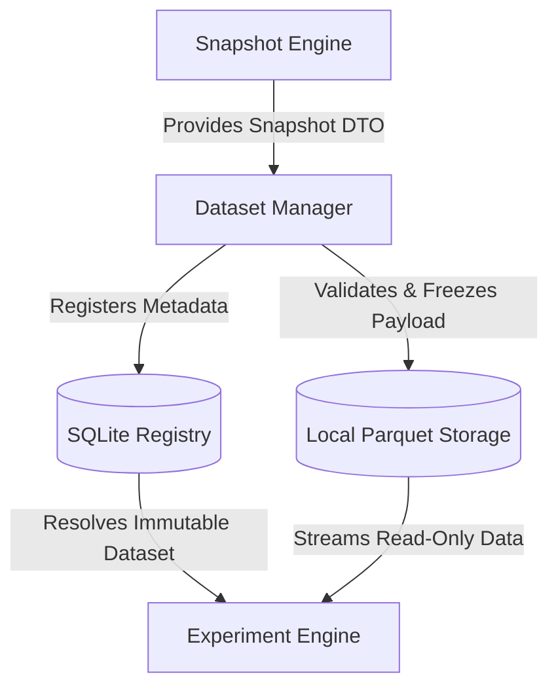

# Dataset Data Contract Specification

This document details the strict data contracts, schemas, and representation formats for the Dataset Management System.

---

## 1. Schema Definitions

### 1.1 Dataset Metadata (JSON Schema Representation)
Each dataset is accompanied by a metadata record that specifies its provenance, structural details, and fingerprint.

```json
{
  "$schema": "https://json-schema.org/draft/2020-12/schema",
  "title": "DatasetMetadata",
  "type": "object",
  "required": [
    "dataset_id",
    "version",
    "fingerprint",
    "snapshot_id",
    "created_at",
    "time_bounds",
    "schema",
    "lifecycle_state",
    "storage_path"
  ],
  "properties": {
    "dataset_id": {
      "type": "string",
      "pattern": "^ds_[a-z0-9_]+_v[0-9]+\\.[0-9]+\\.[0-9]+$"
    },
    "version": {
      "type": "string",
      "pattern": "^[0-9]+\\.[0-9]+\\.[0-9]+$"
    },
    "fingerprint": {
      "type": "string",
      "description": "SHA256 signature of canonicalized data payload"
    },
    "snapshot_id": {
      "type": "string",
      "description": "ID of the source snapshot from the Snapshot Engine"
    },
    "created_at": {
      "type": "string",
      "format": "date-time"
    },
    "time_bounds": {
      "type": "object",
      "required": ["start_time", "end_time"],
      "properties": {
        "start_time": { "type": "string", "format": "date-time" },
        "end_time": { "type": "string", "format": "date-time" }
      }
    },
    "schema": {
      "type": "object",
      "required": ["features", "targets", "data_types"],
      "properties": {
        "features": {
          "type": "array",
          "items": { "type": "string" }
        },
        "targets": {
          "type": "array",
          "items": { "type": "string" }
        },
        "data_types": {
          "type": "object",
          "additionalProperties": {
            "type": "string",
            "enum": ["float64", "int32", "string", "datetime"]
          }
        }
      }
    },
    "preprocessing": {
      "type": "object",
      "properties": {
        "imputation_strategy": { "type": "string" },
        "scaling_parameters": { "type": "object" }
      }
    },
    "lifecycle_state": {
      "type": "string",
      "enum": ["DRAFT", "VALIDATED", "FROZEN", "DEPRECATED", "ARCHIVED"]
    },
    "storage_path": {
      "type": "string",
      "description": "Absolute filesystem path to the immutable payload file"
    }
  }
}
```

### 1.2 Python Dataclasses (Code Contract)
```python
from dataclasses import dataclass, field
from typing import List, Dict, Any, Optional

@dataclass(frozen=True)
def TimeBounds:
    start_time: str
    end_time: str

@dataclass(frozen=True)
def DatasetSchema:
    features: List[str]
    targets: List[str]
    data_types: Dict[str, str]

@dataclass
class DatasetMetadata:
    dataset_id: str
    version: str
    fingerprint: str
    snapshot_id: str
    created_at: str
    time_bounds: TimeBounds
    schema: DatasetSchema
    lifecycle_state: str
    storage_path: str
    preprocessing: Optional[Dict[str, Any]] = None
    is_frozen: bool = False
```

---

## 2. Payload Format & Storage Design

To avoid complex distributed databases or external dependencies, the payload storage relies strictly on single-file formats stored in a secure local directory:

* **File Format**: Apache Parquet (primary, for high performance and strict type enforcement) or Gzipped CSV (fallback/interchange).
* **Location**: `/home/zafka/trade-dashboard/storage/datasets/{dataset_id}.parquet`
* **Column Ordering Rules**:
  1. `timestamp` (Unix timestamp, type `int64` / microseconds or seconds, must be first column).
  2. `symbol` (String index, must be second column).
  3. Feature columns (sorted alphabetically).
  4. Target columns (sorted alphabetically).

---

## 3. Integration Interfaces



### 3.1 Snapshot Engine Integration
The Dataset Manager consumes snapshots generated by `SnapshotService.create_snapshot()`.

* **Interface Contract**:
  ```python
  class SnapshotToDatasetAdapter:
      @staticmethod
      def extract_payload(snapshot: Snapshot) -> List[Dict[str, Any]]:
          """Extract trades, signals, and states from snapshot.
          Flatten and join signals with their feature matrices into a tidy table.
          """
          pass
  ```

### 3.2 Experiment Engine Integration
The Experiment Engine requires a verified dataset path or payload instead of raw snapshot identifiers to execute strategy sweeps.

* **Interface Contract**:
  ```python
  class DatasetManagerInterface:
      def get_dataset_payload(self, dataset_id: str) -> pd.DataFrame:
          """Retrieve and verify payload hash.
          Raises verification error if fingerprint mismatch occurs.
          """
          pass
  ```
