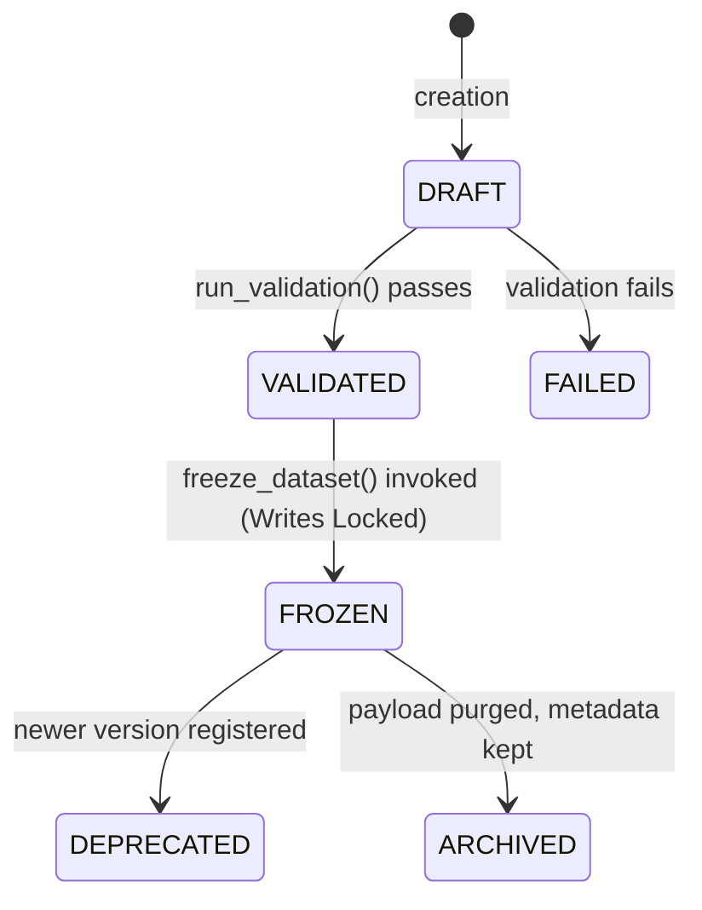

# Dataset Manager Architectural Specification

This document details the architectural design for the **Dataset Management System** for Sprint 4.1. It acts as a research overlay extension sitting above the existing Sprint 3 foundation.

---

## 1. Architectural Alignment & Module Boundary

The Dataset Manager conforms to the standard MoroQuant architectural pattern:
$$\text{Repository} \longrightarrow \text{Service} \longrightarrow \text{Analytics} \longrightarrow \text{API}$$

### 1.1 Module Structure
The Dataset Manager is contained entirely within the `ml_service/research/dataset_manager` directory:

```
ml_service/research/dataset_manager/
├── __init__.py
├── repository.py        # SQLite Metadata Repository
├── service.py           # Core Business Logic & State Engine
├── analytics.py         # Statistical Coverage & Drift Analysis
├── api.py               # REST API Interfaces
└── validation.py        # Strict Quality & Structural Gatekeepers
```

---

## 2. Component Design & Layer Separation

### 2.1 Repository Layer (`repository.py`)
Responsible strictly for database operations on the metadata registry (`dataset_metadata` table inside the SQLite database). It abstracts SQL commands from the business logic.

* **Database Schema (SQLite)**:
```sql
CREATE TABLE IF NOT EXISTS dataset_metadata (
    dataset_id TEXT PRIMARY KEY,
    version TEXT NOT NULL,
    fingerprint TEXT NOT NULL UNIQUE,
    snapshot_id TEXT NOT NULL,
    created_at TEXT NOT NULL,
    start_time TEXT NOT NULL,
    end_time TEXT NOT NULL,
    lifecycle_state TEXT NOT NULL,
    storage_path TEXT NOT NULL,
    is_frozen INTEGER DEFAULT 0,
    schema_json TEXT NOT NULL,
    preprocessing_json TEXT,
    FOREIGN KEY (snapshot_id) REFERENCES snapshots(snapshot_id)
);
```

* **Interface Contract (`DatasetRepository`)**:
  * `save(metadata: DatasetMetadata) -> None`
  * `find_by_id(dataset_id: str) -> Optional[DatasetMetadata]`
  * `find_by_fingerprint(fingerprint: str) -> Optional[DatasetMetadata]`
  * `update_state(dataset_id: str, state: str) -> None`
  * `freeze(dataset_id: str) -> None`

### 2.2 Service Layer (`service.py`)
Implements execution flows, dataset serialization, version generation, and coordinate systems.

* **Interface Contract (`DatasetService`)**:
  * `create_dataset(snapshot_id: str, version_bump: str, symbol_filter: Optional[str]) -> DatasetMetadata`
  * `get_dataset(dataset_id: str) -> Tuple[DatasetMetadata, pd.DataFrame]`
  * `freeze_dataset(dataset_id: str) -> None`

### 2.3 Analytics Layer (`analytics.py`)
Computes metrics over the dataset payloads without altering the underlying immutable data files.

* **Key Analytics Functions**:
  * `compute_class_balance(dataset_id: str) -> Dict[str, float]`
  * `detect_feature_drift(base_dataset_id: str, target_dataset_id: str) -> Dict[str, float]`
  * `compute_correlation_matrix(dataset_id: str) -> pd.DataFrame`

### 2.4 API Layer (`api.py`)
Exposes REST endpoints that match the internal registry for front-end dashboards and remote client integrations.

* **Endpoints**:
  * `POST /api/v1/datasets/create`
  * `GET /api/v1/datasets/{dataset_id}`
  * `POST /api/v1/datasets/{dataset_id}/freeze`
  * `GET /api/v1/datasets/{dataset_id}/analytics`

---

## 3. Dataset Lifecycle & State Machine

A dataset moves through structured lifecycle states to guarantee reproducibility and prevent runtime modifications.



### State Definitions:
1. **DRAFT**: Raw dataset generated from snapshot; temporary and editable.
2. **VALIDATED**: Structural and basic data quality checks successfully passed.
3. **FROZEN**: Read-only flag set. Filesystem write-locks applied. Cannot be deleted or modified.
4. **DEPRECATED**: Kept for historical runs but researchers are warned against selecting this for new experiments.
5. **ARCHIVED**: Materialized payload deleted to recover space. Metadata registry and fingerprint are permanently retained to maintain historical experiment logs.

---

## 4. Validation Suite & Rules

To guard against train-test leakage and low-quality data, every dataset must pass the `validation.py` rules before moving to the `VALIDATED` state.

### 4.1 Structural Checks
1. **Timestamp Monotonicity**: Checks that timestamps are strictly increasing.
2. **DataType Alignment**: Compares inferred types with target schemas.
3. **Primary Key Completeness**: Ensures that no `(timestamp, symbol)` tuples are duplicated or null.

### 4.2 Data Quality Checks
1. **NaN Check**: Missing values must be below the predefined threshold (e.g. $< 1\%$).
2. **Infinite Bounds**: Values must not contain `+inf` or `-inf`.
3. **Variance Threshold**: Features must have a variance $> 0$. A feature with zero variance is rejected as "dead".

### 4.3 Scientific Integrity (Leakage Prevention)
1. **Future Ingress Check**: Confirms that signal timestamps strictly precede target verification timestamps.
2. **Time-Gap Validation**: Ensures no overlapping samples exist between defined training and evaluation subsets.

---

## 5. Integration Architecture

### 5.1 Ingestion from Snapshot Engine
```
[Snapshot Engine] --(Snapshot)--> [Flattening Adapter] --> [Tabular Pandas DataFrame]
```
The Service converts the nested structures (signals, execution states, regime stats) into a uniform flat parquet table using the schema constraints.

### 5.2 Consumption by Experiment Engine
```
[Experiment Engine] --(Requests dataset_id)--> [Dataset Service]
                                                       |
                                               Verify Hash Signature
                                                       |
                                        [Loads Immutable Parquet File]
```
The Experiment Engine consumes the read-only file directly, eliminating the overhead of raw snapshot parsing during high-throughput optimization runs.
