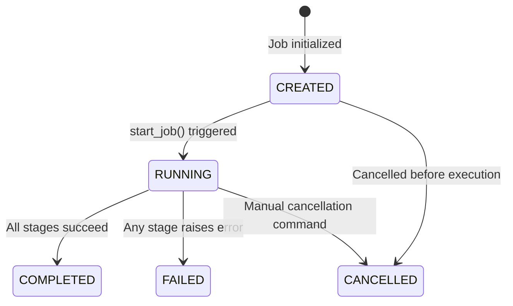

# ADR-014: Research Orchestrator Design and Lifecycle Policy

## Status
Proposed (Design Only)

## Context
MoroQuant has successfully implemented seven core research modules:
1. **Snapshot Engine**: Captures live/replay market events.
2. **Dataset Manager**: Freezes raw OHLCV and market logs into clean, immutable dataset versions.
3. **Feature Store**: Computes versioned, signed feature datasets.
4. **Experiment Engine**: Runs optimization sweeps and fits model candidates.
5. **Evaluation Engine**: Scores model performance on Sharpe, drawdown, calibration, and win rate.
6. **Model Registry**: Manages model verification, fingerprints, and promotion state transitions.
7. **Research Dashboard**: Provides a read-only portal to visualize experiments, comparisons, and lineage.

Currently, moving from raw snapshot generation to model registration is a manual, step-by-step process. To automate the quantitative workflow, we require a **Research Orchestrator**. 

To align with MoroQuant's architectural principles and keep deployment overhead to a minimum:
* The orchestrator must **NOT** introduce distributed systems, external message queues (like RabbitMQ, Kafka), workflow engines (like Temporal, Airflow), or external orchestration platforms.
* It must execute the entire pipeline sequentially within a single local runtime context.
* It must strictly respect the boundaries of existing modules and only own the **workflow orchestration**, without duplicating any underlying business logic.
* In the event of execution failure, prior successful artifacts (such as frozen datasets or computed features) must remain immutable, adhering to the "never rollback frozen artifacts" policy.

## Decisions

### 1. In-Process/Sequential Execution Model
We will implement a lightweight, local execution loop. The orchestrator invokes the API/Service layers of the downstream modules in a synchronous, sequential sequence:
$$\text{Snapshot} \longrightarrow \text{Dataset Manager} \longrightarrow \text{Feature Store} \longrightarrow \text{Experiment Engine} \longrightarrow \text{Evaluation Engine} \longrightarrow \text{Model Registry} \longrightarrow \text{Research Dashboard}$$
Each step is executed as a synchronous call within the orchestrator's execution thread. 

### 2. Strict Input/Output Data Pipeline Contracts
Every stage must consume data outputs produced by the preceding stage. We define a typed, step-by-step data contract where:
* The output metadata of step $N$ (e.g., version IDs, hashes, file URIs) acts as the input configuration or validation payload for step $N+1$.
* Handshakes are validated by the orchestrator prior to starting the next stage.

### 3. State Machine and Lifecycle
A `ResearchJob` will progress through a deterministic state machine:

* **CREATED**: Job structure is registered in the database; configurations are locked.
* **RUNNING**: The sequential pipeline execution is active.
* **COMPLETED**: The entire pipeline finished successfully, producing a validated model version and publishing to the Dashboard view.
* **FAILED**: An error occurred in a stage. The pipeline halted immediately, logging the stack trace/error code.
* **CANCELLED**: The job was explicitly stopped by a researcher.

### 4. Fail-Fast & Immutability Strategy
* If a step fails, the pipeline halts immediately. No subsequent steps are executed.
* The orchestrator records the failure reason and sets the job state to `FAILED`.
* Already generated artifacts (e.g., dataset versions or features saved during earlier successful stages) are **never rolled back or deleted**. They remain frozen in storage to prevent duplicate computation if a researcher retries or builds upon prior stages.

### 5. Architectural Layering
The orchestrator will follow the standard MoroQuant architectural pattern:
* **Repository (`repository.py`)**: Manages SQLite tables tracking jobs, steps, and step execution logs.
* **Service (`service.py`)**: Manages the state machine, sequential loop execution, and input/output handshakes.
* **Analytics (`analytics.py`)**: Computes pipeline metrics, including average stage durations, execution bottlenecks, and stage reliability ratings.
* **API (`api.py`)**: Exposes REST endpoints to trigger, monitor, and query jobs.

## Consequences

### Benefits
* **Zero Infrastructure Overhead**: Eliminates operational dependencies on workflow runners or messaging systems.
* **High Reproducibility**: By preserving prior artifacts on failure, researchers can inspect the exact point of failure and audit the intermediate data.
* **Separation of Concerns**: The orchestrator acts purely as a coordinator, leaving business logic encapsulated within individual services.

### Trade-offs
* **Blocking Local Execution**: Because it runs locally/sequentially, long-running training sweeps block the orchestrator's thread (mitigated by running jobs inside standard background threads or subprocesses, rather than distributed cluster nodes).

## Related Documents
* [Research Platform Architecture](file:///home/zafka/trade-dashboard/docs/research/ResearchPlatformArchitecture.md)
* [Research Workflow Specification](file:///home/zafka/trade-dashboard/docs/research/ResearchWorkflow.md)
* [Research Orchestrator Design Specification](file:///home/zafka/trade-dashboard/docs/research/research_orchestrator_design.md)
* [Research Orchestrator Contract Specification](file:///home/zafka/trade-dashboard/docs/research/research_orchestrator_contract.md)
