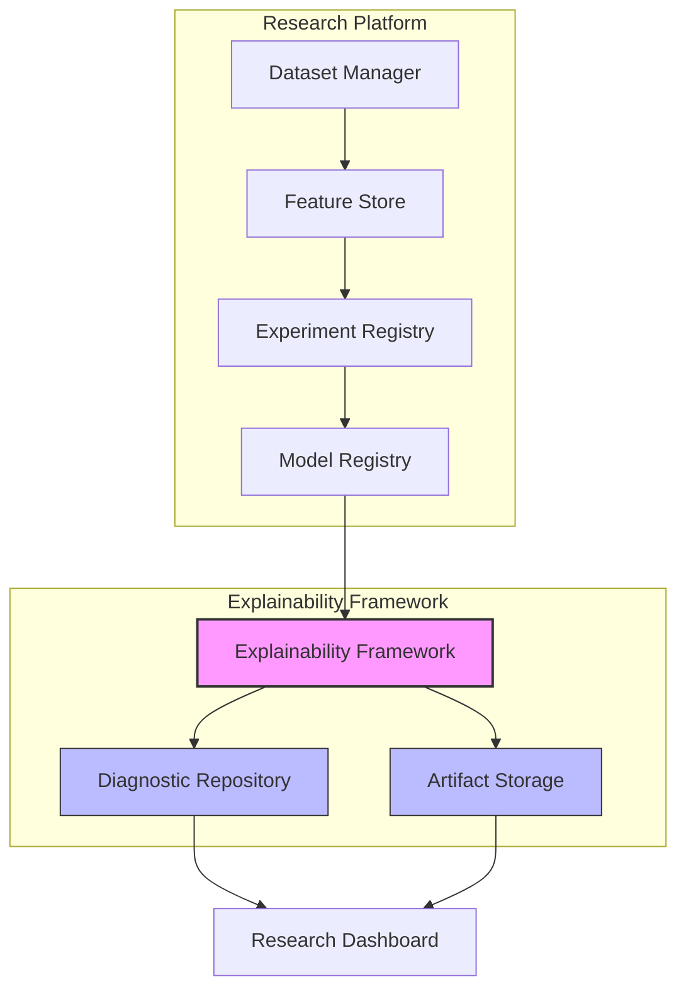

# ADR-022: Model Diagnostics & Explainability Framework

## Status
Approved (Refined) - Version 1.2 Refinement

## Context
MoroQuant has built a structured, reproducible research architecture across seven core modules (as outlined in ADR-009 and ADR-014), establishing strict pipelines for dataset versioning (ADR-010), feature store lineage (ADR-011), model registry lifecycle transitions (ADR-013), and research orchestration (ADR-014).

However, while the current validation logic (e.g., walk-forward Sharpe, drawdowns, calibration metrics like ECE and Brier score) checks the *statistical output* of models, it does not evaluate *how* and *why* these decisions are reached. In automated quantitative trading, treating models as black boxes introduces severe tail risks, including:
1. **Spurious Correlation Exploitation**: A model might exhibit high validation scores by exploiting a temporary or spurious feature correlation that does not hold under shifting market regimes.
2. **Hidden Feature Dominance**: Over-reliance on a single feature or a set of highly correlated features without structural diversification, which increases systemic sensitivity to feature drift or sensor failure.
3. **Lack of Explainability Audits**: Regulators, risk management systems, and quant architects cannot inspect the internal feature attribution profiles of promoted production models.

Currently, explainability analysis is performed on an ad-hoc basis in local researcher notebooks. There is no formalized framework to calculate, persist, version, and display model diagnostics in a reproducible, standardized manner. To close this gap and extend the platform, we require a formal architectural definition of the **Model Diagnostics & Explainability Framework**.

---

## Decision
We establish the **Model Diagnostics & Explainability Framework** as a core research subsystem within the MoroQuant Research Platform. This subsystem is architecturally responsible for producing immutable diagnostic artifacts that describe model attribution, sensitivity, and stability. 

Rather than executing ad-hoc computations, the framework runs as a deterministic pipeline step immediately following successful model training. The output diagnostics are written as versioned, read-only artifacts that are structurally linked to the model version in the Model Registry.

---

## Scope & Provider Architecture
The Explainability Framework defines the architectural pipeline, contract specifications, and storage rules for diagnostic evaluations. Rather than tightly coupling the framework to specific mathematical implementations, it generalizes explainability modules into a modular provider architecture.

### Provider Classification

Diagnostic providers are classified into two categories based on their mathematical inputs and analytical responsibilities:

1. **Standard Providers**: Standard explainability and attribution algorithms that run directly on model inputs and evaluate model behavior using dataset feature spaces.
   - **SHAP Provider**: Computes local and global additive feature attribution values mapping individual predictions to feature inputs (using Tree/Linear explainers).
   - **Correlation Provider**: Computes symmetrical feature-to-feature correlation matrices (Pearson/Spearman coefficients) to map multicollinearity.
   - **Permutation Provider**: Evaluates out-of-sample performance degradation (F1, Sharpe, MSE, etc.) when individual feature columns are shuffled.
2. **Specialized Providers**: Analytical modules that assess properties of the model diagnostics themselves, operating on intermediate outputs of other providers across training runs or validation splits rather than raw model predictions on a single dataset.
   - **Stability Provider**: Measures ranking stability, variance, and consistency of feature importance scores across multiple validation folds or walk-forward windows. Unlike standard providers that consume the raw feature matrix $X$, the Stability Provider expects a Feature Importance Matrix generated from multiple validation slices.

### Conceptual Hierarchy
```
Explainability Framework
├── Standard Providers
│   ├── SHAP Provider
│   ├── Correlation Provider
│   └── Permutation Provider
├── Specialized Providers
│   └── Stability Provider
└── Future Providers
```

> [!IMPORTANT]
> This ADR defines the system architecture, pipeline orchestration, and integration contracts only. It does NOT define or pin specific mathematical algorithms or library implementations. Future explainability algorithms, mathematical formulations, and libraries may be registered as new Diagnostic Providers without modifying this architectural framework.

---

## Diagnostic Run Concept
To trace and coordinate execution metadata, the framework introduces the architectural concept of a **Diagnostic Run**. A Diagnostic Run serves as the parent object connecting all diagnostic outputs for a specific pipeline invocation.

### Run Responsibilities
Each Diagnostic Run manages:
- **Unique Execution ID**: UUID identifying the specific execution run.
- **Timestamp**: Exact start and completion times of the diagnostics run.
- **Linked Model Version**: Reference to the model candidate being diagnosed.
- **Linked Dataset Version**: Reference to the validation dataset used for explainability queries.
- **Linked Feature Version**: Reference to the feature store lineage context.
- **Execution Status**: The current run state (e.g., initialized, executing, completed, failed).
- **Execution Metadata**: Profiling metrics (run duration, memory footprint, provider versions).
- **Artifact References**: Structured links/URIs pointing to the resulting files in storage.

### Service Entrypoint Contract

To ensure interoperability with the Research Orchestrator, FastAPI REST endpoints, and the Research Dashboard, the framework defines a flat public serialization contract for running diagnostics. The orchestrator's main entry point, `execute_diagnostics()`, must return a plain dictionary (`Dict[str, Any]`) rather than a custom object (e.g., `DiagnosticRunResult`). 

Returning a plain dictionary guarantees seamless JSON serialization, testing simplicity, and frictionless integrations across the service boundary.

The returned dictionary MUST include the following mandatory top-level keys:
- `run_id`: `str` (A unique UUID identifying this diagnostic run execution)
- `status`: `str` (The final status of the run, e.g., `"COMPLETED"`, `"FAILED"`)
- `start_time`: `str` (ISO 8601 formatted execution start timestamp)
- `end_time`: `str` (ISO 8601 formatted execution end timestamp)
- `artifact_manifest`: `Dict[str, str]` (A map of relative filenames to their SHA256 checksum fingerprints)
- `output_paths`: `Dict[str, str]` (A map of logical artifact names to their absolute file-system storage paths)
- `execution_duration_sec`: `float` (Total runtime duration in seconds)
- `max_memory_kb`: `Optional[int]` (Peak RSS memory utilization recorded during the run)
- `errors`: `List[str]` (A list of string messages detailing any caught exceptions, provider failures, or execution warnings)

---

## Architecture
The diagnostics pipeline integrates directly into the existing MoroQuant Research Platform modules, forming a downstream extension of the Model Registry and serving as a data source for the Research Dashboard:



### Component Interactions:
1. **Research Platform Pipeline**: Runs model experiments using versioned features and datasets, registering model candidates in the `Model Registry`.
2. **Explainability Trigger**: Once a model version is registered, the `Explainability Framework` initiates a new `Diagnostic Run`. It ingests the model binary, hyperparameters, and the corresponding evaluation dataset from the `Dataset Manager`.
3. **Diagnostic Execution**: The active `Diagnostic Providers` compute explainability metrics using frozen validation splits.
4. **Metadata & Artifact Separation**:
   - Structural records, execution status, and scalar summary metrics are stored in the SQL-based `Diagnostic Repository` under the parent `Diagnostic Run`.
   - Complex matrix representations, plots, distributions, and markdown reports are written to immutable `Artifact Storage`.
5. **Dashboard Consumption**: The `Research Dashboard` queries the `Diagnostic Repository` and reads visual/tabular files from the `Artifact Storage` to display explainability insights to the researcher.

---

## Responsibilities

| Component | Primary Responsibility |
| :--- | :--- |
| **Explainability Framework** | Core execution coordinator. Ingests trained model binaries and validation datasets, coordinates diagnostic runs, and outputs serialized artifacts. |
| **Diagnostic Repository** | SQL database schema (SQLite) containing structured diagnostic metadata, feature mappings, Diagnostic Run parent records, and relationships connecting model versions to explainability files. |
| **Artifact Storage** | File-based repository (Parquet, JSON, Markdown) storing high-dimensional outputs like SHAP values, feature importance distributions, and stability matrices. |
| **Research Dashboard** | Visualizes explainability data (e.g. SHAP summaries, correlation heatmaps, importance comparisons) by reading directly from storage and repository layers. |
| **Research Orchestrator** | Schedules and executes explainability tasks as a mandatory stage in the pipeline execution loop. |
| **Model Registry** | Provides access to model binaries, hyperparameter configs, and metadata to be ingested by the Explainability Framework. |
| **Feature Store** | Provides schemas and feature lineage definitions to map raw diagnostic arrays back to clean feature names. |
| **Dataset Manager** | Serves immutable, hashed validation datasets used by explainability algorithms to compute attribution scores. |

---

## Diagnostic Lifecycle & Quality Gate
The diagnostic lifecycle is a deterministic, linear progression from raw data extraction to a manual/automated architectural promotion decision:

$$\text{Dataset} \longrightarrow \text{Model} \longrightarrow \text{Validation} \longrightarrow \text{Diagnostics} \longrightarrow \text{Quality Gate} \longrightarrow \text{Artifact Gen} \longrightarrow \text{Persistence} \longrightarrow \text{Visualization} \longrightarrow \text{Research Decision}$$

1. **Dataset**: Clean, frozen, and hashed dataset version is generated by the `Dataset Manager`.
2. **Model**: Model candidate is trained and serialized.
3. **Validation**: Model is evaluated against statistical performance metrics (ECE, Brier, Sharpe).
4. **Diagnostics**: Explainability computations run sequentially. Rather than passing raw dataset inputs directly to all providers, Standard and Specialized providers follow an ordered dependency pipeline:
   - **Step 4.a (Standard Computations)**: SHAP, Correlation, and Permutation providers execute using the Model and Validation Dataset ($X$, $y$).
   - **Step 4.b (Feature Importance Assembly)**: The framework aggregates feature importances from standard providers (such as SHAP values and Permutation degradation results) across validation folds or windows to construct a Feature Importance Matrix.
   - **Step 4.c (Specialized Stability Analysis)**: The Stability Provider executes using the constructed Feature Importance Matrix to compute rank variances and consistency.
   
   ```
   [Dataset/Model]
         |
         v
     Standard Providers (SHAP, Permutation, Correlation)
         |
         v
     [Feature Importance Matrix / Fold Importances]
         |
         v
     Specialized Provider (Stability Provider)
   ```
5. **Quality Gate**: Assesses the generated metrics against architectural risk boundaries (e.g., detecting unstable feature importances, abnormal attribution profiles, or failed diagnostic execution) to formulate recommendations.
6. **Artifact Generation**: Diagnostic outputs are formatted into standardized file structures.
7. **Persistence**: Structured metadata and the Diagnostic Run record are saved to the SQLite database; binary/tabular payloads are frozen in storage.
8. **Visualization**: The dashboard displays the attribution profile, quality gate recommendations, and sensitivity maps.
9. **Research Decision**: The Quant Architect reviews the model's diagnostic signature and quality gate recommendations to authorize promotion to `Validated`/`Production`.

> [!NOTE]
> The **Diagnostic Quality Gate** produces architectural recommendations only. It does NOT automatically reject or promote models. Final decisions remain governed by the Research Workflow.

---

## Artifact Standards
The framework outputs a standardized set of diagnostic files. All file contracts are specified below to ensure front-end rendering compatibility and analytical reproducibility:

* **Feature Importance (`feature_importance.json`)**:
  A dictionary mapping registered feature names to numerical importance scores.
  $$\sum_{i=1}^{D} w_i = 1.0 \quad \text{or} \quad \vec{w} \in \mathbb{R}^D$$
* **SHAP Summary (`shap_summary.parquet`)**:
  A tabular dataframe containing out-of-sample observations and their corresponding Shapley values for each feature, allowing the reconstruction of local and global beeswarm plots.
* **Correlation Matrix (`correlation_matrix.json`)**:
  A symmetrical feature-to-feature matrix containing Pearson/Spearman correlation coefficients, highlighting multicollinearity risks.
* **Stability Report (`stability_report.json`)**:
  Standard deviation of feature importance rankings across different cross-validation folds or walk-forward windows.
* **Diagnostic Metadata (`diagnostic_metadata.json`)**:
  Information regarding runtime duration, underlying explainability libraries/versions used, and data shape configurations.
* **Markdown Report (`diagnostics_report.md`)**:
  A human-readable, self-contained summary of the diagnostic run, suitable for audit trails.

---

## Storage & Caching Principles
To respect **ADR-010 (Dataset Immutability & Versioning)** and **ADR-011 (Feature Versioning & Lineage)**, the Model Diagnostics subsystem enforces the following policies:

### Storage Principles
1. **Strict Immutability**: Once diagnostic artifacts are written to disk, they are read-only (`chmod 0444`). They can never be overwritten, modified, or rolled back. If a diagnostic run is repeated, it generates a new version.
2. **Cryptographic Lineage**: The diagnostic metadata must store a SHA256 checksum of the target model binary, the source dataset version ID, and the source feature dataset version ID.
   $$\text{Diagnostic Hash} = \text{SHA256}(\text{model\_binary\_hash} + \text{dataset\_version\_hash} + \text{diagnostic\_payload})$$
3. **Deterministic Reproducibility**: Using the exact model binary hash and dataset version, a researcher must be able to re-run the diagnostic engine and produce bitwise-identical output metrics.

### Research Cache Policy
To prevent redundant and computationally expensive explainability calculations, the framework implements an architectural caching policy.

$$\text{Cache Key} = \text{Model Version} + \text{Dataset Version} + \text{Feature Version} + \text{Provider Version}$$

If a Diagnostic Run is requested with a Cache Key matching an already completed run, the Diagnostic Providers may reuse the existing immutable artifacts instead of recomputing them. This policy preserves lineage and immutability guarantees.

---

## Research Orchestrator Integration
The existing sequential execution pipeline defined in **ADR-014** is extended to incorporate model diagnostics. The pipeline flow is updated as follows:

$$\dots \longrightarrow \text{Evaluation Engine} \longrightarrow \text{Model Registry} \longrightarrow \mathbf{\text{Explainability Framework}} \longrightarrow \text{Research Dashboard}$$

### Pipeline Extension Policies:
- The orchestrator invokes the explainability stage *after* a model candidate is written to the Model Registry but *before* the dashboard views are refreshed.
- In-process execution is maintained; the orchestrator runs the explainability tasks on the same execution context.
- If the explainability stage fails, the job state is updated to `FAILED`, but previously generated model binaries and datasets remain frozen, respecting the fail-fast policy of ADR-014.

---

## Dashboard Integration
The Research Dashboard interacts with the Diagnostics subsystem under a strict read-only boundary:
- **Presentation-Only Layer**: The dashboard reads generated diagnostic JSON, Parquet, and Markdown files to render visualizations (interactive beeswarms, heatmaps, bar charts).
- **Zero-Computation Policy**: The dashboard must **NEVER** calculate explainability metrics or run diagnostic pipelines. All calculations are performed upstream by the Explainability Framework under the command of the Research Orchestrator.

---

## Future Extensions
The Diagnostics Framework is designed to be horizontally extensible. Future analytical modules fit naturally into this structure as registered providers without requiring database migrations or pipeline refactoring:
- **Label Diagnostics**: Analyzes class balance, target noise, and labeling thresholds.
- **Probability Diagnostics**: Computes confidence scores, probability calibrations, and reliability curves.
- **Drift Diagnostics**: Compares training distribution against live production data streams to detect feature drift.
- **Data Quality Diagnostics**: Identifies missing values, outliers, and anomalous inputs.
- **Execution Diagnostics**: Profiles compute resource consumption, memory footprints, and inference latencies.

---

## Consequences

### Positive Consequences
- **Improved Risk Mitigation**: Protects against deploying models that achieve high historical performance through overfitting or spurious patterns.
- **Regulatory Readiness**: Establishes audit trails showing exactly which features drove model decisions.
- **Consistent Visualizations**: Unifies model explainability views under a standardized schema consumed by the Research Dashboard.
- **Resource Optimization**: Caching reduces compute times for repeated analyses.

### Trade-offs & Limitations
- **Computation Latency**: Calculating SHAP values or permutation importances for complex, high-dimensional datasets increases pipeline execution time.
- **Storage Footprint**: High-dimensional SHAP matrices (`.parquet` files) require significant storage space (mitigated by compression and selective feature subsetting).

---

## Success Criteria
The framework is considered successfully implemented when:
- The **Explainability Framework** subsystem exists and coordinates diagnostic runs.
- **Diagnostic Runs** are systematically tracked via unique IDs and metadata.
- The **Provider Architecture** is operational, allowing algorithm registration.
- **Artifact Lineage** is preserved from upstream features and datasets down to final diagnostic outputs.
- **Immutable Diagnostic Artifacts** are successfully generated and saved.
- The **Research Orchestrator** integrates diagnostics as a pipeline stage.
- The **Research Dashboard** consumes and displays diagnostic outputs using read-only interfaces.
- All existing ADR invariants (immutability, sequential execution, etc.) remain intact.

## Architecture Compliance & Refinement Notes
The modifications introduced in Version 1.2 (specifically the return contract of `execute_diagnostics()` returning a serialized plain `Dict[str, Any]` and the classification/inputs of the specialized `StabilityProvider`) represent formal architectural decisions. 

These updates are designed to resolve ambiguities identified during the Interface Compliance Audit and are NOT considered design deviations. All future automated and manual compliance audits of the diagnostics subsystem must evaluate implementation codebase conformance directly against this updated contract.

---

## Related Documents
- [ADR-009: Research Platform](file:///home/zafka/trade-dashboard/docs/adr/ADR-009-Research-Platform.md)
- [ADR-010: Dataset Immutability & Versioning](file:///home/zafka/trade-dashboard/docs/adr/ADR-010-Dataset-Immutability-Versioning.md)
- [ADR-011: Feature Versioning & Lineage](file:///home/zafka/trade-dashboard/docs/adr/ADR-011-Feature-Versioning-Lineage.md)
- [ADR-012: Research Dashboard Separation](file:///home/zafka/trade-dashboard/docs/adr/ADR-012-Research-Dashboard-Separation.md)
- [ADR-013: Model Registry Lifecycle & Lineage Policy](file:///home/zafka/trade-dashboard/docs/adr/ADR-013-Model-Registry-Lifecycle.md)
- [ADR-014: Research Orchestrator Design](file:///home/zafka/trade-dashboard/docs/adr/ADR-014-Research-Orchestrator.md)
