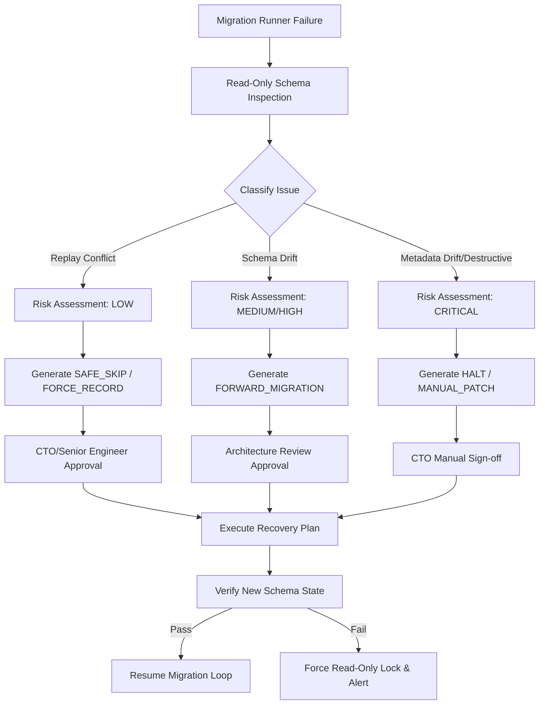

# ADR-023 v1.1: Database Recovery & Migration Reconciliation Framework

**Status**: PROPOSED (Ready for Freeze Review)  
**Author**: Antigravity, Principal Database Architect  
**Date**: 2026-07-26  

---

## 1. Architectural Principles

To ensure deterministic state transitions and prevent production data loss, the framework is built on the following core principles:

*   **Forward-only Migrations**: The database schema must only evolve by adding, modifying, or extending structures progressively. Rolling back or reverting schema states must never be automated or run implicitly on production databases.
*   **Immutable Migration History**: Historical migration scripts (`*.sql` and `*.py`) are read-only code records. They must not be modified or re-ordered once merged into the main development branch.
*   **Deterministic Rebuilds**: Building a database from scratch using the full historical migration path on an empty instance must yield a schema structurally identical to an upgraded production instance.
*   **Replayability**: The ability to reconstruct the database schema sequentially from version `001` through `HEAD` on a blank database without errors or warnings.
*   **Recovery without Mutation**: The diagnostic phase of the recovery engine must be completely read-only. It inspects, logs, and recommends, but never writes data or modifies database structures without human validation and approval.
*   **Separation of Detection vs. Modification**: The recovery module operates as a separate runtime component from the migration executor. Detection runs out-of-band; modification occurs only through explicitly approved command payloads.
*   **Schema Truth vs. Metadata Truth**: The physical schema structure (tables, columns, indexes) is the ultimate physical reality ("Schema Truth"), whereas the `schema_migrations` table is a ledger ("Metadata Truth"). The recovery engine bridges the gap between ledger records and physical state.

---

## 2. Recovery Classification Layer

Every detected database mismatch or execution failure must be classified into exactly one of the following categories:

### 2.1 Metadata Drift
*   **Definition**: A mismatch where a migration is recorded in `schema_migrations` as applied, but its corresponding physical schema elements (e.g., tables or columns) are missing.
*   **Detection Criteria**: Migration version exists in the ledger; schema elements are absent.
*   **Allowed Actions**: `HALT` (immediate stop).
*   **Forbidden Actions**: Automatic creation of tables, silent bypass, or deleting the ledger entry.

### 2.2 Schema Drift
*   **Definition**: Discrepancies in data types, constraints, or default values between the physical schema and migration specifications.
*   **Detection Criteria**: Column name matches but properties (e.g., `NOT NULL`, default, data type) mismatch target.
*   **Allowed Actions**: `FORWARD_MIGRATION`, `MANUAL_PATCH`.
*   **Forbidden Actions**: Inline modifications of existing migration files or raw unlogged execution.

### 2.3 Replay Conflict
*   **Definition**: A migration runner execution fails because a statement tries to add an element (e.g., column, table) that already exists.
*   **Detection Criteria**: SQLite exception thrown indicating duplicate columns/tables matching the target definition of the failed migration.
*   **Allowed Actions**: `FORCE_RECORD` (if schema matches), `SAFE_SKIP`.
*   **Forbidden Actions**: Ignoring the failure without documenting it or editing the active transaction.

### 2.4 Superseded Migration
*   **Definition**: A migration defines a table state that is dropped or completely replaced by a subsequent migration in the same sequence (e.g., `030` superseded by `031`).
*   **Detection Criteria**: A downstream migration file explicitly drops the output of an upstream migration file.
*   **Allowed Actions**: `SAFE_SKIP` (during fresh installs), `FORCE_RECORD`.
*   **Forbidden Actions**: Running the old code if the final state matches the newer specification.

### 2.5 Missing Migration
*   **Definition**: A migration ledger is missing intermediate records, but subsequent migrations have been recorded.
*   **Detection Criteria**: Hole detected in version numbering within `schema_migrations`.
*   **Allowed Actions**: `HALT`.
*   **Forbidden Actions**: Silent insertion of metadata or running migrations out of order.

### 2.6 Destructive Migration
*   **Definition**: A migration that drops tables, truncates columns, or removes constraints with potential data loss.
*   **Detection Criteria**: Migration file parses to reveal `DROP TABLE`, `DROP COLUMN`, or datatype narrowing.
*   **Allowed Actions**: `MANUAL_PATCH` (requires manual backup verification).
*   **Forbidden Actions**: Automated runner execution.

### 2.7 Manual Database Modification
*   **Definition**: Alterations made directly to production databases by administrators outside of the migration system.
*   **Detection Criteria**: Extra tables/columns exist in the database that are not defined in any migration file.
*   **Allowed Actions**: `FORWARD_MIGRATION` (to retroactively document the change in codebase), `MANUAL_PATCH`.
*   **Forbidden Actions**: Silent deletion of unknown fields.

### 2.8 Unknown State
*   **Definition**: Schema mismatch that cannot be classified under any known drift pattern.
*   **Detection Criteria**: Multiple overlapping errors, corrupted system tables, or inconsistent schema metadata.
*   **Allowed Actions**: `HALT`.
*   **Forbidden Actions**: Any write operations.

---

## 3. Recovery Risk Model

Every generated recovery plan must be graded with an overall risk score to dictate operational governance:

*   **LOW**: Safely auto-suggested options that do not impact physical data storage or index definitions.
    *   *Rules*: Adding missing indexes, recording metadata for identical schemas (`FORCE_RECORD`).
*   **MEDIUM**: Modifies non-critical structures or backfills default values.
    *   *Rules*: Adding columns with default values, minor non-null index updates.
*   **HIGH**: Structural changes on tables containing transactional data.
    *   *Rules*: Re-creating tables, changing keys, applying forward-only schema normalization patches.
*   **CRITICAL**: Data loss risk or corrupted tracking state.
    *   *Rules*: Dropping tables, altering core telemetry or trade histories, metadata holes.

The Recovery Engine **must never** execute `HIGH` or `CRITICAL` plans automatically, and they must be blocked by the deploy runtime unless manual approval tokens are provided.

---

## 4. Recovery Recommendation Types

| Recommendation Action | Description | Appropriate Use Case | Required Approval | Risks |
| :--- | :--- | :--- | :--- | :--- |
| **`SAFE_SKIP`** | Bypasses execution of a redundant statement or migration. | Superseded migration or optional index duplicate. | Senior Engineer | Mismatched physical layout if bypassed incorrectly. |
| **`FORCE_RECORD`** | Injects version string into `schema_migrations` table. | Replay Conflict (columns exist, match target). | CTO | Bypassing validation check on subtle datatype drift. |
| **`FORWARD_MIGRATION`** | Executes a new migration script to normalize schemas. | Schema drift or Manual modifications. | Architecture Review | Potential deployment latency or locking issues. |
| **`MANUAL_PATCH`** | Demands out-of-band DBA SQL script execution. | Highly complex state repairs or critical structural changes. | CTO | Human execution error; bypasses typical runner safeguards. |
| **`HALT`** | Aborts all deployments and keeps database in read-only lock. | Critical drift, data corruption, metadata mismatch. | CTO + Stop Deployment | Production downtime or delayed feature releases. |

---

## 5. Recovery Decision Tree

---

## 6. Mandatory Replay Validation

To guarantee continuous integration health, **Replay Validation** is established as an immutable platform invariant:

$$\text{Fresh DB} \xrightarrow{001 \dots \text{HEAD}} \text{Target Schema} \equiv \text{Production Database Schema}$$

Any Pull Request that breaks this sequence or fails to compile the final target schema on a fresh SQLite instance is automatically blocked from merge by pipeline assertions. This enforces that developers write clean, incremental migrations instead of relying on post-hoc manual adjustments.

---

## 7. CTO Approval Matrix

| Action Type | Risk Level | Target Classification | Required Approval Authority |
| :--- | :--- | :--- | :--- |
| **`SAFE_SKIP`** | LOW | Replay Conflict, Superseded | Senior Engineer / Lead Developer |
| **`FORCE_RECORD`** | LOW / MEDIUM | Replay Conflict, Metadata sync | CTO |
| **`FORWARD_MIGRATION`** | MEDIUM / HIGH | Schema Drift, Manual change | Architecture Review Board |
| **`MANUAL_PATCH`** | HIGH / CRITICAL | Destructive, Complex Drift | CTO Only |
| **`HALT`** | CRITICAL | Unknown State, Corruption | CTO Only (Triggers deploy block) |

---

## 8. Compatibility Matrix & ADR Relationships

*   **ADR-007 (Telemetry & Auditing)**: No conflict. ADR-023 audit trails will log to the database/files using ADR-007's log standards.
*   **ADR-010 (Model Performance Engine)**: ADR-023 protects the `experiments` schema used by ADR-010 from accidental metadata wipes.
*   **ADR-013 (Data Ingestion Pipeline)**: Replay validation guarantees schema constraints for raw OHLCV feeds are preserved during live recovery cycles.
*   **ADR-014 (Paper Portfolio)**: Normalizes paper trading variables (e.g., initial balance) without dropping position tables.
*   **ADR-022 (Execution Policies)**: Reconciles `execution_decisions` columns safely to secure execution analytics pipelines.

---

## 9. Updated Sprint Breakdown

*   **Sprint 2.3A (Recovery Inspector)**: Core schema capture utilities and database analysis engine.
*   **Sprint 2.3B (Decision Analyzer)**: AST-driven compilation of target states, logic classifications, and risk score calculation rules.
*   **Sprint 2.3C (CLI & Execution Controllers)**: Implementing `agy db recover` and transaction-safe executors.
*   **Sprint 2.3D (Pipeline Verification)**: GitHub Actions integration for Replay Validation and production schema clone checks.

---

## 10. Success Criteria & Definition of Done

### Success Criteria
1. Upgrading from version `028` to `032` on production schema executes successfully with zero schema errors.
2. The migration history (`001` through `032`) remains 100% immutable.
3. Fresh installations yield identical schemas to production instances.
4. Attempting to run duplicate schema changes results in an automated recovery log recommendation rather than an unhandled script failure.

### Definition of Done (DoD)
*   [ ] Unit tests cover all 8 Recovery Classifications.
*   [ ] Command execution logs write to a secure, tamper-proof audit trail.
*   [ ] Replay validation pipeline blocks merges on any script parsing syntax error.
*   [ ] The codebase is fully prepared for ADR-023 v1.1 freeze.
