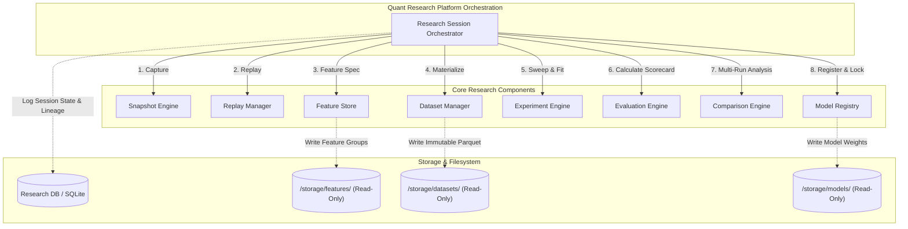
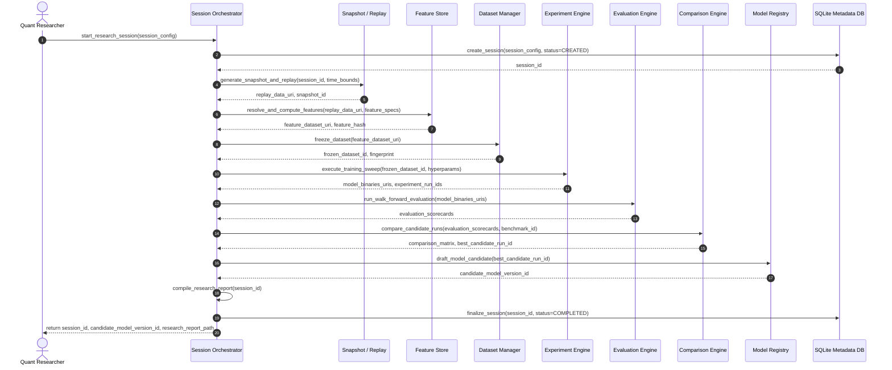

# ADR-024: Quant Research Platform Architecture

**Status**: PROPOSED (Design Only)
**Author**: Antigravity, Principal Quant Architect
**Date**: 2026-07-31

---

## 1. Problem Statement
Quantitative research at MoroQuant currently operates as a fragmented sequence of ad-hoc scripts, manual feature calculation runs, and undocumented modeling iterations. While individual engines exist—such as the Snapshot Engine, Dataset Manager, Feature Store, and Model Registry—they lack a cohesive, automated, and unified orchestration layer. 

Without a formalized, session-bound Research Platform, the following structural risks persist:
* **Auditability Gaps**: Quantitative experiments lack a unified parent session context. Linking specific raw market conditions, replay logs, optimization parameter sweeps, metric scorecards, and final model promotions requires manual reconstruction across separate files and DB records.
* **Reproducibility Gaps**: Subtle variances in execution environments, non-deterministic float representations, and untracked intermediate data states prevent mathematical reproducibility. There is no automated framework to verify that a model candidate can be regenerated deterministically from raw market tick data down to the exact trained weights.
* **Comparison Constraints**: Experiments lack standardized comparative benchmarks, making it difficult to objectively compare walk-forward metrics (Sharpe, Drawdown, ECE, Brier score) across model architectures, symbols, and regimes.
* **Lax Gatekeeping**: The transition of a candidate model to active paper or live trading relies on manual steps rather than strict, auditable, and automated checklist promotions.

---

## 2. Goals
* **Deterministic Reproducibility**: Guarantee that given the same raw market data and research session configuration, all derived snapshots, replay outputs, features, and model weights can be reproduced with 100% mathematical precision.
* **Unified Lineage & Auditability**: Enforce complete end-to-end lineage tracking across the research lifecycle, recorded in a single database schema under a central `ResearchSession` entity.
* **Rigorous Metric scorecards**: Standardize walk-forward evaluation (ECE, Brier, Sharpe, Drawdown, Profit Capture) and enable multi-run comparative analysis.
* **Automated Promotion Safeguards**: Formalize model state transitions from candidate to production via automated verification gates.
* **Strict Architecture & Dependency Rules**: Maintain clear component boundaries, ensuring unidirectional data flow and zero regression on existing subsystems (including the Recovery Framework).

---

## 3. Non-Goals
* **Code Implementation**: Writing application code, APIs, or CLI commands.
* **Schema Modifications**: Running actual database migrations or altering current DB engines.
* **Execution System Redesign**: Re-architecting the live execution logic, paper trading runtime, or database recovery engine (ADR-023 remains untouched).
* **Distributed Orchestration**: Introducing external task schedulers or queue brokers (e.g., Celery, Temporal, Airflow).

---

## 4. Architecture
The Quant Research Platform sits as an orchestration layer above the individual quantitative services. It aggregates their operations under a unified **Research Session Lifecycle**, storing execution metadata in the Research DB while saving immutable artifacts (Datasets, Feature Parquets, Model Weights) to the local filesystem using OS-level read-only locks.



---

## 5. Component Responsibilities

| Component | Core Responsibility | Input Artifact | Output Artifact |
| :--- | :--- | :--- | :--- |
| **Snapshot Engine** | Captures raw exchange ticks and structures them into localized, point-in-time snapshot files. | Live / Historical Ticks | Standardized Snapshot File |
| **Replay Manager** | Replays snapshots under custom slippage and latency parameters to simulate historical market states. | Snapshot File, Replay Config | Replay Tick Stream |
| **Dataset Manager** | Resamples, filters, and freezes replay output streams into canonical training/evaluation datasets. | Replay Tick Stream | Immutable Dataset File (`chmod 444`) |
| **Feature Store** | Computes parameterized feature mathematical formulas against the frozen dataset. | Immutable Dataset File | Feature Dataset (`chmod 444`) |
| **Experiment Engine** | Conducts hyperparameter sweeps and model training runs against feature datasets. | Feature Dataset, Run Config | Candidate Model Binary |
| **Evaluation Engine** | Computes statistical metrics (Sharpe, Brier, ECE, Drawdown) on out-of-sample datasets. | Candidate Model Binary | Evaluation Scorecard |
| **Comparison Engine** | Ranks and filters active experiments and scorecards against target baseline benchmarks. | Evaluation Scorecard List | Ranked Run Matrix |
| **Model Registry** | Governs digital signatures, checks checksum integrity, and handles candidate-to-production transitions. | Best Model Configuration | Promoted Production Model |

---

## 6. Research Lifecycle
The platform executes research pipelines following a strict, unidirectional sequence:

```
Market Data ──> Snapshot ──> Replay ──> Experiment ──> Evaluation ──> Comparison ──> Research Report ──> Candidate Promotion
```

1. **Market Data Ingestion**: Gathering raw historical or live exchange orderbooks and trades.
2. **Snapshot Generation**: Capturing and partitioning raw data into deterministic, canonical time intervals.
3. **Replay Simulation**: Injecting execution policies, latency profiles, and fee models over snapshot streams.
4. **Experiment Run**: Slicing data into train/test intervals, engineering features via the Feature Store, and executing ML fit procedures.
5. **Evaluation Verification**: Running walk-forward validation and outputting scorecards with calibration metrics.
6. **Comparison Analysis**: Running comparison queries to benchmark the candidate run against baseline models.
7. **Research Report Compilation**: Generating a structured markdown report detailing model architecture, performance charts, and data lineage.
8. **Candidate Promotion**: Passing checking criteria to transition the model from `Candidate` to `Validated` and finally to `Production`.

---

## 7. Sequence Diagram
The following sequence details the lifecycle orchestrator driving the entire flow:



---

## 8. Dependency Rules
To avoid cyclical dependencies and spaghetti configurations, the following rules are strictly enforced:
* **Downward Dependency Flow Only**: A component may only depend on components situated to its left or upstream in the sequence. For example, the Feature Store knows about Dataset Manager outputs, but the Dataset Manager must never import or call the Feature Store.
* **Session Orchestration Isolation**: Individual engines (e.g., Feature Store, Model Registry) must remain completely independent of the `ResearchSessionOrchestrator`. They consume configuration contracts and return standard data payloads; the orchestrator alone imports and coordinates the services.
* **Separation of Read/Write**: Diagnostic and comparison engines are strictly read-only. They inspect registries and output comparisons, but never alter model metadata state or delete existing files.

---

## 9. Public Component Boundaries
Each service exposes a minimal public boundary defining its inputs and output signatures.

```python
class ResearchSessionOrchestrator:
    def create_session(config: SessionConfig) -> SessionContext: ...
    def run_session(session_id: str) -> ResearchSessionReport: ...
    def get_session_status(session_id: str) -> SessionStatus: ...

class FeatureStore:
    def compute_features(dataset_path: str, spec: FeatureSpec) -> FeatureDatasetPayload: ...
    def register_feature_definition(definition: FeatureDefinition) -> str: ...

class DatasetManager:
    def freeze_dataset(payload: FeatureDatasetPayload) -> FrozenDatasetMetadata: ...
    def verify_fingerprint(dataset_id: str) -> bool: ...

class ExperimentEngine:
    def run_sweep(dataset_id: str, sweep_config: SweepConfig) -> List[RunMetadata]: ...

class EvaluationEngine:
    def evaluate_model(model_path: str, validation_dataset_id: str) -> Scorecard: ...

class ComparisonEngine:
    def compare_runs(run_ids: List[str]) -> ComparisonReport: ...

class ModelRegistry:
    def register_candidate(run_id: str) -> ModelVersion: ...
    def promote_to_validated(version_id: str, signature: str) -> bool: ...
    def promote_to_production(version_id: str) -> bool: ...
```

---

## 10. Storage Responsibilities
The platform splits storage between structured metadata (SQLite) and heavy telemetry payloads (Filesystem):
* **SQLite Metadata Ledger**: Contains registries for sessions, snapshots, datasets, feature definitions, training runs, metrics, and models. All schema tables utilize foreign key constraints to ensure complete relational lineage integrity.
* **Immutable Filesystem Volumes**: Parquet dataframes, tick files, and serialized model binaries are written to designated directory structures (`/storage/features/`, `/storage/datasets/`, `/storage/models/`). Upon freezing, these files are set to read-only (`chmod 444`), preventing mutation.

---

## 11. Research Session Model
A research session is tracked via the `ResearchSession` entity which acts as the umbrella boundary for any quantitative experiment:

| Field | Type | Description |
| :--- | :--- | :--- |
| `session_id` | UUID | Primary key uniquely identifying the session. |
| `status` | Enum | Current state (`CREATED`, `RUNNING`, `COMPLETED`, `FAILED`, `CANCELLED`). |
| `config_snapshot` | JSON | Locked JSON config containing all parameters, date bounds, and model architectures. |
| `snapshot_id` | Foreign Key | References the starting market snapshot metadata record. |
| `dataset_version_id` | Foreign Key | References the frozen dataset used. |
| `feature_dataset_id` | Foreign Key | References the calculated feature dataset metadata. |
| `best_run_id` | Foreign Key | References the winning experiment run identified. |
| `created_at` | Timestamp | Timestamp of session creation. |
| `completed_at` | Timestamp | Timestamp of session resolution. |

---

## 12. Experiment Versioning
To maintain absolute reproducibility, we apply semantic identifiers to all research layers:
1. **Dataset Versioning (`DS_[Major].[Minor].[Patch]`)**:
   * *Major*: Structural data definition updates (e.g., changing tick resampling frequency from 1m to 5m).
   * *Minor*: Schema alterations (e.g., adding a new OHLCV transform column).
   * *Patch*: Temporal bounds adjustments or data filters (e.g., shifting date windows).
2. **Feature Dataset Versioning (`FDS_[Major].[Minor].[Patch]`)**:
   * *Major*: Feature formula logic modification (e.g., SMA to EMA calculation change).
   * *Minor*: Parameter array modifications (e.g., configuring extra lookbacks).
   * *Patch*: Code optimization with identical numerical outputs.
3. **Model Versioning (`M_[Symbol]_[ModelType]_[Major].[Minor].[Patch]`)**:
   * *Major*: Model architecture class swaps (e.g., XGBoost to LSTM).
   * *Minor*: Hyperparameter bounds updates.
   * *Patch*: Retraining runs with identical parameters on updated temporal datasets.

---

## 13. Reproducibility Rules
To guarantee that a research run is mathematically reproducible, the platform enforces:
* **Canonical Data Alignment**: All feature dataframes are ordered chronologically by `timestamp` and sorted alphabetically by feature column name before fingerprinting.
* **Float Standardizations**: Numeric columns are formatted to fixed string precision (`%.8f`) before generating cryptographic checksums (`SHA-256`), eliminating variations between hardware architectures.
* **Library Lockstep**: All model sessions log the specific dependency versions (`requirements.txt` state) to detect potential variance in library calculation scripts.
* **Signature Assertions**: Models will not load unless the loaded binary hash matches the fingerprint recorded in the Model Registry.

---

## 14. Future Sprint Breakdown
The implementation of the Quant Research Platform is divided into five consecutive, design-compliant sprints:

### Sprint 3.1: Research Session Management & Ingestion Pipelines
* **Deliverables**:
  * Implement the database schema migrations for `ResearchSession` and execution telemetry.
  * Construct the sequential `ResearchSessionOrchestrator` execution loops.
  * Connect Snapshot/Replay output bindings to session metadata creation.

### Sprint 3.2: Versioned Feature Stores & Immutability Engine
* **Deliverables**:
  * Build the Feature Registry tracking mathematical definition DAGs.
  * Build the Dataset Manager payload freezing logic (`chmod 444` parquet file handling).
  * Build the canonical fingerprint generator and hash validation layers.

### Sprint 3.3: Experiment Engine Execution & Sweeps
* **Deliverables**:
  * Build training script wrappers to automatically capture and log parameters to SQLite.
  * Support in-process hyperparameter sweeps (e.g., Optuna integration) logging to the registry.
  * Enforce model binary serialization and cryptographic fingerprinting.

### Sprint 3.4: Evaluation & Comparison Analytics
* **Deliverables**:
  * Build the walk-forward evaluation calculator computing Sharpe, Drawdown, ECE, and Brier metrics.
  * Construct the Comparison Engine to rank experiment runs against reference benchmarks.
  * Implement metrics lookup caches to optimize query execution times.

### Sprint 3.5: Research Reports & Automated Promotion Gatekeeping
* **Deliverables**:
  * Build the automated markdown report compiler producing performance graphs and lineage charts.
  * Enforce model transition constraints (checking digital signatures and quality gate thresholds).
  * Connect the paper trading execution runner to load validated models via registry lookups.

---

## 15. Definition of Done (DoD)
* **Design Approval**: The ADR is approved and frozen by the CTO.
* **Visual Specifications**: All dashboard visual layouts align with existing MQDS component structures.
* **AST Validation**: Codebase graph index (`graphify-out/graph.json`) is fully updated.
* **System Constraints**: The design does not modify database schema tables outside the research workspace, does not alter the recovery framework (ADR-023), and does not run any application code.
