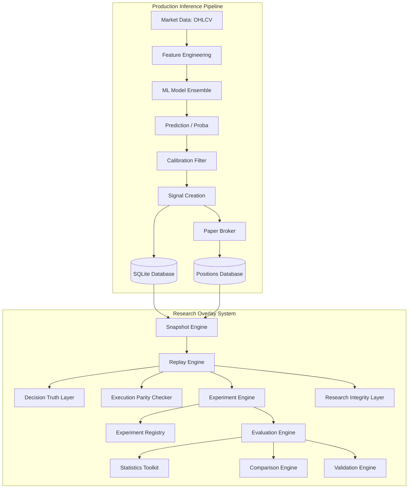
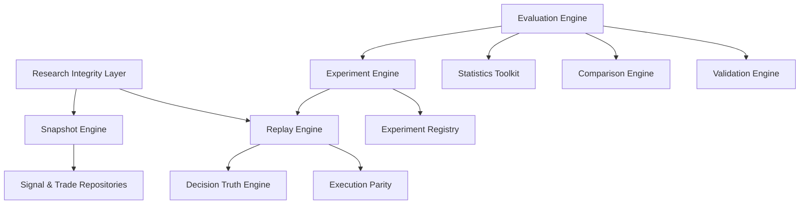
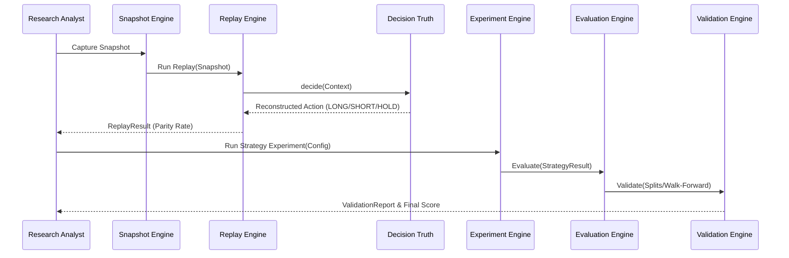

# Research Overlay Architecture

This document describes the design, dependency structure, modules, and sequence lifecycles of the Research Overlay System.

## 1. System Architecture

## 2. Dependency Graph

## 3. Module Responsibilities

* **Snapshot Engine**: Captures a deterministic state of the database tables (signals, positions, account equity) at a specific point in time to create immutable JSON snapshots.
* **Replay Engine**: Re-runs past predictions against the captured snapshots to reconstruct trading decisions.
* **Decision Truth Engine**: Single source of truth for argmax and confidence-threshold decision logic.
* **Execution Parity**: Implements production-equivalent filters (cooldowns, conflict filters, exposure limits) in replay mode.
* **Experiment Engine**: Runs parameterized counterfactual strategy configurations over replay results.
* **Experiment Registry**: Stores and tracks strategy configurations and runs.
* **Evaluation Engine**: Computes performance metrics (returns, Sharpe, Sortino, drawdowns, and expectancy).
* **Research Integrity Layer**: Analyzes and alerts for survivorship bias, data leakage, and loss of determinism.
* **Statistics Toolkit**: Pure statistical helper for VaR, CVaR, sample sizing, distribution kurtosis/skewness.
* **Comparison Engine**: Performs paired bootstrapping and hypothesis testing to compare strategy results.
* **Validation Engine**: Performs walk-forward and out-of-sample splits to test generalization.

## 4. Sequence Diagrams

### 4.1 Replay & Experiment Lifecycle

