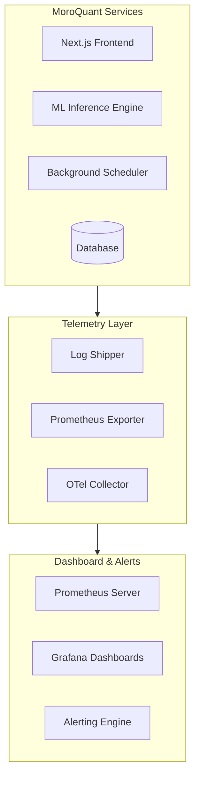

# Runtime Observability Design

This document details the telemetry, log aggregation, metric tracking, and monitoring specifications for the MoroQuant platform. It focuses on design principles and architectures, not specific runtime installations.

## Observability Architecture Overview

---

## 1. Health Checks

Every service must expose a standardized health endpoint at `/health` returning JSON payloads.

### Endpoint States
- **`GET /health/live`**: Checks if the container or process is running. Fast return, no dependency checks.
- **`GET /health/ready`**: Verifies that downstream services (database, Redis, broker) are reachable.

---

## 2. Telemetry Domains

### Metrics
We collect standard operational and application-level metrics:
- **System Metrics**: CPU, memory, filesystem I/O, network traffic.
- **HTTP/API Metrics**: Request latency, response codes, active connection counts.
- **Trading Metrics**: Order execution latency, slippage, active position sizing.

### Logging
- **Standard**: All stdout logs must format as single-line JSON structure.
- **LogLevels**:
  - `DEBUG`: Verbose execution traces (excluded in production).
  - `INFO`: Standard lifecycle events, trade closures.
  - `WARN`: Recoverable errors (e.g. database retry successes).
  - `ERROR`: System-level failures requiring attention (e.g. order rejection).

### Tracing
- Integrate OpenTelemetry (OTel) instrumentation for request context tracking.
- All service requests must propagate a `trace_id` header across service borders.

---

## 3. Dedicated Monitoring Domains

### Heartbeats
- Essential processes (scheduler, execution worker) must emit a periodic heartbeat.
- Missing heartbeats trigger instant severity-1 alerting.

### Scheduler Monitoring
- Track execution delays (scheduled execution time vs. actual start time).
- Log task duration, completion status, and crash traces.

### Model Monitoring
- Monitor inference input data drift.
- Profile inference computation speed.
- Track distribution deviations of generated trade signals.

### Database Monitoring
- Track query performance and slow query count.
- Monitor active pool connections and database locking durations.

---

## 4. Alerting & Visualization Strategy

### Alerting Tiers
- **P0 (Critical)**: Immediate paging. Triggered by lost heartbeats, execution engine errors, or balance anomalies.
- **P1 (High)**: Slack/Teams warning. Triggered by high latency, database connection warnings, or elevated model drift.
- **P2 (Warn)**: Log registrations. Triggered by minor latency jumps or transient errors.

### Future Integrations
- **Prometheus**: Deploy Prometheus server agents to scrape `/metrics` endpoints across all pods.
- **Grafana**: Build Grafana boards displaying real-time system performance, system metrics, and risk engine telemetry.
