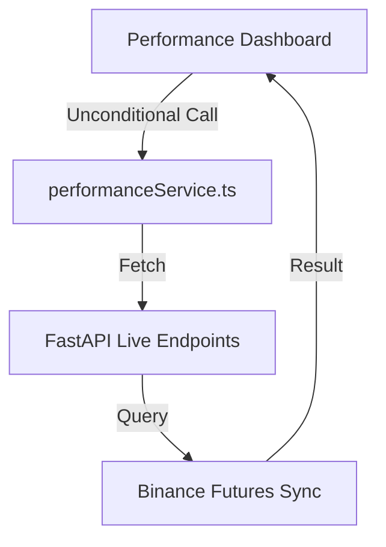

# Audit Report: Paper Trading Mode Data Display Issue

**Status**: Completed  
**Auditor**: Antigravity  
**Target Issue**: Paper Mode shows empty or missing data despite the SQLite database containing ~200 completed autonomous paper trades.

---

## 1. Root Cause Analysis

The root cause of the issue is a **data flow disconnect** between the Frontend/Service layers and the Backend API endpoints. 

While the user can select and change the trading mode to `PAPER` on the UI (persisting it in the SQLite database and the client-side Zustand store), the data retrieval layer does not branch on the selected mode. The dashboard pages and open positions panel request live trading endpoints (Binance-backed) unconditionally, completely ignoring the active trading mode.

---

## 2. Affected Files

1. **Dashboard Page**: `app/dashboard/performance/page.tsx` ([page.tsx](file:///home/zafka/trade-dashboard/app/dashboard/performance/page.tsx))
   - Unconditionally calls live performance retrieval methods during dashboard data refresh.
2. **Open Positions Component**: `components/dashboard/OpenPositionsPanel.tsx` ([OpenPositionsPanel.tsx](file:///home/zafka/trade-dashboard/components/dashboard/OpenPositionsPanel.tsx))
   - Unconditionally fetches open positions from live Binance API endpoints.
3. **Service Layer**: `lib/services/performanceService.ts` ([performanceService.ts](file:///home/zafka/trade-dashboard/lib/services/performanceService.ts))
   - Fetches from `/api/analytics/*` and `/api/positions/*` live endpoints without any awareness of or branching for the selected trading mode.

---

## 3. Data Flow & Endpoint Comparison

### Current Data Flow (All Modes)



### Endpoint Mapping

| Metric Category | Current Endpoint (Always Used) | Expected Endpoint (When Mode = PAPER) | Expected Endpoint (When Mode = LIVE) |
|---|---|---|---|
| **Performance Report** | `/api/analytics/live-performance` | `/api/paper/analytics` | `/api/analytics/live-performance` |
| **Open Positions** | `/api/positions/open` | `/api/paper/positions/live` | `/api/positions/open` |
| **Regime Performance** | `/api/analytics/regimes` | `/api/paper/analytics/regime` | `/api/analytics/regimes` |
| **Confidence Buckets** | `/api/analytics/confidence` | `/api/paper/analytics/confidence` | `/api/analytics/confidence` |

---

## 4. Audit Verification Details

1. **Verify Trading Mode flow (UI → Store → Service → API → Backend)**:
   - **UI**: Set via `TradingModeManager.tsx`.
   - **Store**: Held in `useTradingModeStore` (Zustand) and persisted to localstorage as `trading-mode-storage`.
   - **Service**: **Disconnect exists here.** The trading mode state never reaches or influences the functions inside `performanceService.ts`.
   - **API / Backend**: Correctly sets the database singleton in SQLite `trading_system_state` table via POST `/api/trading/mode`.
2. **Identify which endpoint is used when**:
   - Currently, the dashboard uses `/api/analytics/live-performance` and `/api/positions/open` regardless of the mode selection.
3. **Verify whether the backend already exposes paper trading endpoints**:
   - **Yes.** The FastAPI router `ml_service/api/routes.py` successfully exposes paper endpoints under the `/api/paper/` prefixes (e.g. `/paper/analytics`, `/paper/positions/live`, etc.) which interface with `paper_positions` and `paper_account` tables in SQLite.
4. **Determine whether the frontend is requesting `paper_positions`, `paper_trade_history` or another endpoint**:
   - The frontend is **not** requesting any paper position or paper trade history endpoints for the main dashboard view. It continues requesting `/api/positions/open` and `/api/analytics/live-performance`.
5. **Determine whether the selected Trading Mode reaches the Service Layer**:
   - **No.** The Service Layer (`performanceService.ts`) has no imports or logic referring to the Zustand trading mode store or the active trading mode.

---

## 5. Recommended Fixes

### Step 1: Update the Service Layer (`lib/services/performanceService.ts`)
Introduce a `mode` parameter to the dashboard fetchers, or retrieve the current mode state inside the functions to direct requests:

```typescript
// Example refactored function structure
export async function getLivePerformanceReport(mode?: TradingMode): Promise<LivePerformanceReport> {
  const base = getApiBaseUrl();
  const endpoint = mode === 'PAPER' ? `${base}/paper/analytics` : `${base}/analytics/live-performance`;
  const response = await fetchWithRetry(endpoint);
  ...
}
```

### Step 2: Integrate Hook in Pages & Panels
In `app/dashboard/performance/page.tsx` and `components/dashboard/OpenPositionsPanel.tsx`, import and call the `useTradingMode` hook:

```typescript
const { mode } = useTradingMode();
```

Pass the active `mode` state to the corresponding service retrieval function calls so they cascade to the correct endpoints dynamically.

---

## 6. Priority & Constraints

* **Priority**: **HIGH** (blocking validation of paper trading performance and analytics dashboard visibility).
* **Constraints Checked**:
  - No frontend UI redesign is required.
  - No implementation of new screens is required.
  - Parity is strictly targeted to backend-supported endpoints.
