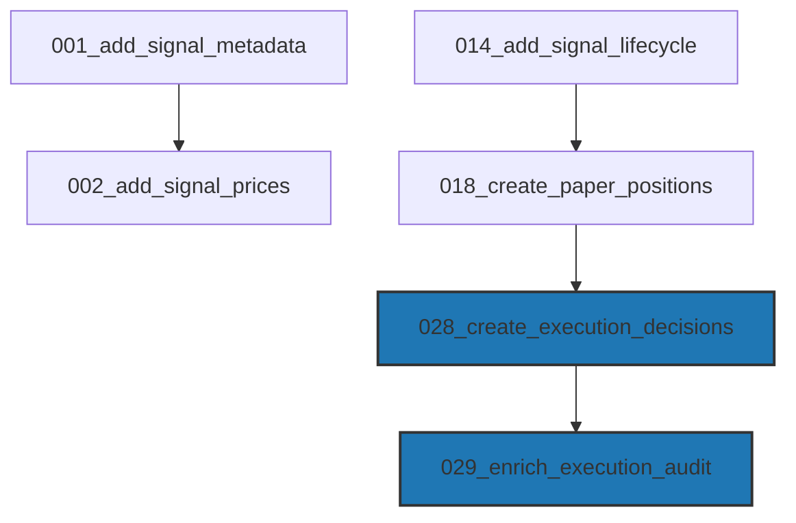

# Execution Analytics Database Audit (Sprint 4.7)

**Date**: 2026-07-11  
**Status**: PASS WITH WARNINGS  
**Auditor**: Antigravity

---

## 1. Table Audit & Schema Registry

A complete search across the codebase and database was performed to locate references to `execution_decisions`, `execution_metrics`, `execution_events`, `execution_summary`, and `execution_reports`. 

### 1.1 Table Availability

| Table/Entity Name | Database Table Status | Code Reference | Purpose |
| :--- | :--- | :--- | :--- |
| `execution_decisions` | **ACTIVE** (44 rows) | [repository.py](file:///home/zafka/trade-dashboard/ml_service/analytics/execution_analytics/repository.py), [execution_audit.py](file:///home/zafka/trade-dashboard/ml_service/trading/execution_audit.py) | Persists both `ACCEPTED` and `REJECTED` signal decisions with execution metadata. |
| `execution_metrics` | **NO TABLE** (Module Only) | [execution_metrics.py](file:///home/zafka/trade-dashboard/ml_service/audit/execution_metrics.py) | Python data structure and calculator. Not persisted in SQLite. |
| `execution_events` | **NO TABLE** | None | Not implemented or used. Exists conceptually inside `paper_positions` status fields. |
| `execution_summary` | **NO TABLE** | None | Exists conceptually as dynamic API responses or log outputs. |
| `execution_reports` | **NO TABLE** (Module Only) | [execution_report.py](file:///home/zafka/trade-dashboard/ml_service/audit/execution_report.py) | Python reporting framework that formats metrics as JSON/text. |

### 1.2 Indexes Audit (`execution_decisions`)

All expected database indexes for execution analytics queries are present and functional:
*   `idx_execution_decisions_symbol` on `symbol` (Active)
*   `idx_execution_decisions_decision` on `decision` (Active)
*   `idx_execution_decisions_created_at` on `created_at` (Active)
*   `idx_execution_decisions_reason` on `reason` (Active)

---

## 2. Migration Layer & Graph

### 2.1 Responsible Migrations
*   **028_create_execution_decisions.sql**: Responsible for the base table structure, autoincrement integer PK, foreign key constraints to `signals(id)` and `paper_positions(id)`, and the initial set of columns (price, slippage, latency, etc.).
*   **029_enrich_execution_audit.sql**: Responsible for adding `source`, `signal_timestamp`, `execution_policy`, and `reason_detail` column definitions.

### 2.2 Dependency Graph

### 2.3 Migration Quality Assessment
*   **Ordering**: Correct. `028` runs before `029`. Both execute after the base `signals` and `paper_positions` tables are created.
*   **Dependencies**: Explicit. Foreign key constraints exist:
    *   `FOREIGN KEY (signal_id) REFERENCES signals(id)`
    *   `FOREIGN KEY (position_id) REFERENCES paper_positions(id)`
*   **Idempotency & IF NOT EXISTS**: **PASS**. Both migrations use `CREATE TABLE IF NOT EXISTS` or check column existence to prevent failure during re-runs.
*   **Database.initialize() Hook**: **WARNING**. `Database._init_schema()` in [database.py](file:///home/zafka/trade-dashboard/ml_service/data/database.py#L40) does not invoke the migration runner `run_migration.py`. Instead, migrations are run asynchronously by `validate_production_health.py` during validation or startup checks. This creates a risk where the server starts up before migrations are applied, causing transient "no such table: execution_decisions" errors.

---

## 3. Recommended Fixes

1.  **Standardize Startup Execution**: Integrate a blocking migration runner execution check directly inside `Database._init_schema()` or at the very beginning of FastAPI's `@app.on_event("startup")` before any queries run.
2.  **Clean up Foreign Key Anomalies**: Repair the 1 foreign key violation in `execution_decisions` (row ID 2 pointing to non-existent position ID 2) to maintain relational integrity.
