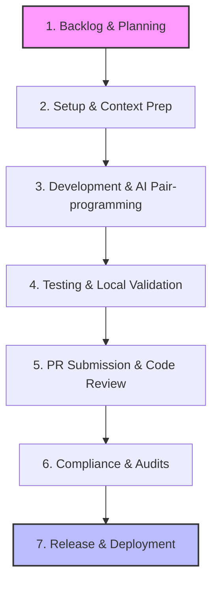

# 01 - Engineering Workflow

This document details the software development lifecycle (SDLC) workflow for the MoroQuant project.

## Development Lifecycle Workflow

## Phase Guidelines

### 1. Backlog & Planning
- All work begins with an explicit ticket or task assignment in the tracking system.
- Requirements must specify **Acceptance Criteria (AC)** before development begins.

### 2. Setup & Context Prep
- Pull the latest changes from the master/main branch.
- Identify existing codebases, design rules, and active settings.
- If using AI tools, feed context rules (e.g., [AGENTS.md](file:///home/zafka/trade-dashboard/AGENTS.md) or [CLAUDE.md](file:///home/zafka/trade-dashboard/CLAUDE.md)) to the AI.

### 3. Development
- Write self-documenting code.
- Adhere strictly to the technology stack.
- Employ AI for boilerplate, bug detection, and edge-case handling.

### 4. Testing & Local Validation
- Run unit tests locally.
- Validate performance with mock datasets or simulations.
- Do not check in code that fails the test suite.

### 5. Pull Request (PR) & Code Review
- Submit PR matching the naming and branch standard.
- Complete review checklist.
- Address human or automated lint errors.

## Phase Responsibility Matrix

| Phase | Responsible | Output / Deliverable |
|---|---|---|
| Planning | Product Owner / Lead | Ticket with AC |
| Setup | Engineer / AI | Clean workspace, branched repo |
| Development | Engineer / AI | Code changes, inline comments |
| Testing | Engineer / AI | Unit tests passing |
| Code Review | Peer Engineers | PR approval |
| Release | Release Engineer | Deployed artifacts, tagged commits |
