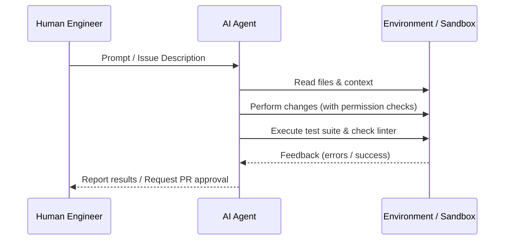

# 02 - AI Collaboration Standard

MoroQuant leverages autonomous AI agents to accelerate development. This document defines the rules of engagement between human engineers and AI agents to ensure codebase stability.

## Agent Collaboration Workflow

## AI Collaboration Rules

### 1. Context and Permission Boundaries
- **No Wildcard Permissions**: AI agents must never request blanket read/write access (`*` or root-level directories).
- **Scope Limitation**: Agents must operate strictly within the target subdirectory of the project.
- **Rule Adherence**: Agents must look for instruction files (e.g., [AGENTS.md](file:///home/zafka/trade-dashboard/AGENTS.md) or specialized agent rule files) to respect system-level constraints.

### 2. Output and Interactivity Rules
- **No Placeholders**: AI agents must provide fully implemented features, not partial templates or `// TODO: implement later` comments.
- **No Direct-to-User Chat for Tasks**: Agents must use designated tools for filesystem operations and should not ask the user to execute steps the agent is capable of running itself.
- **Self-Correction**: Agents are expected to inspect error outputs, fix compile issues, and run unit tests before concluding their execution.

## Agent Roles and Responsibilities

To ensure order, consistency, and alignment with repository boundaries, the system defines clear, non-overlapping roles for the primary AI agents:

### Claude Code Responsibilities
Claude Code is responsible **exclusively for implementation-level tasks**. It operates inside the sandbox to build, repair, and optimize system code.
*   **Production Implementation**: Writing code for features, services, and APIs.
*   **Refactoring**: Restructuring code to improve quality without changing behavior.
*   **Bug Fixes**: Diagnosing and patching runtime and logic bugs.
*   **Database Migrations**: Writing and executing SQL scripts for database schemas.
*   **Tests**: Writing unit, integration, and regression tests.
*   **Runtime Integration**: Interfacing code blocks, setting up handlers, and wiring dependencies.
*   **Performance Optimization**: Enhancing speed, memory usage, and throughput.

> [!IMPORTANT]
> **What Claude Code should NOT do (unless explicitly requested):**
> - Generate audit reports or reviews.
> - Create or alter Architecture Decision Records (ADRs).
> - Draft Request for Comments (RFCs) or Sprint reports.
> - Author design specifications or repository-level governance documentation.

### Antigravity Responsibilities
Antigravity is responsible for **system-level design, documentation, verification, and repository governance**. It ensures structural compliance across the repository.
*   **Audits**: Verifying data, schemas, logic, and configurations against standards.
*   **Architecture**: Designing system topologies, directories, and interface boundaries.
*   **ADR & RFC Management**: Writing and managing ADRs, RFCs, and major design specs.
*   **Documentation**: Authoring guides, books, indices, and collaboration standards.
*   **Research Specifications**: Outlining mathematical, statistical, or data-flow designs.
*   **Sprint Reports & Technical Reviews**: Evaluating implementation results and sprint completions.
*   **Root Cause Analysis (RCA)**: Diagnosing high-level system failures and designing hotfixes.
*   **Repository Governance**: Organizing, classifying, and keeping directories clean.

---

## AI Execution Checklist

- [ ] Has the agent verified the local context rules and system information?
- [ ] Are permissions scoped specifically to the directories containing the target files?
- [ ] Have all proposed code changes been locally compiled and verified?
- [ ] Does the agent explain changes using concise, descriptive reasoning?
- [ ] Have tests run successfully inside the workspace?

