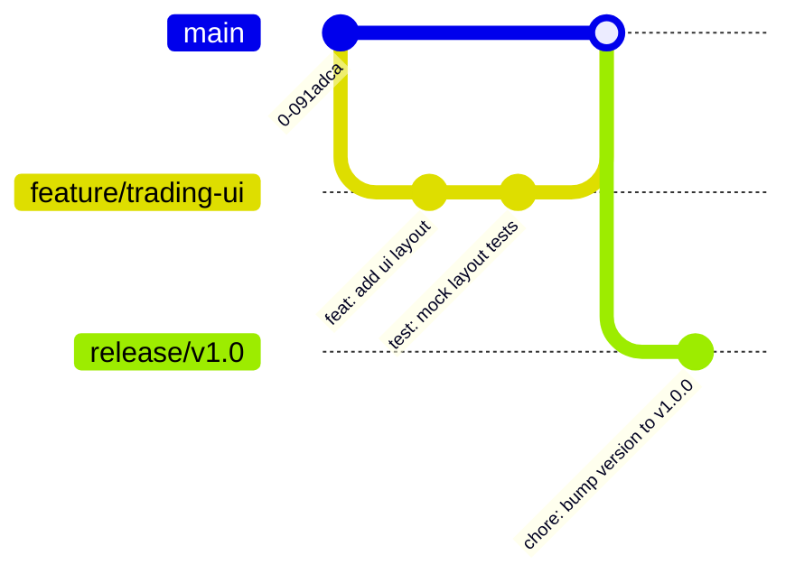

# 03 - Git Workflow

MoroQuant follows a structured Git workflow to ensure branch hygiene, clear history, and reliable integration.

## Branching Strategy

We use a modified Feature Branch workflow. Direct commits to `main` or `master` are strictly prohibited.



### Branch Naming Conventions

| Prefix | Use Case | Example |
|---|---|---|
| `feat/` | New features or capabilities | `feat/tpsl-validation` |
| `fix/` | Bug fixes or hotfixes | `fix/memory-leak-ws` |
| `docs/` | Documentation edits only | `docs/playbook-setup` |
| `test/` | Adding or correcting tests | `test/backtest-edgecases` |
| `chore/` | Maintenance, library updates, config adjustments | `chore/eslint-update` |

## Commit Message Standard

We follow the **Conventional Commits** specification:

```
<type>(<scope>): <description>

[optional body]

[optional footer(s)]
```

### Allowed Types
- **feat**: A new feature
- **fix**: A bug fix
- **docs**: Documentation changes
- **style**: Changes that do not affect the meaning of the code (white-space, formatting, missing semi-colons, etc.)
- **refactor**: A code change that neither fixes a bug nor adds a feature
- **perf**: A code change that improves performance
- **test**: Adding missing tests or correcting existing tests
- **chore**: Changes to the build process or auxiliary tools and libraries

## Pull Request Lifecycle

### PR Checklist
- [ ] Pull latest target branch (`main`) and rebase/merge into feature branch.
- [ ] Keep commits clean and atomic. Squashing commits is encouraged before final review.
- [ ] PR Title follows Conventional Commits format.
- [ ] PR Description specifies the issue/ticket link and explains the "why" and "how".
- [ ] Mandatory green CI/CD build (linting, type checking, unit tests).
- [ ] Approved by at least one maintainer.
