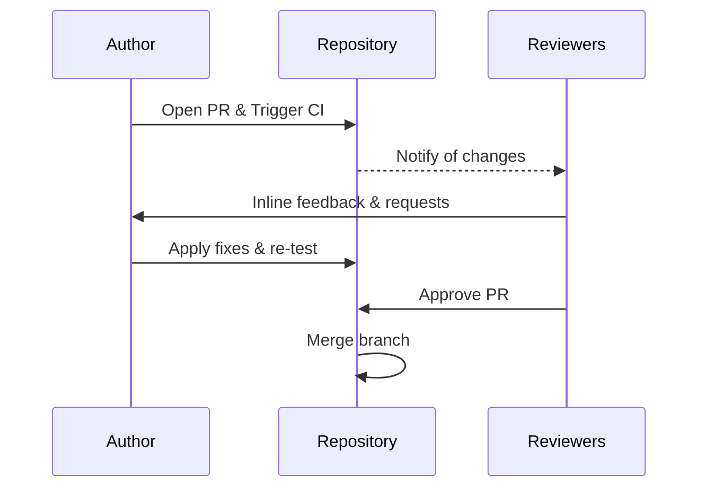

# 05 - Code Review Standard

Code reviews ensure we maintain code health, security, readability, and compatibility. All PRs must go through peer review before merging.

## Review Flow

## Code Quality Benchmarks

### 1. Maintainability and Readability
- Keep functions small and focused on a single responsibility.
- Use meaningful variable and function names.
- Avoid deep nesting (prefer early returns).

### 2. Formatting & Linting
- All PRs must conform to the project eslint and compiler rules.
- Do not bypass linting rules using ignore comments unless specifically authorized in code review.

### 3. Architecture & Patterns
- Follow existing patterns established in the Next.js frontend or Python ML services.
- Keep business logic separated from presentation logic.

## Reviewer Checklist

| Category | Review Items |
|---|---|
| **Correctness** | Does the code satisfy the acceptance criteria? Are edge cases handled? |
| **Testing** | Are unit tests added/modified? Do they test both success and failure states? |
| **Security** | Is user input validated? Are API credentials/secrets kept out of source control? |
| **Performance** | Are database queries or calculations optimized? Any potential infinite loops? |
| **Docs** | Are public methods, classes, and complex modules commented? Are guides updated? |

## Feedback Guidelines
- **Constructive Tone**: Focus on the code, not the author. Explain *why* a change is suggested.
- **Labeling Comments**:
  - `[Blocker]`: Must be resolved before merging.
  - `[Suggestion]`: Quality of life improvement. Optional to implement.
  - `[Question]`: Seeking clarification on design or execution.
