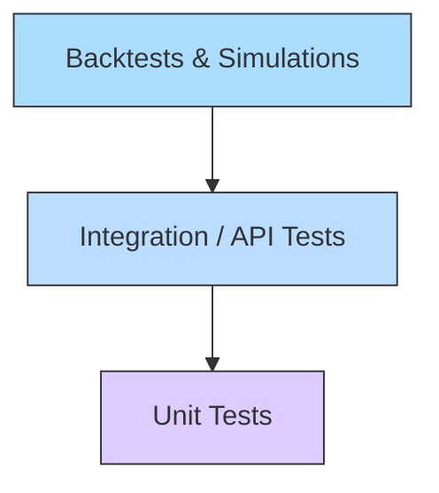

# 06 - Testing Standard

Testing is the foundation of confidence in MoroQuant. We require test coverage across multiple levels of the system to prevent regressions.

## Testing Pyramid

## Test Types

### 1. Unit Tests
- **Frontend**: Jest or Vitest for UI components and custom React hooks.
- **Backend / ML Services**: pytest for trading math, execution models, and data validation rules.
- **Coverage**: Aim for high coverage on core algorithmic logic (e.g., SL/TP validation, execution engines).

### 2. Integration & End-to-End Tests
- API routes must be tested under failure scenarios (e.g. timeout, invalid tokens).
- Use mock integrations for brokers, exchanges, or external data feeds. Do not hit real trading endpoints during testing.

### 3. Backtesting & Simulations
- Quantitative models must go through structured historical backtests.
- Log inputs, outputs, metric calculations (e.g. Sharpe ratio, max drawdown), and timestamp ranges.
- Validate logic against reference sets.

## Running Tests

| Subsystem | Framework | Execution Command Example |
|---|---|---|
| Frontend | npm / Jest / Vitest | `npm run test` or `npm run test:watch` |
| ML Services | pytest | `pytest` |

## Test Design Guidelines
- **Deterministic**: Tests must not rely on live databases, external networks, or real-time clocks (stub system time).
- **Isolation**: Each test case must run independently of others and clean up state afterward.
- **Negative Testing**: Always include test cases for invalid inputs, boundary values, and system errors.
