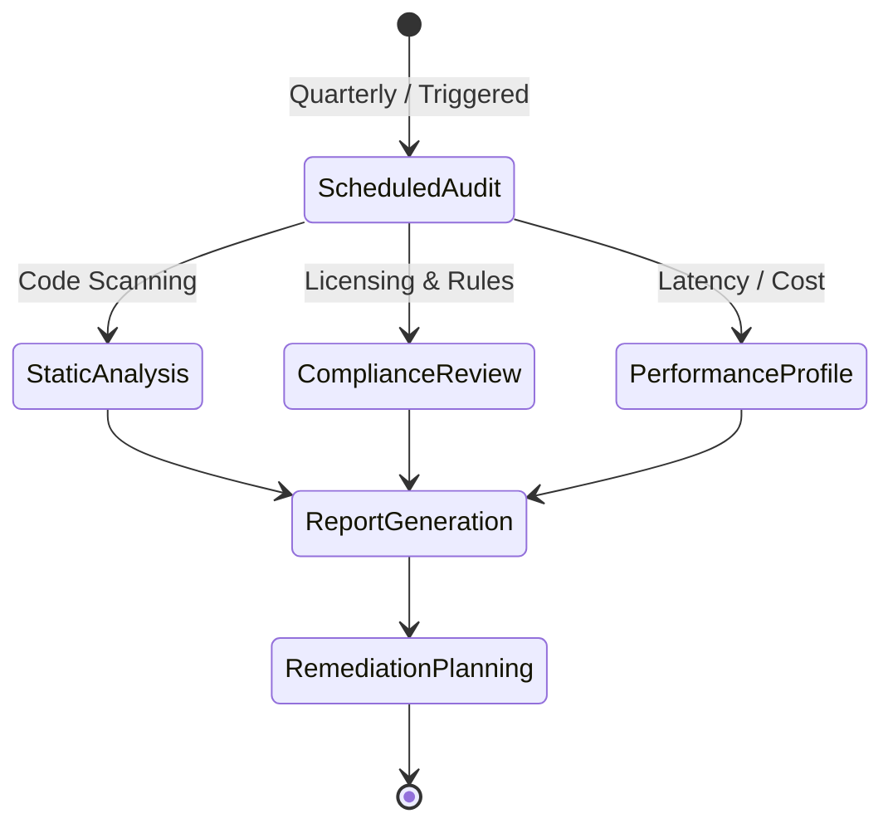

# 07 - Audit Standard

MoroQuant requires regular audits to ensure code security, regulatory compliance, and peak trading performance.

## Audit Workflow

## Audit Domains

### 1. Security Audits
- **Dependency Scanning**: Run automated vulnerability scans (e.g. `npm audit`, `pip-audit`) on external packages.
- **Secrets Auditing**: Prevent credentials, API keys, or private trading details from entering git history.
- **Access Controls**: Audit user permissions, API token lifetimes, and route authorization logic.

### 2. Regulatory & Trade Compliance
- Verify all data feeds and brokerage APIs adhere to licensing agreements.
- Check trade logging processes to ensure comprehensive record-keeping (order tracking, fills, cancel logs).
- Confirm compliance with trade risk boundaries (e.g., maximum drawdowns, leverage limits, risk per trade).

### 3. Performance & Resource Audits
- Profile memory usage and latency, especially in ML model inference and real-time WebSocket feeds.
- Monitor cloud costs, database size growth, and execution speed.

## Audit Schedule and Ownership

| Audit Type | Frequency | Owner | Tooling / Check |
|---|---|---|---|
| Dependency Scan | Weekly (CI/CD) | DevOps / AI | `npm audit`, Dependabot |
| Security Check | Monthly | Lead Architect | Source code review, secret scans |
| Trade Compliance | Quarterly | Compliance Officer | Order history & risk engine audit |
| Performance Profile | Prior to major releases | ML / Frontend Leads | Memory profiling, load tests |
