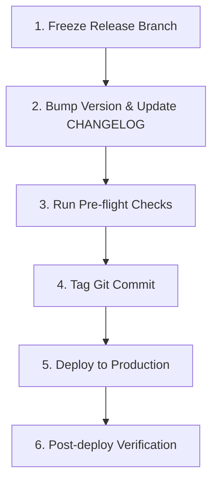

# 08 - Release Process

This document describes the steps required to prepare, tag, verify, and deploy a new release of MoroQuant.

## Release Workflow



## Release Steps

### 1. Release Branch Creation
- Branch off the target integration branch to a dedicated release branch: `release/vX.Y.Z`.
- No new features are allowed on this branch. Only critical bug fixes and documentation patches may be committed.

### 2. Versioning & CHANGELOG
- Follow **Semantic Versioning** (`MAJOR.MINOR.PATCH`).
- Update `VERSION.md` or configuration files with the new version tag.
- Generate or update the `CHANGELOG.md` detailing added features, improvements, and fixes since the last release.

### 3. Pre-flight Checks
- All unit and integration tests must pass on the release branch.
- Execute a final lint check and build process (e.g. `npm run build` for frontend).

### 4. Git Tagging
- Tag the finalized release commit on `main` branch:
  ```bash
  git tag -a vX.Y.Z -m "Release version X.Y.Z"
  git push origin vX.Y.Z
  ```

### 5. Deployment
- Trigger the deployment pipeline to release the web frontend and ML services.
- Ensure database migration strategies (if any) are dry-run tested prior to execution.

## Pre-flight Checklist

- [ ] All unit, integration, and performance tests pass.
- [ ] No blocker issues remain open.
- [ ] `CHANGELOG.md` is updated with changes.
- [ ] Version numbers bumped across relevant package files.
- [ ] System architecture diagrams match the deployed version.
- [ ] Rollback strategy prepared and verified.
