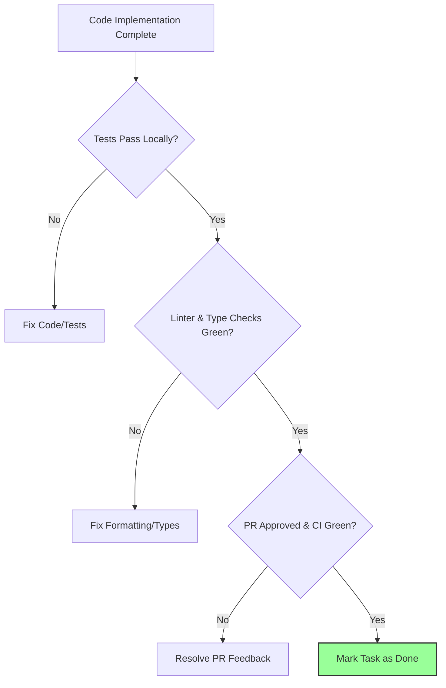

# 10 - Definition of Done

The Definition of Done (DoD) is the final quality gate that every task, user story, or bug fix must pass before it is marked as complete.

## Definition of Done Checklist

Every task must fulfill the following criteria:

### 1. Implementation
- [ ] Code compiles without warnings or errors.
- [ ] No placeholder or partial implementation code remains.
- [ ] Code adheres to the established project coding style, design systems, and tech stack guidelines.
- [ ] No secrets, private credentials, or keys are hardcoded in the source files.

### 2. Testing
- [ ] Unit tests are written for all new logic.
- [ ] Pre-existing test suite passes successfully.
- [ ] Integration tests verify interactions with mocked external APIs.
- [ ] Local manual testing confirms the Acceptance Criteria are met.

### 3. Documentation
- [ ] Code is self-documenting with descriptive names.
- [ ] Complex algorithms, workarounds, or business logic include clear inline explanations.
- [ ] Related system guides, READMEs, or architectural documents are updated.
- [ ] If architectural changes were introduced, an ADR was written and accepted.

### 4. Code Review & Integration
- [ ] Pull Request is raised with Conventional Commit naming.
- [ ] Code is approved by at least one peer engineer.
- [ ] Linting, type checks, and formatting tasks pass green in CI.
- [ ] The feature branch is successfully merged into the integration branch.

## DoD Gatekeeper Flow

