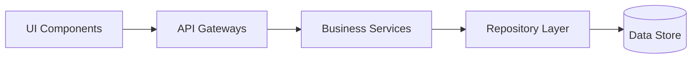

# 12 - Architecture Principles

This document highlights the architectural pillars that govern MoroQuant development.

## Core Architectural Pillars

### 1. Separation of Concerns (SoC)
- Visual components must not interact directly with raw SQL or remote execution sockets.
- System services must delegate persistence to standard repository implementations.

### 2. High Concurrency and Low Latency
- Core trading loops must be optimized to run deterministically.
- Asynchronous tasks must run in dedicated background pipelines, freeing up the client API threads.

### 3. Modularity
- Create components and services that are decoupled.
- Swap subsystems (e.g. data feeds, brokers) using standard interface patterns.

## Domain Boundaries

## Architecture Checklist
- [ ] Business logic is separated from framework specifics.
- [ ] Dependencies point inward toward the core domain logic.
- [ ] Direct module couplings are minimized via interface abstractions.
