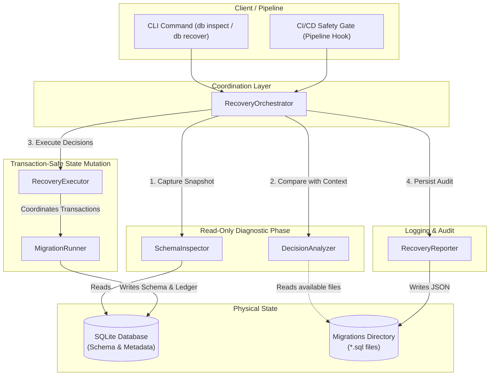
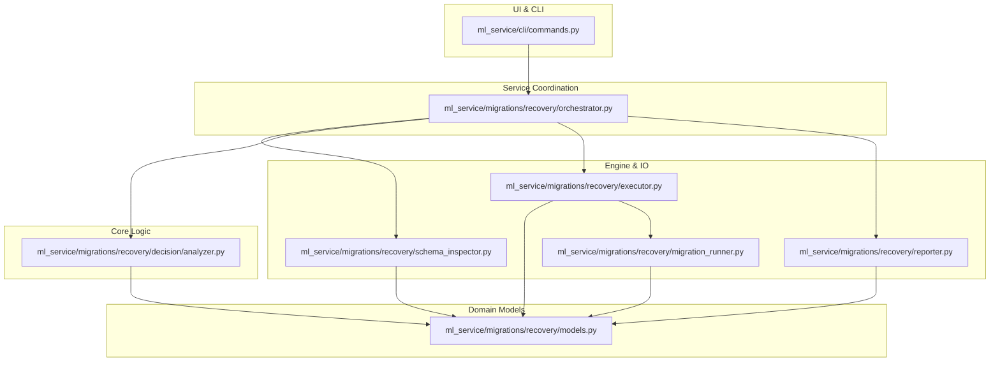
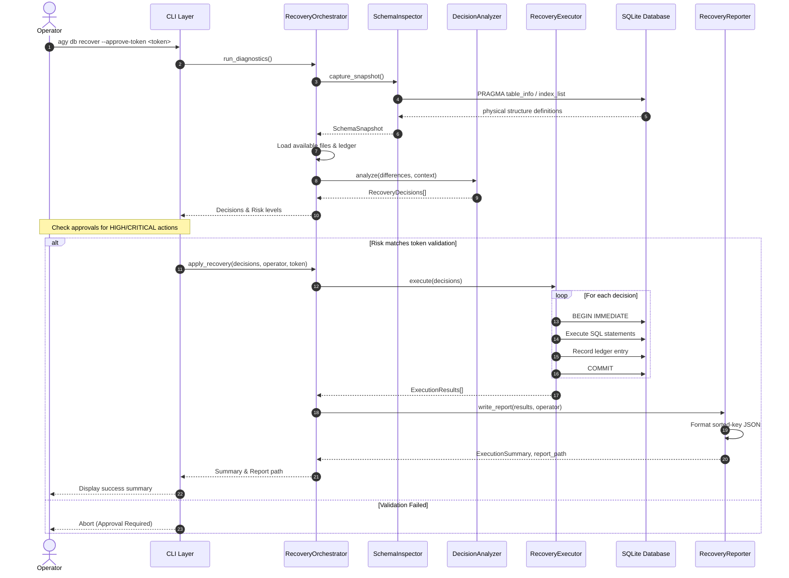

# Database Recovery Framework Architecture

This document describes the design and system architecture of the Database Recovery & Migration Reconciliation Framework (ADR-023 v1.1).

---

## 1. Architectural System Diagram

The Recovery Framework isolates diagnostic logic from state-modifying execution. The following block diagram shows the logical relationships between runtime components:



---

## 2. Component Responsibilities

| Component | Responsibility | Constraints |
| :--- | :--- | :--- |
| **`RecoveryOrchestrator`** | Coordinates the entire recovery workflow. It constructs the input context, executes diagnostics, triggers validation gates (e.g., approval token checks), runs the execution layer, and invokes the reporter. | Stateless. Contains no database mutations or direct IO. |
| **`SchemaInspector`** | Queries `sqlite_master` and database schemas to reconstruct the physical structure ("Schema Truth") as an immutable `SchemaSnapshot`. | Read-only. Does not query migration files or write to the database. |
| **`DecisionAnalyzer`** | Receives the `SchemaSnapshot` and compares it against the `DecisionContext` (applied ledger and filesystem files) to calculate classifications, risk grades, and recommendations. | Pure function. Completely deterministic and isolated from external dependencies. |
| **`RecoveryExecutor`** | Consumes approved `RecoveryDecision` payloads and executes the corrective actions. Coordinates transactional grouping and fail-fast behaviors. | Side-effect heavy. Modifies database state using short-lived transactions. |
| **`MigrationRunner`** | Underlying engine that parses SQL files, acquires SQLite table locks, applies statement sets, and updates the `schema_migrations` ledger. | Atomic transactions. Rolls back database to original state on any failure. |
| **`RecoveryReporter`** | Gathers execution telemetry, builds the `ExecutionSummary` object, and serializes a deterministic, sorted-key JSON report to the filesystem. | Restricts paths to avoid directory traversal. Writes atomically using a temporary staging file. |

---

## 3. Dependency Graph

The framework relies on strict dependency boundaries. Lower layers must never depend on higher layers.



---

## 4. Execution Sequence Diagram

The interaction sequence for a complete database recovery run shows the separation of the read-only phase from the execution phase:



---

## 5. Lifecycle Phases

The framework operates under three distinct lifecycle pipelines:

### 5.1 Dry-Run Lifecycle (Diagnostics)
1. **Instantiation**: The orchestrator resolves absolute paths to the database and migration assets.
2. **Inspection**: The `SchemaInspector` collects physical metadata (tables, columns, default values, indices).
3. **Ledger Alignment**: The orchestrator scans the filesystem and queries the `schema_migrations` table to build the `DecisionContext`.
4. **Analysis**: The `DecisionAnalyzer` matches differences against the taxonomy, determines risk metrics, and returns decisions.

### 5.2 Apply Lifecycle (State Modification)
1. **Pre-Execution Check**: Verifies that no `HALT` recommendations exist and that the environment is clear.
2. **Approval Verification**: Matches calculated risk grades with user validation prompts and secure tokens.
3. **Stepwise Transactions**: Applies statements grouped by decision.
4. **Ledger Update**: Synchronizes physical schema changes with entries inside `schema_migrations`.
5. **Auditing**: Emits the final execution telemetry to the audit storage log.

### 5.3 Approval Token Lifecycle
The token controls the deployment permissions for high-impact drift remediation:
* **Storage**: Protected environment variable (`MQ_CTO_APPROVAL_TOKEN`) on deployment target servers.
* **Handshake**: Passed from CLI runtime flag `--approve-token` (or local env variable) into `RecoveryOrchestrator.apply_recovery`.
* **Assertion**: If the analyzer labels any decision as `HIGH` or `CRITICAL`, the orchestrator checks that the input token matches the server-side environment value. If it mismatches, it halts immediately with `ApprovalRequiredError`.

---

## 6. Transaction Ownership & Boundaries

```
                    ┌────────────────────────────┐
                    │      RecoveryExecutor      │
                    └─────────────┬──────────────┘
                                  │ Directs loop
                                  v
                    ┌────────────────────────────┐
                    │      MigrationRunner       │
                    └─────────────┬──────────────┘
                                  │
         ┌────────────────────────┴────────────────────────┐
         │ BEGIN IMMEDIATE                                 │
         │   -> Applies corrective DDL statement           │
         │   -> Inserts entry in schema_migrations ledger  │
         │ COMMIT / ROLLBACK on Exception                  │
         └─────────────────────────────────────────────────┘
```

* **Unit of Atomicity**: Every recovery decision has its own isolated transaction boundary. 
* **Rollback Isolation**: A DDL syntax failure or index conflict within a specific recovery step triggers an immediate transaction `ROLLBACK`. This prevents partial states and ensures that only fully successful steps are recorded in the ledger.
* **Database Isolation**: The runner sets `PRAGMA busy_timeout = 5000` and locks tables using immediate-write permissions to prevent deadlocks and block read/write operations by other connections during the short recovery windows.
