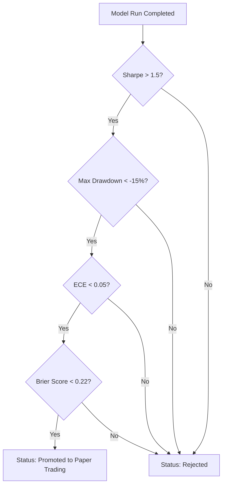

# Experiment Tracking Specification

## Overview
The Experiment Tracking service acts as the metadata ledger for all machine learning training and optimization runs. It captures the complete environment state, input datasets, model configurations, results, and logs, making sure that every quantitative research test can be fully reviewed, verified, and compared.

---

## Run Metadata Structure
Each training execution is categorized as a **Run** under a parent **Experiment**. It contains the following properties:

- **Experiment ID**: Globally unique identifier linking a series of runs to a single quantitative objective (e.g., `exp_btc_trend_following_v1`).
- **Run ID**: Unique hash (UUIDv4) identifying the specific execution run (e.g., `run_7f8a9b2c-3d4e...`).
- **Status**: The execution state of the run:
  - `CREATED`: Pre-execution setup.
  - `RUNNING`: Training loop actively executing.
  - `COMPLETED`: Finished training and evaluations.
  - `FAILED`: Aborted due to hardware or code exceptions.

---

## Inputs and Parameters
To recreate a run exactly, the system logs all inputs and parameters:

- **Dataset Version**: The exact dataset version ID used (e.g., `ds_btc_hourly_volatility_v1.0.0`).
- **Feature Version**: A map of active feature versions used in the model (e.g., `{"volatility.atr_14": "1.0.1", "momentum.rsi": "1.1.0"}`).
- **Model Version**: The registered model structure name and software version (e.g., `ensemble_xgb_lgbm_v2.1.0`).
- **Hyperparameters**: Key-value store of model-specific configurations:
  ```json
  {
    "xgb_max_depth": 6,
    "xgb_learning_rate": 0.03,
    "lgbm_num_leaves": 31,
    "ensemble_weights": {"xgb": 0.6, "lgbm": 0.4}
  }
  ```

---

## Performance Metrics
Metrics are divided into three distinct phases to ensure no temporal leakage occurs:

### 1. Training Metrics
- **Train Loss**: Optimization objective value.
- **Validation Loss**: Early-stopping monitor value.

### 2. Walk-Forward Backtest Metrics
- **Sharpe Ratio**: Risk-adjusted excess return (annualized).
- **Sortino Ratio**: Downside risk-adjusted excess return (annualized).
- **Calmar Ratio**: Annualized return divided by Max Drawdown.
- **Profit Factor**: Gross profits divided by gross losses.
- **Win Rate**: Number of profitable trades divided by total trades.
- **Max Drawdown**: Maximum peak-to-trough equity drop.

### 3. Statistical and Calibration Metrics
- **ECE (Expected Calibration Error)**: Difference between predicted confidence and actual win rate.
- **Brier Score**: Mean squared error of the predicted probability vs. binary win outcomes.

---

## Artifacts and Logs
A completed run must export its run logs and model outputs to the storage layer:
- **Model Binaries**: Serialized model structures (e.g., `.json` for XGBoost, `.txt` for LightGBM).
- **Optimizer Config**: Parameters used during search routines (e.g., Optuna study `.db` files).
- **Equity Curves**: Complete chronological series of backtest account value.
- **Feature Importance**: Exported pandas matrices detailing SHAP values and gain metrics.
- **Logs**: Text outputs from stdout/stderr captured during the run.

---

## Comparison and Ranking Engine
The Comparison Engine evaluates runs using a composite Scorecard:

```
Scorecard = w_1 * Sharpe + w_2 * (1 - MaxDrawdown) + w_3 * (1 - ECE)
```

Runs are ranked within an Experiment, allowing researchers to filter the top performing runs.

```
Experiment: Trend Following V1
├── Rank 1: Run_7f8a9b2c (Sharpe: 2.1, MaxDD: -12.4%, ECE: 0.04) ──► Candidate
├── Rank 2: Run_5a3c2b1d (Sharpe: 1.8, MaxDD: -8.2%,  ECE: 0.06)
└── Rank 3: Run_9d8e7f6a (Sharpe: 1.5, MaxDD: -15.1%, ECE: 0.09)
```

---

## Promotion Criteria
To move a model from Research/Backtest to Paper Trading, it must pass a strict quality gate:



### Promotion Gate Checklist:
1. **Walk-Forward Sharpe**: Greater than 1.5.
2. **Maximum Drawdown**: Shall not exceed 15% in historical backtests.
3. **Calibration Validation**: Expected Calibration Error (ECE) must be under 0.05.
4. **Significance Check**: Minimum of 100 trades completed in the validation set.
5. **Approval**: Verification from the Principal Quant Architect (database transaction record).
