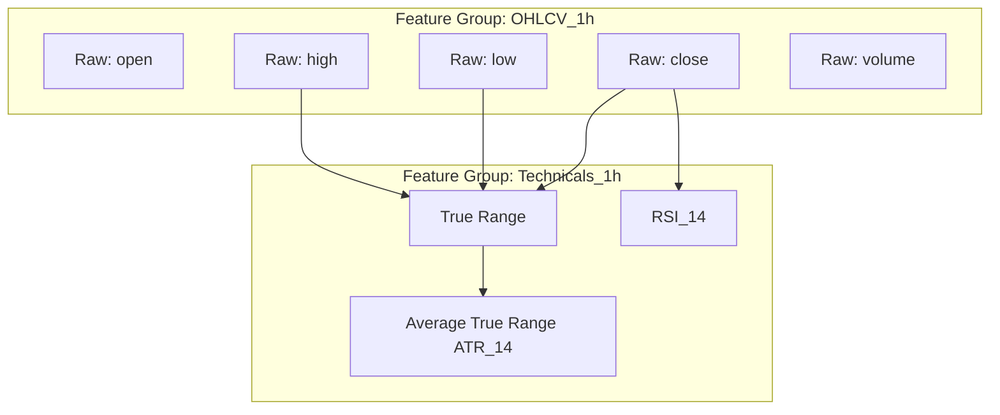

# Feature Store Architecture Specification

## Overview
The Feature Store serves as the single source of truth for all quantitative indicators, signal features, and targets. It decouples the process of calculating features from the model training and model serving routines. This ensures that the identical feature code runs in historical simulation (offline) and live trading (online), eliminating train-test leakage.

---

## Feature Registry
The Feature Registry is a catalog containing definitions of all registered features. It serves as an API search index for researchers to locate and reuse existing features. A feature must be registered before it can be computed or included in a dataset.

### Registry Attributes:
- **Identifier**: Unique string namespace (e.g., `volatility.atr_14`).
- **Feature Group**: Collection of features computed together (e.g., `volatility`).
- **Status**: State of the feature (`DEVELOPMENT`, `ACTIVE`, `DEPRECATED`).
- **Owner**: Developer or researcher who created the feature.

---

## Feature Metadata
Every feature requires comprehensive metadata defining its mathematical attributes and computation properties:

```json
{
  "feature_name": "rsi_14_1h",
  "namespace": "momentum.rsi",
  "version": "1.1.0",
  "data_type": "float64",
  "description": "Relative Strength Index computed over a 14-period window using 1-hour close prices.",
  "parameters": {
    "window_size": 14,
    "source_field": "close",
    "smoothing_method": "wilders"
  },
  "dependencies": [
    "ohlcv.close"
  ],
  "computation_source": "from ta.momentum import RSIIndicator; ...",
  "statistics": {
    "min": 0.0,
    "max": 100.0,
    "mean": 51.24,
    "std_dev": 12.35
  }
}
```

---

## Feature Versioning
Feature code evolves over time (e.g., fixing an edge-case bug in calculation, optimizing performance). Features are versioned using SemVer principles:
- **Major (X.0.0)**: Incompatible changes that shift the feature's output values for the same input row. (e.g., switching from exponential moving average smoothing to simple moving average smoothing in MACD).
- **Minor (1.Y.0)**: Backward-compatible additions (e.g., adding an optional parameter that defaults to the original behavior).
- **Patch (1.0.Z)**: Implementation improvements that do not affect mathematical outputs (e.g., optimizing memory usage, converting loop-based code to vectorized NumPy code).

---

## Feature Groups
Features that share the same ingestion source, computation frequency, and entity key (e.g., `symbol` + `timestamp`) are organized into **Feature Groups**.

```
Feature Store Root
  ├── ohlcv_1h (Group)
  │     ├── open
  │     ├── high
  │     ├── low
  │     └── close
  ├── volatility_1h (Group)
  │     ├── atr_14
  │     └── bollinger_upper_20
  └── funding_rates (Group)
        ├── funding_rate
        └── predicted_funding_rate
```

Each Feature Group has:
- A defined schema.
- An update frequency (e.g., hourly, daily, on-tick).
- Storage configurations (e.g., path to parquet files in Blob Storage, SQL tables).

---

## Feature Lineage and Dependencies
Feature Lineage tracks the dependency tree of how a feature is derived. A feature can depend on raw fields, other features, or external variables.



Lineage validation prevents **circular dependencies** at registration time by building a directed acyclic graph (DAG) of all calculations.

---

## Future Online Feature Store Compatibility
To transition from offline model training (historical parquet/SQL files) to online model serving (sub-second live inference during paper/live trading), the Feature Store is designed for dual-path access:

```
                      ┌────────────────────────┐
                      │ Feature Store API      │
                      └───────────┬────────────┘
                                  │
                  ┌───────────────┴───────────────┐
                  ▼                               ▼
    ┌───────────────────────────┐   ┌───────────────────────────┐
    │ Offline Path (Batch)      │   │ Online Path (Streaming)   │
    │ - Cold Blob Storage       │   │ - In-Memory Cache (Redis) │
    │ - Walk-Forward Training   │   │ - Low Latency Inferences  │
    └───────────────────────────┘   └───────────────────────────┘
```

### Transition Architecture:
1. **Unified Interface**: The same python function `get_features(symbol, timestamp)` is called by the training code and inference engine.
2. **In-Memory Cache (Redis/Key-Value)**: The online path stores the most recent $N$ periods of data in a high-speed cache, updating via exchange WebSocket feeds.
3. **Point-in-Time Join Engine**: When historical data is retrieved, the Feature Store joins data based on the matching time index to prevent data leakage from the future.
