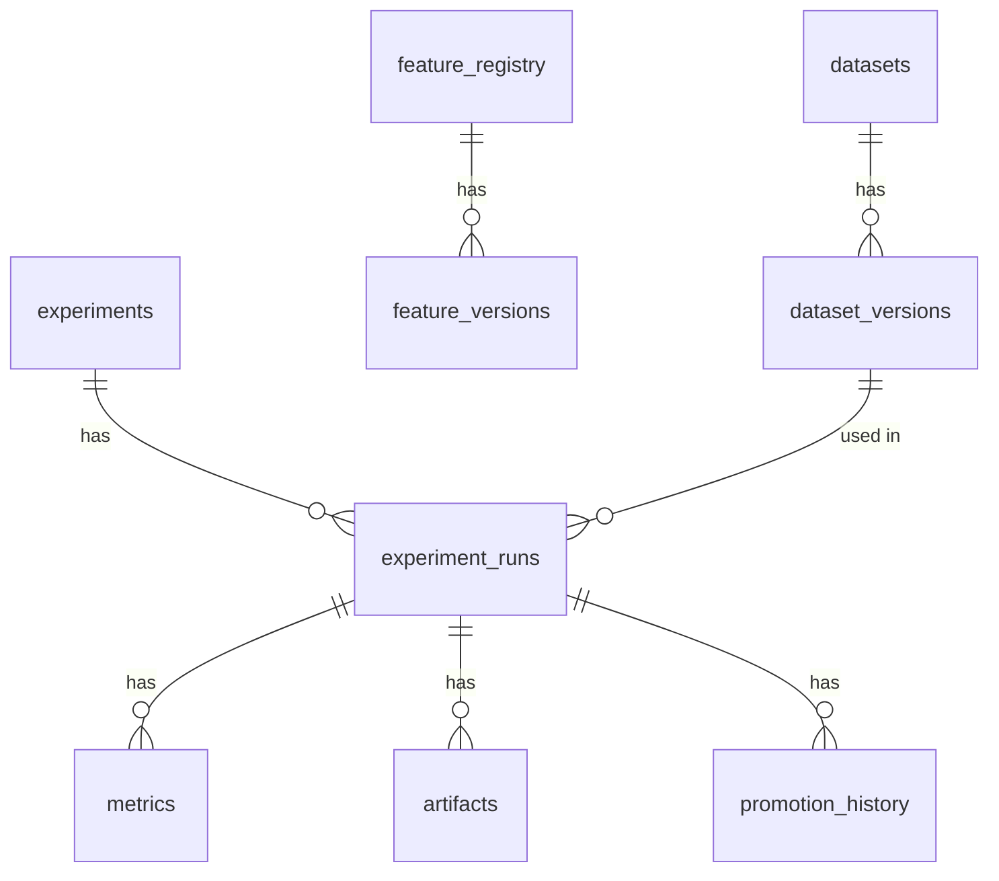

# Research Database Design Specification

## Overview
This document specifies the database tables required to support dataset versioning, feature cataloging, experiment tracking, and model promotion history. 

---

## Database Schema (Logical Layout)

### 1. `datasets`
Represents the parent definition of a dataset query configuration.
- `id` (UUID, Primary Key)
- `name` (VARCHAR, Unique) — e.g., `btc_hourly_volatility`
- `description` (TEXT)
- `created_by` (VARCHAR)
- `created_at` (TIMESTAMP)

### 2. `dataset_versions`
Represents a specific frozen dataset generated for model training.
- `id` (UUID, Primary Key)
- `dataset_id` (UUID, Foreign Key -> `datasets.id`)
- `version_string` (VARCHAR) — e.g., `1.0.0`
- `fingerprint` (VARCHAR) — HMAC-SHA256 hash of the content
- `storage_uri` (VARCHAR) — path to frozen Parquet/CSV in object storage
- `start_time` (TIMESTAMP) — temporal boundary start
- `end_time` (TIMESTAMP) — temporal boundary end
- `metadata_json` (JSONB) — feature list, scaling factors, row counts
- `is_frozen` (BOOLEAN) — true if immutable and locked
- `created_at` (TIMESTAMP)

### 3. `feature_registry`
Represents registered features available in the system.
- `id` (UUID, Primary Key)
- `name` (VARCHAR, Unique) — e.g., `volatility.atr_14`
- `description` (TEXT)
- `feature_group` (VARCHAR) — e.g., `volatility`
- `data_type` (VARCHAR) — e.g., `float64`
- `status` (VARCHAR) — e.g., `DEVELOPMENT`, `ACTIVE`, `DEPRECATED`
- `created_at` (TIMESTAMP)

### 4. `feature_versions`
Tracks versions of feature logic code.
- `id` (UUID, Primary Key)
- `feature_id` (UUID, Foreign Key -> `feature_registry.id`)
- `version_string` (VARCHAR) — e.g., `1.0.0`
- `source_code` (TEXT) — python logic snippet
- `git_commit` (VARCHAR) — git commit containing the code
- `dependency_json` (JSONB) — upstream features or raw columns needed
- `created_at` (TIMESTAMP)

### 5. `experiments`
Groups research runs targeting a single objective.
- `id` (UUID, Primary Key)
- `name` (VARCHAR, Unique) — e.g., `exp_btc_trend_following_v1`
- `description` (TEXT)
- `created_by` (VARCHAR)
- `created_at` (TIMESTAMP)

### 6. `experiment_runs`
Tracks individual training and testing runs.
- `id` (UUID, Primary Key)
- `experiment_id` (UUID, Foreign Key -> `experiments.id`)
- `dataset_version_id` (UUID, Foreign Key -> `dataset_versions.id`)
- `status` (VARCHAR) — `CREATED`, `RUNNING`, `COMPLETED`, `FAILED`
- `hyperparameters_json` (JSONB) — model configuration parameters
- `model_version` (VARCHAR) — configuration identifier
- `model_storage_uri` (VARCHAR) — path to serialized weights
- `run_duration_seconds` (INTEGER)
- `created_at` (TIMESTAMP)
- `ended_at` (TIMESTAMP)

### 7. `metrics`
Logs metrics computed during or after training.
- `id` (BIGINT, Primary Key)
- `run_id` (UUID, Foreign Key -> `experiment_runs.id`)
- `metric_key` (VARCHAR) — e.g., `sharpe_ratio`, `ece`
- `metric_value` (DOUBLE PRECISION)
- `step` (INTEGER) — index (e.g., training epoch or validation fold)
- `timestamp` (TIMESTAMP)

### 8. `artifacts`
Tracks outputs generated during runs.
- `id` (UUID, Primary Key)
- `run_id` (UUID, Foreign Key -> `experiment_runs.id`)
- `name` (VARCHAR) — e.g., `equity_curve.png`, `optuna_study.db`
- `storage_uri` (VARCHAR) — object storage location
- `file_type` (VARCHAR) — e.g., `png`, `db`, `json`
- `created_at` (TIMESTAMP)

### 9. `reports`
Aggregated comparison files and research paper drafts.
- `id` (UUID, Primary Key)
- `name` (VARCHAR) — e.g., `sprint_3_5_btc_evaluation_report`
- `description` (TEXT)
- `run_ids` (JSONB) — array of run UUIDs included in the comparison
- `markdown_content` (TEXT) — compiled markdown text
- `created_by` (VARCHAR)
- `created_at` (TIMESTAMP)

### 10. `promotion_history`
Tracks the history of model promotions to production.
- `id` (UUID, Primary Key)
- `run_id` (UUID, Foreign Key -> `experiment_runs.id`)
- `target_environment` (VARCHAR) — e.g., `PAPER_TRADING`, `PRODUCTION`
- `promoted_by` (VARCHAR)
- `promotion_reason` (TEXT)
- `metadata_json` (JSONB) — benchmark comparison links, approval digital signatures
- `created_at` (TIMESTAMP)

---

## Entity Relationship Diagram

