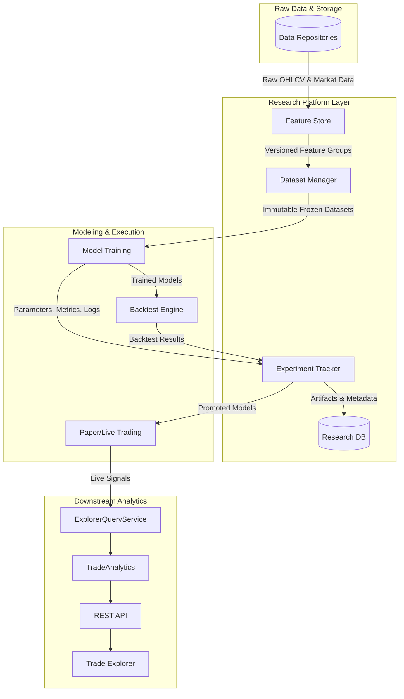
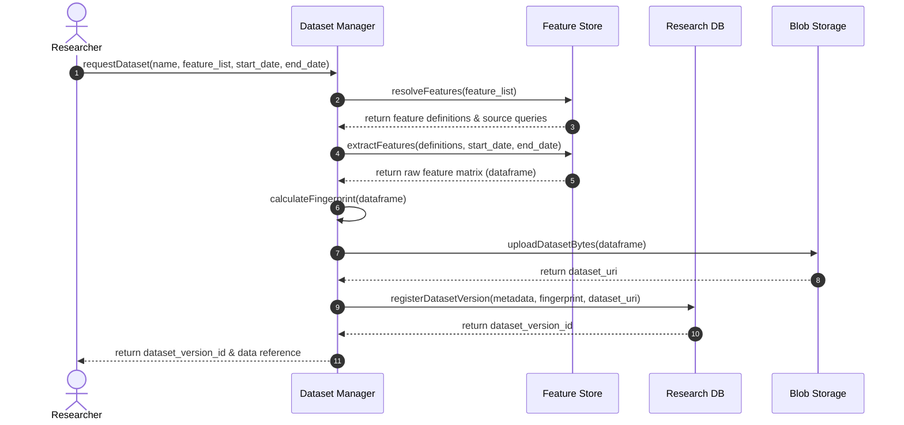
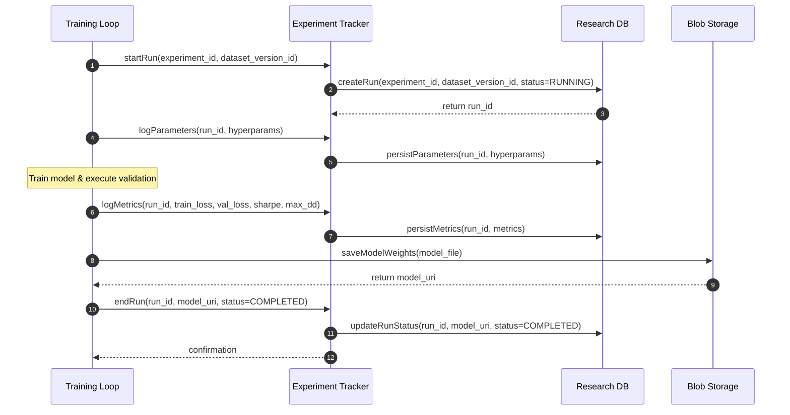
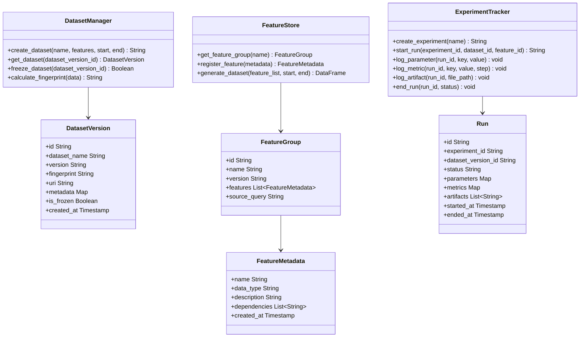

# Research Platform Architecture Specification

## Purpose
The MoroQuant Research Platform serves as the foundational data and metadata orchestration layer that precedes model training. Its primary purpose is to transform quantitative research from an ad-hoc, manual process into a structured, reproducible, and verifiable engineering pipeline. By establishing rigorous versioning, tracking, and comparison frameworks, the platform ensures that all production-bound trading signals are backed by auditable statistical evidence and reliable data lineage.

## Goals
- **Deterministic Reproducibility**: Ensure any research result, backtest, or trained model can be fully reproduced given the exact dataset and feature definitions used.
- **Unified Feature Store**: Provide a centralized, versioned, and documented repository of features to eliminate train-test leakage and facilitate feature reuse.
- **Comprehensive Experiment Tracking**: Automatically record all parameters, datasets, features, model metrics, and artifacts during research phases.
- **Rigorous Evaluation & Comparison**: Provide standard quantitative metrics (Sharpe, Sortino, Calmar, profit capture, regime-based performance) to objectively rank models.
- **Seamless Promotion Workflow**: Establish clear, automated promotion pathways from backtest to paper trading, and eventually to live trading.

## Scope
- Design of the Dataset Manager, Feature Store, and Experiment Tracker layers.
- Definition of database schemas, metadata standards, and data flow pipelines.
- Draft of REST API specifications for interaction with the research services.
- Detailed workflow definitions spanning research, backtest, and promotion phases.

## Non-Goals
- Implementation of database migrations, SQL schemas, or application code.
- Optimization of the live trading execution engine or order routing mechanisms.
- Modification of existing trading explorer interfaces or analytical engines.

---

## System Context
The Research Platform sits directly between raw data repositories and the model training loop, serving as the gateway to all machine learning workflows.



---

## Component Diagram
The diagram below details the internal components of the Research Platform and their interaction patterns.

```mermaid
graph ND
    subgraph Research Platform
        direction TB
        FR[Feature Registry] <--> FS[Feature Store Service]
        DR[Dataset Registry] <--> DM[Dataset Manager Service]
        ER[Experiment Registry] <--> ET[Experiment Tracking Service]
        MR[Model Registry] <--> MC[Comparison Engine]
    end

    subgraph Data Store
        RDB[(Metadata Database)]
        Blob[(Artifact Blob Storage)]
    end

    %% Component Connections
    FS <--> DM
    DM <--> ET
    ET <--> MR
    MC <--> MR

    %% Persistence Connections
    FR -.->|Schema & Lineage| RDB
    DR -.->|Dataset Metadata| RDB
    ER -.->|Runs & Metrics| RDB
    MR -.->|Model Registry Metadata| RDB
    MR -.->|Model Artifact Binaries| Blob
    DR -.->|Frozen Dataset Files| Blob
```

---

## Sequence Diagrams

### Sequence 1: Dataset Generation and Freezing
This workflow demonstrates how a researcher requests a dataset, extracts features, computes fingerprints, and freezes the dataset for training.



### Sequence 2: Experiment Tracking and Model Registration
This sequence tracks an active training run, logging parameters, metrics, and persisting the resulting model.



---

## Class Diagrams



---

## Data Flow
The flow of data starts with raw market ingest and flows through transformation layers until it yields a validated signal model.

1. **Ingest & Clean**: Raw tick and candlestick data are retrieved from exchanges via the existing Repositories layer.
2. **Feature Computation**: Features are computed deterministically by the Feature Store and registered with versioned metadata.
3. **Dataset Assembly**: Features are sliced temporally, merged, and fingerprinted. The resulting dataset is frozen in storage.
4. **Model Training**: The Model Training pipeline pulls the frozen dataset, trains the ensemble models, and logs all training metadata.
5. **Backtest & Validate**: Models are backtested against out-of-sample data. Walk-forward statistics are recorded in the Experiment Tracker.
6. **Promotion & Integration**: Evaluated models meeting promotion criteria are flagged for promotion to paper trading, where they start producing real-time mock signals.

---

## Research & Experiment Lifecycle

### Research Lifecycle
```
Idea Generation ──> Feature Formulation ──> Dataset Definition ──> Backtest Strategy ──> Model Auditing
```
- **Idea**: Formulate trading thesis based on market observations or mathematical properties.
- **Features**: Write code for new features, register them in the Feature Registry, and track their version.
- **Dataset**: Merge new and existing features into a labeled dataset over specific historical training windows.
- **Backtest**: Run walk-forward simulations, optimization runs (such as Optuna parameters), and log the outputs.
- **Auditing**: Execute path-dependent MAE/MFE validation and regime stability checks.

### Experiment Lifecycle
```
Created ──> Running ──> Succeeded/Failed ──> Evaluated ──> Candidate ──> Promoted ──> Retired
```
- **Created**: Experiment run initialized in database; parameters locked.
- **Running**: Active training process executing computations.
- **Succeeded/Failed**: Run completes successfully (persisting artifacts) or terminates on error.
- **Evaluated**: Comparison engine ranks the run against benchmark runs using statistical ratios.
- **Candidate**: Model meets performance thresholds and is queued for verification.
- **Promoted**: Flagged for paper trading or live deployment.
- **Retired**: Superseded by a newer, superior model; marked inactive but kept for audit trails.

---

## Future Integration
- **Paper Trading**: The Research Platform exposes an active model endpoint where the paper trading execution worker retrieves active model versions, downloads model binaries, and runs inferences against live WebSocket streams.
- **Live Trading**: Integrates via a secure gateway that verifies a model's promotion history, checks the data lineage of features used, and maps the model to live execution configurations.
