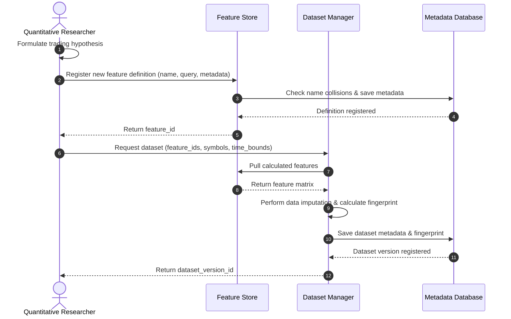
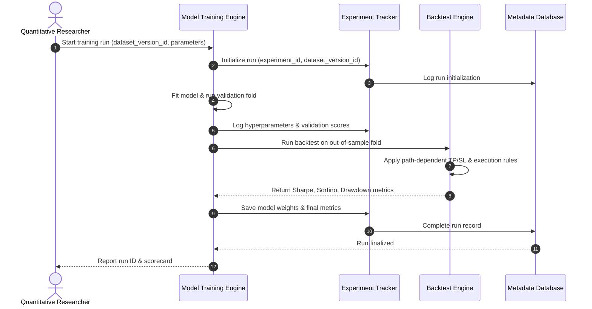
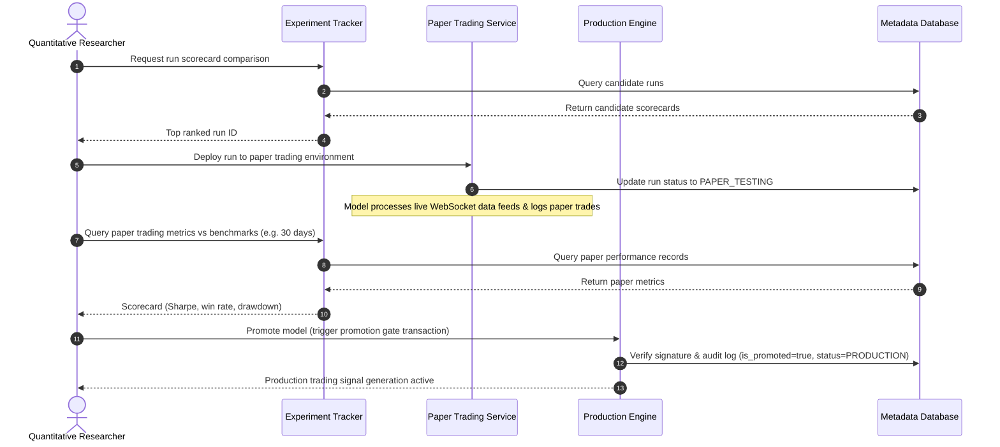

# Research Workflow Specification

## Introduction
The Research Workflow defines the standard operating lifecycle of a trading idea at MoroQuant. It governs how a quantitative hypothesis moves through feature engineering, model training, risk validation, paper trading, and eventual production deployment, enforcing gatekeeping protocols at each stage.

---

## The Workflow Pipeline

```
┌──────┐    ┌─────────┐    ┌──────────┐    ┌──────────┐    ┌────────────┐
│ Idea ├───►│ Dataset ├───►│ Features ├───►│ Training ├───►│ Validation │
└──────┘    └─────────┘    └──────────┘    └──────────┘    └─────┬──────┘
                                                                 │
┌────────────┐    ┌───────────────┐    ┌───────────┐    ┌────────▼───┐
│ Production │◄───┤ Promotion Gate │◄───┤ Paper Tr. │◄───┤  Backtest  │
└────────────┘    └───────────────┘    └───────────┘    └────────────┘
```

1. **Idea Phase**: Formulate a hypothesis (e.g., "Funding rate divergence indicates local bottoms during volatile regimes").
2. **Dataset Phase**: Identify targeted symbols, sample intervals, and temporal bounds.
3. **Features Phase**: Design and implement technical indicators or alternative data metrics in the Feature Store.
4. **Training Phase**: Fit candidate models (e.g., XGBoost, LightGBM) on the training portion of the dataset.
5. **Validation Phase**: Perform walk-forward, out-of-sample tests to check calibration and generalizability.
6. **Backtest Phase**: Run historical simulations using path-dependent stop-loss/take-profit parameters.
7. **Paper Trading Phase**: Deploy the model in a simulated forward-testing environment with live websocket data feeds.
8. **Promotion Gate Phase**: Assess model performance against live benchmarks and execute the promotion transaction.
9. **Production Phase**: Route actual capital signals to exchange APIs.

---

## Detailed Sequence Flows

### Sequence 1: Idea Validation, Feature Engineering, and Dataset Creation
This flow traces how raw ideas get translated into registered features and frozen datasets.



### Sequence 2: Model Training, Backtesting, and Validation
This flow details how the dataset is used to train, evaluate, and backtest a model.



### Sequence 3: Paper Trading Deployment and Promotion to Production
This flow tracks live forward testing and the promotion to production.


