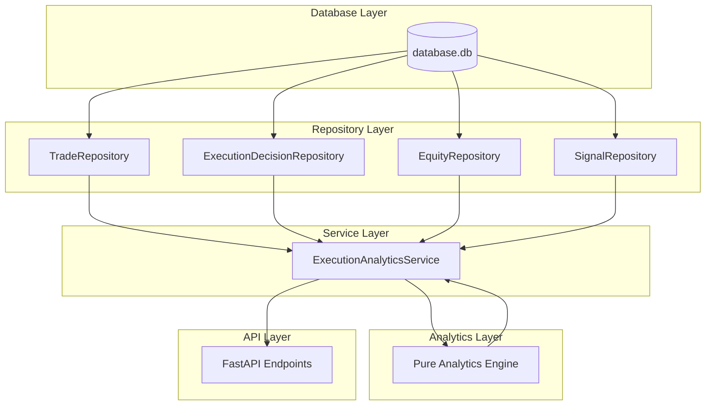
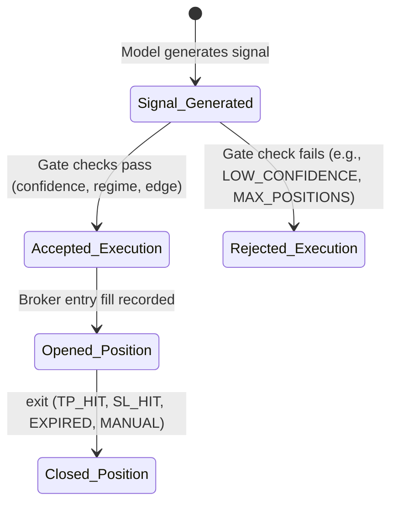

# Execution Analytics Platform Architectural Design Specification

This document details the architectural design for the **Execution Analytics Platform** for Sprint 4.6. It establishes a production-grade query, audit, and analytics engine to monitor and optimize MoroQuant's execution pipeline.

---

## 1. Architectural Alignment & Module Boundary

The Execution Analytics Platform strictly adheres to the standard MoroQuant architectural pattern:
$$\text{Repository} \longrightarrow \text{Service} \longrightarrow \text{Analytics} \longrightarrow \text{API}$$

All platform logic is contained within the `ml_service/analytics/execution/` module:

```
ml_service/analytics/execution/
├── __init__.py
├── repository.py        # Database Access Layer (Restructured repositories)
├── service.py           # Orchestration & Coordination Layer
├── analytics.py         # Pure Mathematical Metrics & Calculations
├── contract.py          # Dataclasses & Data Verification Contracts
└── api.py               # REST API Endpoint Declarations
```

---

## 2. Component Design & Layer Separation



### 2.1 Database Ownership & Repository Layer (`repository.py`)
The database storage is owned by SQLite (`database.db`). The repository layer is the *sole* component authorized to read and write database tables. It addresses past architectural shortcomings:

1. **Restructured `TradeRepository`**:
   - Resolves repository lag by updating the query mapper to extract execution metadata: `signal_price`, `execution_price`, `execution_timestamp`, `slippage_pct`, and `execution_latency_ms`.
   - Distinguishes between `paper` positions (`paper_positions`) and `live` synced positions (`user_trade_history`) using separated method endpoints.
2. **New `ExecutionDecisionRepository`**:
   - Encapsulates queries for the `execution_decisions` table.
   - Provides methods like `get_decisions_in_range(start_time, end_time, source)` to feed the analytics funnel.
3. **Database Connection Consolidation**:
   - Bypasses raw sqlite connection creation. All queries utilize the centralized session/connection pool defined in `ml_service/repositories/database.py`.

### 2.2 Service Layer (`service.py`)
Acts as the controller that orchestrates the query process:
- Retrieves raw data from repositories (e.g. filtered by timeframe, symbol, regime, or source).
- Maps raw database models to clean, immutable domain contracts defined in `contract.py`.
- Invokes pure functions in the analytics layer to run metrics aggregates.
- Packages final analytics scorecards for API serialization.

### 2.3 Analytics Layer (`analytics.py`)
A highly optimized, completely isolated, side-effect-free calculation module containing pure functions.
- **Rules**: Absolutely no SQL imports, no connection managers, no IO, and no environment reads.
- **Scope**: Implements exact math for:
  - **Slippage**: Mean, median, and max slippage percentiles.
  - **Latency**: Mean, median, and tail (95th/99th percentile) latency in milliseconds.
  - **Funnel Conversion**: Total signals -> Acceptance/Rejections -> Opened Positions -> Closed Positions (with exit reason counts).
  - **Performance aggregates**: Win rate, Profit Factor, Expectancy, and Holding Durations.
  - **Attribute Segmentation**: Group-by aggregations for symbols, regimes, and policies.

### 2.4 API Layer (`api.py`)
Declares FastAPI router endpoints to serve the Next.js UI dashboard. Under `/api/v1/analytics/execution/`, we expose distinct routes to separate data lineage cleanly.

---

## 3. Data Flow & Funnel State Machine

The analytics engine reconstructs the execution pipeline using a state-based conversion funnel:



---

## 4. Analytics Domain Specifications

### 1. Execution Funnel
- **Calculations**: Counts and conversion percentages for each step of the pipeline.
- **Lineage**:
  $$\text{Acceptance Rate} = \frac{\text{Accepted Decisions}}{\text{Total Signals Generated}}$$
  $$\text{Fill Rate} = \frac{\text{Opened Positions}}{\text{Accepted Decisions}}$$

### 2. Acceptance / Rejection Analytics
- **Calculations**: Count distribution by `RejectReason` (e.g., `LOW_CONFIDENCE`, `MAX_POSITIONS`, `BAD_REGIME`, `NEGATIVE_EDGE`).
- **Use Case**: Identify whether execution is throttled due to risk boundaries or regime filters.

### 3. Execution Quality
- **Slippage**: $\text{slippage\_pct} = \frac{\text{execution\_price} - \text{signal\_price}}{\text{signal\_price}} \times 100$ (adjusted for buy/sell direction).
- **Latency**: Difference between `execution_timestamp` and `signal_timestamp`.

### 4. Position Lifecycle
- **Holding Duration**: $\text{closed\_at} - \text{opened\_at}$. Analyzed via mean, median, and standard deviation.
- **Exit Reasons**: Distribution of exits across `TP_HIT`, `SL_HIT`, `EXPIRED`, and `MANUAL_CLOSE`.

### 5. Performance Analytics
- **Win Rate**: $\frac{\text{Winning Trades}}{\text{Total Trades}}$
- **Profit Factor**: $\frac{\sum \text{Profits}}{\sum |\text{Losses}|}$
- **Expectancy**:
  $$\text{Expectancy} = (\text{Win Rate} \times \text{Avg Win}) - ((1 - \text{Win Rate}) \times \text{Avg Loss})$$

### 6. Segmentation Domains (Symbol, Regime, Policy)
- Groups all metrics above across:
  - **Symbol**: Segments quality/performance by asset (e.g., BTCUSDT, ETHUSDT).
  - **Regime**: Segments performance under different market conditions (e.g., TRENDING_LONG, RANGE).
  - **Policy**: Compares dynamic stop policies (`FIXED_SL`, `BREAK_EVEN`, `TRAILING`).

---

## 5. Verification Strategy

1. **Unit Tests (`tests/test_execution_analytics.py`)**:
   - Validate calculations in `analytics.py` using synthetic dataclass arrays.
   - Verify that edge cases (like division by zero when no trades are lost, or empty arrays) return default values (`0.0`).
2. **Integration Tests**:
   - Query repository methods using a mock SQLite database prepopulated with test signals, rejections, and positions.
   - Verify that database operations do not open dangling sqlite database connections.
3. **Lineage Audits**:
   - Test suite assertion verifying that live API endpoints never return paper datasets, and vice versa.
