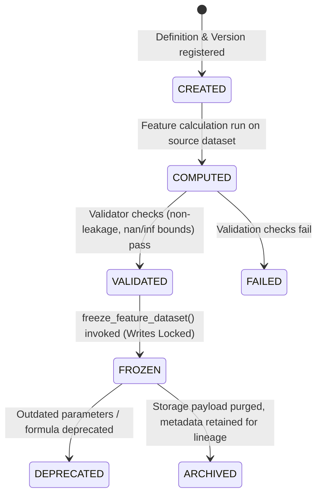

# Feature Store Architectural Design Specification

This document details the architectural design for the **MoroQuant Feature Store** layer for Sprint 4.2. It establishes a single source of truth for engineered quantitative features to eliminate feature inconsistency, feature leakage, and non-reproducible experiments.

---

## 1. Architectural Alignment & Module Boundary

The Feature Store conforms to the standard MoroQuant architectural pattern:
$$\text{Repository} \longrightarrow \text{Service} \longrightarrow \text{Analytics} \longrightarrow \text{API}$$

All Feature Store logic is contained within the `ml_service/research/feature_store/` module:

```
ml_service/research/feature_store/
├── __init__.py
├── repository.py        # SQLite Feature Metadata Registry
├── service.py           # Feature Calculation, Versioning & Serialization Flow
├── analytics.py         # Feature Coverage, Shift, Correlation, and Drift analysis
├── validator.py         # Leakage, Lookahead, and Nan/Inf checks
├── api.py               # Local REST endpoint adapters
└── types.py             # Type safety, dataclasses, and lifecycle enums
```

### 1.1 Module Structure & Responsibilities

1. **Feature Repository (`repository.py`)**:
   * Strictly manages database transactions on the metadata registry tables (`feature_definitions`, `feature_versions`, `feature_datasets`) inside the shared SQLite database.
   * Isolates SQLite SQL queries from computation logic.
2. **Feature Service (`service.py`)**:
   * Orchestrates the feature computation pipeline.
   * Resolves feature definitions and dependencies.
   * Runs the calculation logic on standard datasets and writes output Parquet files.
   * Guarantees that:
     $$\text{Dataset Version} + \text{Feature Version} \longrightarrow \text{Deterministic Feature Output}$$
3. **Feature Analytics (`analytics.py`)**:
   * Inspects feature statistical distributions (e.g., drift, information coefficient, feature importance, mutual information, correlation matrix) without mutating stored payloads.
4. **Feature Validator (`validator.py`)**:
   * Performs critical quantitative integrity checks.
   * Guards against leakage, lookahead bias, timestamp misalignment, and extreme values.

---

## 2. Component Design & Layer Separation

### 2.1 Repository Layer Schema (`repository.py`)

The SQLite schema tracks definition specifications, version records, and generated payloads.

```sql
-- Core feature definitions
CREATE TABLE IF NOT EXISTS feature_definitions (
    feature_name TEXT PRIMARY KEY,    -- e.g., 'rsi_14'
    description TEXT NOT NULL,
    formula_ref TEXT NOT NULL,       -- Pointer or code reference/formula string
    created_at TEXT NOT NULL
);

-- Version tracking for feature parameter configurations
CREATE TABLE IF NOT EXISTS feature_versions (
    feature_version_id TEXT PRIMARY KEY, -- e.g., 'rsi_14_v1.0.0'
    feature_name TEXT NOT NULL,
    version TEXT NOT NULL,               -- e.g., '1.0.0'
    parameters_json TEXT NOT NULL,       -- e.g., '{"period": 14, "col": "close"}'
    created_at TEXT NOT NULL,
    FOREIGN KEY (feature_name) REFERENCES feature_definitions(feature_name)
);

-- Registry mapping generated feature payloads back to source datasets (Lineage)
CREATE TABLE IF NOT EXISTS feature_datasets (
    feature_dataset_id TEXT PRIMARY KEY, -- e.g., 'fds_btcusdt_rsi14_v1.0.0_ds_btcusdt_v1.0.0'
    source_dataset_id TEXT NOT NULL,     -- Pointer to source dataset (Dataset Manager)
    feature_version_id TEXT NOT NULL,
    fingerprint TEXT NOT NULL UNIQUE,     -- SHA256 signature of canonicalized output
    storage_path TEXT NOT NULL,          -- Path to immutable Parquet file
    created_at TEXT NOT NULL,
    lifecycle_state TEXT NOT NULL,       -- CREATED, COMPUTED, VALIDATED, FROZEN
    is_frozen INTEGER DEFAULT 0,
    FOREIGN KEY (feature_version_id) REFERENCES feature_versions(feature_version_id)
);
```

---

## 3. Feature Lifecycle & State Machine

A feature dataset goes through distinct phases to guarantee reproducibility and prevent runtime modifications.



### State Definitions:
1. **CREATED**: The feature definition and parameterized version are declared in the metadata registry, but no physical calculation has occurred.
2. **COMPUTED**: The feature payload has been generated from the source dataset and temporarily saved.
3. **VALIDATED**: The payload has successfully passed all leak and statistical compliance tests.
4. **FROZEN**: Read-only flag set. Operating system write-locks applied (`chmod 0444`). The data and metadata are completely locked.
5. **DEPRECATED**: Maintained for historical verification of models, but researchers are warned against selecting it for new training jobs.
6. **ARCHIVED**: Physical Parquet data file is purged to conserve space. The SQLite metadata record and cryptographic signature are permanently kept for historical lineage verification.

---

## 4. Quant Research Integrity & Protections

To protect the model training pipeline, the Feature Store enforces strict rules:

### 4.1 Time-Series Monotonicity & Alignment
* All calculations are row-independent or forward-lagged.
* No feature calculation may sort the dataframe in reverse-chronological order or perform interpolation/imputation using future values.
* Checks that timestamps exactly align with the source dataset to prevent row shifts.

### 4.2 Lookahead Bias Prevention
* **Lagging Enforcement**: Rolling indicators (e.g. rolling averages, RSI, standard deviations) must strictly evaluate past sequences. Any return computation or forward-looking targets must be separated from features.
* **Point-in-Time Realism**: Data point features must only be computed using data that would have been available at `timestamp`.

### 4.3 Determinism and Canonicalization
Every computed feature file is canonicalized and signed using the exact same fingerprint strategy used in Sprint 4.1:
$$\text{Fingerprint} = \text{SHA256}(\text{Canonicalized Feature DataFrame})$$
This guarantees that silent code updates or numerical differences across OS packages are flagged immediately.

---

## 5. Integration Architecture

```
[Dataset Manager] --(Source Dataset)--> [Feature Service]
                                              |
                                     (Uses Feature Version)
                                              |
                                              v
[Experiment Engine] <--(Immutable Parquet)-- [Feature Store]
```

### 5.1 Dataset Manager Integration
* The Feature Store consumes frozen datasets registered by the Dataset Manager.
* A feature dataset cannot be calculated from a source dataset that is not in the `FROZEN` state.

### 5.2 Experiment & Replay Engine Integration
* **Training / Tuning**: The Experiment Engine loads the combined source and feature Parquet files directly, verifying fingerprints at runtime.
* **Replay Engine**: Replay retrieves features using the specific `feature_version_id` to guarantee that live or simulated trading logic applies the identical transformation parameters as research.
