# Lineage Graph Design Specification

**Sprint**: 4.7A  
**Status**: DESIGN COMPLETE  
**Auditor**: Antigravity

---

## 1. DAG Lineage Design

The Lineage Graph uses a horizontal Directed Acyclic Graph (DAG) layout. Nodes represent versioned assets, and edges represent transformation or validation dependencies.

```mermaid
graph LR
    Raw[Raw Ingest: Binance] --> DS[Dataset: v2.4.1]
    DS --> FS[Feature Set: v1.0]
    FS --> Run[Experiment Run: run_231f]
    Run --> Model[Model: candidate_v12]
    Model --> Back[Backtest: bt_988]
    Back --> Paper[Paper Trade: active]
    Paper --> Promo[Promotion Gate: PASS]
    Promo --> Prod[Production: deploy_v3]
```

---

## 2. Parent-Child & Version Lineage Relationships

### 2.1 Dataset Lineage
*   Tracks raw source files, partitions, and target window sizes.
*   **Properties**: `row_count`, `checksum_sha256`, `timestamp_range`.

### 2.2 Feature Lineage
*   Maps features to their dataset versions. If a feature formula changes, a new node version is spawned.
*   **Properties**: `feature_version`, `features_list`, `formula_metadata`.

### 2.3 Experiment Lineage
*   Represents a training execution using a specific dataset and feature version combination.
*   **Properties**: `hyperparameters_json`, `algorithm`, `metrics`.

### 2.4 Promotion Lineage
*   Identifies the audit trail of approval from candidate to active status.
*   **Properties**: `promoted_by`, `verification_logs_url`, `timestamp`.
