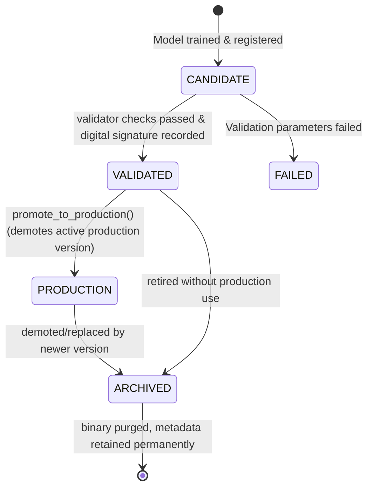

# Model Registry Architectural Design Specification

This document details the architectural design for the **Model Registry** for Sprint 4.4. It establishes a production-grade model catalog and lineage engine to manage the lifecycle of machine learning models in MoroQuant.

---

## 1. Architectural Alignment & Module Boundary

The Model Registry conforms to the standard MoroQuant architectural pattern:
$$\text{Repository} \longrightarrow \text{Service} \longrightarrow \text{Analytics} \longrightarrow \text{API}$$

### 1.1 Module Structure
All Model Registry logic is contained within the `ml_service/research/model_registry/` module:

```
ml_service/research/model_registry/
├── __init__.py
├── repository.py        # SQLite Model Metadata & Lineage Registry
├── service.py           # Model Promotion, Versioning & Activation Flow
├── analytics.py         # Model Performance Drift, Attributions (SHAP), & Calibration
├── validator.py         # Model Lineage Verification & Compatibility Gatekeeper
├── api.py               # REST API Endpoints
└── types.py             # Dataclass specifications and state definitions
```

---

## 2. Component Design & Layer Separation

### 2.1 Repository Layer (`repository.py`)
Strictly manages SQLite database operations on the registry tables.

```sql
-- Base model identifiers
CREATE TABLE IF NOT EXISTS models (
    model_id TEXT PRIMARY KEY,          -- e.g., 'mdl_xgb_btc_trend'
    name TEXT NOT NULL,
    description TEXT,
    created_at TEXT NOT NULL
);

-- Version details for each trained model
CREATE TABLE IF NOT EXISTS model_versions (
    model_version_id TEXT PRIMARY KEY,  -- e.g., 'mdl_xgb_btc_trend_v1.0.0'
    model_id TEXT NOT NULL,
    version TEXT NOT NULL,              -- e.g., '1.0.0'
    lifecycle_state TEXT NOT NULL,      -- CANDIDATE, VALIDATED, PRODUCTION, ARCHIVED
    fingerprint TEXT NOT NULL UNIQUE,   -- SHA256 checksum of model artifact + parameters
    storage_path TEXT NOT NULL,         -- Path to directory containing the model binaries
    hyperparameters_json TEXT NOT NULL, -- Serialized parameter configuration
    created_at TEXT NOT NULL,
    promoted_at TEXT,
    promoted_by TEXT,
    FOREIGN KEY (model_id) REFERENCES models(model_id)
);

-- Upstream lineage tracker
CREATE TABLE IF NOT EXISTS model_lineage (
    model_version_id TEXT PRIMARY KEY,
    snapshot_id TEXT NOT NULL,
    dataset_id TEXT NOT NULL,
    feature_dataset_id TEXT NOT NULL,
    experiment_id TEXT NOT NULL,
    best_config_id TEXT NOT NULL,
    FOREIGN KEY (model_version_id) REFERENCES model_versions(model_version_id),
    FOREIGN KEY (dataset_id) REFERENCES dataset_metadata(dataset_id),
    FOREIGN KEY (feature_dataset_id) REFERENCES feature_datasets(feature_dataset_id)
);

-- Quantitative metrics evaluation ledger
CREATE TABLE IF NOT EXISTS model_evaluations (
    model_version_id TEXT PRIMARY KEY,
    sharpe_ratio REAL NOT NULL,
    max_drawdown REAL NOT NULL,
    ece REAL NOT NULL,
    brier_score REAL NOT NULL,
    win_rate REAL NOT NULL,
    profit_factor REAL NOT NULL,
    sortino_ratio REAL NOT NULL,
    trade_count INTEGER NOT NULL,
    is_approved INTEGER DEFAULT 0,
    approved_by TEXT,
    approved_at TEXT,
    FOREIGN KEY (model_version_id) REFERENCES model_versions(model_version_id)
);
```

### 2.2 Service Layer (`service.py`)
Orchestrates model promotion workflows, directory management, and environment transitions.

* **Interface Contract (`ModelRegistryService`)**:
  * `register_candidate(model_id: str, version_bump: str, storage_path: str, hyperparameters: dict, lineage: dict) -> ModelVersionMetadata`
  * `evaluate_and_validate(model_version_id: str, scores: dict, reviewer: str) -> bool`
  * `promote_to_production(model_version_id: str, promoter: str) -> None`
  * `archive_model(model_version_id: str) -> None`

### 2.3 Analytics Layer (`analytics.py`)
Computes drift and out-of-sample calibration measurements without altering the models or dataset files.

* **Key Analytics Functions**:
  * `evaluate_feature_attribution_drift(model_version_id: str, dataset_id: str) -> Dict[str, float]` (SHAP drift)
  * `measure_confidence_calibration(model_version_id: str, dataset_id: str) -> Dict[str, float]` (Brier, ECE, calibration curves)
  * `generate_backtest_parity_audit(model_version_id: str) -> Dict[str, Any]` (Execution engine vs. backtest result comparison)

### 2.4 API Layer (`api.py`)
Provides endpoints for query interfaces, promotion operations, and lineage lookups.

* **Endpoints**:
  * `POST /api/v1/models/register`
  * `POST /api/v1/models/{model_version_id}/validate`
  * `POST /api/v1/models/{model_version_id}/promote`
  * `GET /api/v1/models/{model_version_id}/lineage`
  * `GET /api/v1/models/{model_version_id}/analytics`

---

## 3. Model Lifecycle & State Machine

Every model version moves through distinct states governing its write-access permissions and deployment status:



### State Definitions:
1. **CANDIDATE**: Serialized model is saved in storage. Writeable. Lineage links verified.
2. **VALIDATED**: High-quality threshold passed (Sharpe, Drawdown, ECE, Brier). Write-locked (`chmod 0444`).
3. **PRODUCTION**: Actively loaded by Live Trading/Replay engines to emit signals.
4. **ARCHIVED**: Model weights deleted to reclaim space. Fingerprints, metadata, and lineage entries are locked permanently in the SQLite DB.

---

## 4. Integration Architecture & Complete Lineage Tracing

The model registry builds on the features from all previous sprints, linking snapshots, data tables, feature layers, and experiments directly to the final deployment.

```
[Snapshot Engine]
      │
      ▼
[Dataset Manager] (dataset_metadata)
      │
      ▼
[Feature Store]   (feature_datasets)
      │
      ▼
[Experiment Engine] (experiment_results)
      │
      ▼
[Evaluation Engine] (evaluate_experiment scorecard)
      │
      ▼
[Model Registry]  (model_versions + model_lineage)
```

### Lineage Resolution Query:
For any operational model in live execution, the `ModelValidator` can execute a single SQL recursive query to pull:
1. The exact raw base snapshot (`snapshot_id`).
2. The dataset representation definition (`dataset_id`).
3. The engineered parameter configurations (`feature_dataset_id` linked to `feature_version_id`s).
4. The Hyperparameter optimization history (`experiment_id`).
5. The performance scorecard evaluation criteria (`model_evaluations`).
