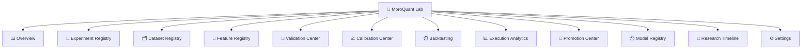

# MoroQuant Lab Research Workbench Design Specification

**Sprint**: 4.8  
**Phase**: Phase 0 (Architecture & UX Design)  
**Status**: DESIGN COMPLETE (Architecture Only)

---

## 1. Research Workbench Architecture

The MoroQuant Lab UI is structured as a Quantitative Research Workbench. It serves as an integrated command center representing the complete model development lifecycle.

```
┌────────────────────────────────────────────────────────────────────────┐
│                          🧪 MoroQuant Lab UI                           │
└───────────────────────────────────┬────────────────────────────────────┘
                                    │
       ┌────────────────────────────┼────────────────────────────┐
       ▼                            ▼                            ▼
┌──────────────┐             ┌──────────────┐             ┌──────────────┐
│  Data Layer  │             │ Model Layer  │             │ Execution    │
└──────┬───────┘             └──────┬───────┘             └──────┬───────┘
       ├─ Dataset Registry          ├─ Experiment Registry       ├─ Backtesting
       └─ Feature Registry          ├─ Validation Center         ├─ Execution Analytics
                                    ├─ Calibration Center        └─ Promotion Center
                                    └─ Model Registry
```

---

## 2. UI Information Architecture & Navigation Map

The navigation follows a persistent left-hand sidebar pattern allowing rapid transitions between research contexts.



---

## 3. Screen Hierarchy & Flows

### 3.1 Overview Page (Research Command Center)
*   **Purpose**: Real-time diagnostic state of the entire ML quantitative pipeline.
*   **KPIs**: Active Experiments, Target Win Rate, System ECE, Acceptance Rate, Production Models count.
*   **Main Widgets**:
    *   *Active pipeline card grid* (Active runs, latest promotions, backing feature/dataset counts).
    *   *System calibration gauges* (Latest ECE vs Calibration targets).
    *   *Active backtests execution stream*.
*   **API Dependencies**: `/api/lab/experiments`, `/api/models`, `/api/db/info`.

### 3.2 Experiment Registry
*   **Purpose**: Run-tracking workspace similar to MLflow.
*   **Primary Actions**: Search run ID, compare runs, tag best candidates.
*   **Tables**: Run list with columns: `Run ID`, `Experiment ID`, `Status`, `Duration`, `Dataset Version`, `F1-Score`, `ECE`, `Promotion Status`.
*   **Charts**: Walk-forward fold metrics compare scatter plots, training loss curve overlays.
*   **API Dependencies**: `/api/lab/experiments`.

### 3.3 Dataset Registry
*   **Purpose**: Visualize data provenance and version tracking.
*   **Lineage Visualizer**:
    ```
    [Raw Exchange Data] ──► [Cleaned Database] ──► [Feature Version] ──► [Dataset version] ──► [Model Run]
    ```
*   **Tables**: Dataset version inventory list (`Version`, `Row Count`, `Created At`, `Active Experiments Using It`).
*   **API Dependencies**: `/api/lab/experiments` (extracting dataset lineages).

### 3.4 Feature Registry
*   **Purpose**: Track feature definition stores and importance.
*   **Tables**: Feature list (`Feature Name`, `Group`, `Importance Score`, `Usage Count`, `Status`).
*   **Charts**: Feature importance horizontal bar charts.
*   **API Dependencies**: `/api/lab/experiments` (extracting feature configurations).

### 3.5 Validation Center
*   **Purpose**: Walk-forward validation diagnostic center.
*   **Main Widgets**:
    *   *Walk-Forward Folds Grid*: Visual bar displaying train/test/purge periods.
    *   *Confusion Matrix*: Multi-class (Long/Short/Neutral) heat map.
*   **KPIs**: Average F1-score, Precision, Recall, ROC AUC.
*   **API Dependencies**: `/api/lab/experiments/{run_id}`.

### 3.6 Calibration Center
*   **Purpose**: Probability calibration visualizer.
*   **Main Widgets**:
    *   *Reliability Diagram*: Estimated vs actual win-rates line plot.
    *   *ECE Histogram*: Error margins per confidence bin.
*   **KPIs**: Expected Calibration Error (ECE), Brier Score.
*   **API Dependencies**: `/api/lab/experiments/{run_id}`.

### 3.7 Backtesting
*   **Purpose**: Relocated backtest runner and workspace.
*   **Design**: Unchanged engine wrapper. Serves as a module inside the Lab menu structure.
*   **API Dependencies**: `/api/backtests` routes.

### 3.8 Execution Analytics
*   **Purpose**: Inspect paper/live fills and alpha decay metrics.
*   **Main Widgets**:
    *   *Funnel Chart*: Signals Generated -> Decisions Accepted -> Positions Filled -> TP/SL Hits.
    *   *Slippage Scatter*: Slippage vs latency correlation plot.
*   **KPIs**: Acceptance Rate, Average Latency (ms), Avg Slippage (%).
*   **API Dependencies**: `/api/execution_analytics` (or analytics repositories).

### 3.9 Promotion Center
*   **Purpose**: Stage gate promotion management.
*   **Visual Lifecycle Stages**:
    ```
    [Candidate Model] ──► [Validation Check] ──► [Calibration Check] ──► [Paper Evaluation] ──► [Promote]
    ```
*   **Primary Actions**: Request promotion, approve Candidate, rollback model.
*   **API Dependencies**: `/api/models/governance`.

### 3.10 Model Registry
*   **Purpose**: Production model repository shelf.
*   **Tables**: Shelves categorized by: `Production`, `Candidate`, `Archived`.
*   **Columns**: `Model Version`, `F1-Score`, `Brier Score`, `Dataset Version`, `Git Commit Hash`.
*   **API Dependencies**: `/api/models`.

### 3.11 Research Timeline
*   **Purpose**: Audit trail of system events.
*   **Widgets**: Chronological feed: "User X created Experiment Y", "Model Z promoted to Production".
*   **API Dependencies**: System event logs.

### 3.12 Settings
*   **Purpose**: Configure validation folds, thresholds, and target database connections.

---

## 4. State Management & API Mapping

The UI utilizes a centralized context architecture to store the active research run ID.

*   `activeRunId`: String state identifying which experiment run is selected. Selected across *Experiment Registry*, auto-populating *Validation Center* and *Calibration Center* widgets.
*   `activeSymbol`/`activeTimeframe`: Controls dataset views.

| Endpoint | Method | Component / Module Mapping |
| :--- | :--- | :--- |
| `/api/lab/experiments` | GET | Experiment List Table, Overview summary |
| `/api/lab/experiments/{run_id}` | GET | Validation Center, Calibration Center widgets |
| `/api/models` | GET | Model Registry Shelf |
| `/api/models/governance` | POST | Promotion Center action gates |
| `/api/db/info` | GET | Overview database stats |

---

## 5. Responsive Behavior

*   **Grid layout**: Collapses from 4 cards wide on Desktop to 1 card wide on mobile.
*   **Sidebar**: Persistent visible layout on Desktop (`>1024px`); collapses to a slide-out hamburger menu on tablet/mobile screens.
*   **Charts**: Vector SVGs render dynamically using standard resize listeners.
