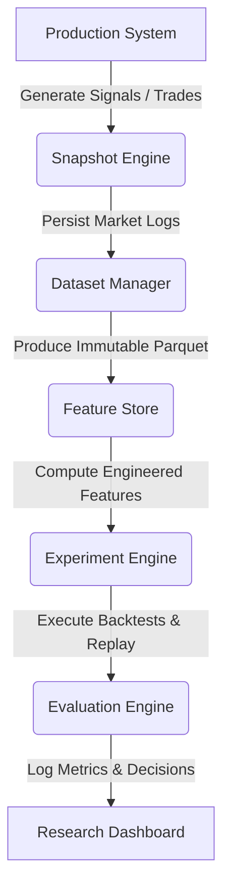

# Research Experiment Dashboard Architectural Design Specification

This document details the architectural design for the **MoroQuant Research Experiment Dashboard** layer for Sprint 4.3. It defines the structure, boundaries, data flows, and view mechanics required to provide researchers with a read-only portal to explore historical experiments.

---

## 1. Architectural Alignment & Module Boundary

The Research Dashboard conforms to the standard MoroQuant architectural pattern:
$$\text{Repository} \longrightarrow \text{Service} \longrightarrow \text{Analytics} \longrightarrow \text{API} \longrightarrow \text{Frontend}$$

All backend code for the Research Dashboard is located inside the `ml_service/research/dashboard/` module:

```
ml_service/research/dashboard/
├── __init__.py
├── repository.py        # Read-only Experiment & Lineage Database Client
├── service.py           # Experiment Details & Lineage Aggregator
├── analytics.py         # On-the-fly Comparison & Metric Matrix calculations
├── api.py               # REST API endpoints mapping to frontend contracts
└── types.py             # Shared dataclasses and validation models
```

### 1.1 Module Structure & Responsibilities

1. **Research Dashboard Repository (`repository.py`)**:
   * Reads immutable metadata catalogs from SQLite databases (specifically reading from experiment records, dataset manager databases, and feature store registries).
   * Strictly read-only; contains no database write or update statements.
2. **Research Dashboard Service (`service.py`)**:
   * Collects, resolves, and merges information across modules (e.g. mapping an Experiment ID back to its Feature Dataset ID, and then mapping that back to the original source Dataset).
3. **Research Dashboard Analytics (`analytics.py`)**:
   * Computes on-the-fly, stateless comparison matrices and ranks experiments relative to each other (e.g. Sharpe ratio, max drawdown, tracking error differences).
4. **Research Dashboard API (`api.py`)**:
   * Exposes JSON payloads defined by the API contract specification to the frontend web application.

---

## 2. Platform Data Flow

The Research Dashboard sits at the terminal end of the quantitative engineering workflow:



### Flow Lifecycle
1. **Raw Log Generation**: The Snapshot Engine captures live/replay events.
2. **Dataset Creation**: The Dataset Manager freezes these logs as immutable datasets.
3. **Feature Generation**: The Feature Store generates versioned, signed feature artifacts (Parquet).
4. **Backtest / Experimentation**: The Experiment Engine loads features and executes strategies.
5. **Evaluation Output**: The Evaluation Engine outputs performance metrics and execution trails.
6. **Visualization**: The Research Dashboard reads these records from historical files to populate the user workspace.

---

## 3. Frontend & Backend Responsibilities

### 3.1 Backend Responsibilities
* Provide fast, queryable access to experiment run data.
* Enforce schema-strict JSON responses for all requests.
* Trace lineage trees dynamically by resolving foreign key relationships across the Feature Store and Dataset Manager.
* Compute statistical summary comparisons (ranking, metric differences) without mutating database state.

### 3.2 Frontend Responsibilities
* Present data clearly through structured quantitative dashboards (Explorer, Detail, Lineage, Comparison, Evaluation).
* Never bypass the API; consume only verified data contracts.
* Avoid client-side metric recalculations that could result in rounding errors or variance from the core Python engine's statistical outputs.

---

## 4. Analyst Views & User Experience

The dashboard workspace consists of five core view structures:

### 4.1 Experiment Explorer
* **Purpose**: Provide a search and filter dashboard for historical experiments.
* **Key Components**:
  * Filtering controls (strategy type, parameter ranges, performance thresholds).
  * Main tabular list of experiments containing: Name, Version, Creation Date, Sharpe Ratio, Max Drawdown, and Status.
  * Direct action buttons to inspect or select for comparison.

### 4.2 Experiment Detail
* **Purpose**: Inspect the specific configurations and parameter values of a single experiment run.
* **Key Components**:
  * Configuration files or dictionary blocks (strategy parameters, transaction cost models).
  * Associated metrics summary card (performance metrics, execution duration, model version).

### 4.3 Lineage View
* **Purpose**: Trace the source features and datasets that generated this experiment to guarantee auditability.
* **Key Components**:
  * An interactive visual node diagram or hierarchy list representing:
    $$\text{Source Dataset} \longrightarrow \text{Feature Version(s)} \longrightarrow \text{Experiment Run} \longrightarrow \text{Evaluation Outcome}$$
  * Details on demand: Clicking a node displays version hashes, SHA256 fingerprints, and storage file paths.

### 4.4 Comparison View
* **Purpose**: Perform side-by-side metric comparison of multiple experiment runs to identify superior configurations.
* **Key Components**:
  * Metric side-by-side comparison tables.
  * Parameter difference highlight grid (visually highlights which strategy settings differ).
  * Normalised performance chart comparison.

### 4.5 Evaluation View
* **Purpose**: Deep-dive into trade attribution, statistical profiles, and execution diagnostics.
* **Key Components**:
  * Cumulative return curves and drawdown charts.
  * Statistical distribution profiles (daily return histograms, skewness, kurtosis).
  * Decision validation records (reason for trade execution, slippage analysis).

---

## 5. Statistical Integrity & Reproducibility Safeguards

* **Immutable References**: Every metric shown is locked to a specific Experiment ID, which in turn maps to a specific Dataset SHA256 fingerprint.
* **No Database Writes**: The repository layer does not support execution of SQL `INSERT`, `UPDATE`, or `DELETE` statements.
* **Stateless Analytics**: Analytics computations (like ranking and variance comparisons) do not store calculated outputs in the database; they are computed dynamically and discarded, ensuring that the stored research database remains pristine.
