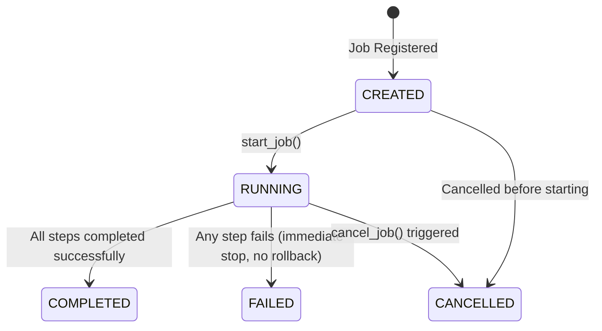

# Research Orchestrator Architectural Design Specification

This document details the architectural design for the **Research Orchestrator** for Sprint 4.5. It establishes an orchestration layer to coordinate and execute MoroQuant's quantitative research modules as a unified, sequential pipeline.

---

## 1. Architectural Alignment & Module Boundary

The Research Orchestrator conforms to the standard MoroQuant architectural pattern:
$$\text{Repository} \longrightarrow \text{Service} \longrightarrow \text{Analytics} \longrightarrow \text{API}$$

### 1.1 Module Structure
All Research Orchestrator backend code resides within the `ml_service/research/orchestrator/` module:

```
ml_service/research/orchestrator/
├── __init__.py
├── repository.py        # SQLite Metadata Storage (Jobs, Steps, Logs)
├── service.py           # Sequential Pipeline Execution, Lifecycle & State Transitions
├── analytics.py         # Pipeline Duration, Efficiency, & Stage Bottlenecks
├── api.py               # REST API Endpoints
└── types.py             # Domain Models, Lifecycles, and Stage Configurations
```

### 1.2 Boundary Limits
* **No Business Logic Duplication**: The orchestrator does not know how to run backtests, engineer features, or serialize models. It only coordinates inputs, triggers respective services, and collects output metadata.
* **No Distributed Engine**: Avoids Celery, Temporal, or external message brokers. It executes sequentially in-process, or utilizing local Python threading/multiprocessing contexts to avoid blocking the main server thread.

---

## 2. Component Design & Layer Separation

### 2.1 Repository Layer (`repository.py`)
Manages SQLite database operations for orchestrating research workflows. The schema keeps track of the orchestrator state, steps execution history, and logs.

```sql
-- Main job tracking table
CREATE TABLE IF NOT EXISTS research_jobs (
    job_id TEXT PRIMARY KEY,            -- e.g., 'job_20260710_001'
    name TEXT NOT NULL,                 -- User-defined job descriptor
    status TEXT NOT NULL,               -- CREATED, RUNNING, COMPLETED, FAILED, CANCELLED
    current_stage TEXT,                 -- SNAPSHOT, DATASET, FEATURE, EXPERIMENT, EVALUATION, REGISTRY, DASHBOARD
    started_at TEXT,                    -- ISO8601 Timestamp
    finished_at TEXT,                   -- ISO8601 Timestamp
    duration_seconds REAL,              -- Finished At - Started At
    created_at TEXT NOT NULL
);

-- Sub-step tracking for each pipeline stage
CREATE TABLE IF NOT EXISTS research_job_steps (
    step_id TEXT PRIMARY KEY,           -- e.g., 'step_job_001_dataset'
    job_id TEXT NOT NULL,
    stage_name TEXT NOT NULL,           -- SNAPSHOT, DATASET, FEATURE, etc.
    status TEXT NOT NULL,               -- PENDING, RUNNING, COMPLETED, FAILED, SKIPPED
    input_payload_json TEXT NOT NULL,   -- Parameters passed to this stage
    output_payload_json TEXT,           -- Resulting metadata/references returned
    error_message TEXT,                 -- Populated on failure
    started_at TEXT,
    finished_at TEXT,
    duration_seconds REAL,
    FOREIGN KEY (job_id) REFERENCES research_jobs(job_id) ON DELETE CASCADE
);

-- Execution stdout/stderr logs for troubleshooting
CREATE TABLE IF NOT EXISTS research_job_logs (
    log_id INTEGER PRIMARY KEY AUTOINCREMENT,
    job_id TEXT NOT NULL,
    step_id TEXT,                       -- Optional link to specific step
    log_level TEXT NOT NULL,            -- INFO, WARNING, ERROR
    message TEXT NOT NULL,
    timestamp TEXT NOT NULL,
    FOREIGN KEY (job_id) REFERENCES research_jobs(job_id) ON DELETE CASCADE,
    FOREIGN KEY (step_id) REFERENCES research_job_steps(step_id) ON DELETE CASCADE
);
```

### 2.2 Service Layer (`service.py`)
Manages execution sequences, transitions states, and validates step inputs and outputs against contract rules.

* **Interface Contract (`ResearchOrchestratorService`)**:
  * `create_job(name: str, config: ResearchJobConfig) -> ResearchJobMetadata`
  * `execute_job(job_id: str) -> None` (Spawns synchronous sequence in background worker)
  * `cancel_job(job_id: str, requester: str) -> None`
  * `get_job_status(job_id: str) -> ResearchJobMetadata`
  * `get_job_timeline(job_id: str) -> List[JobStepMetadata]`

* **Sequential Execution Pattern (Pseudocode Design)**:
  ```python
  def execute_job(self, job_id: str):
      self.repo.update_job_status(job_id, "RUNNING", started_at=now())
      stages = ["SNAPSHOT", "DATASET", "FEATURE", "EXPERIMENT", "EVALUATION", "REGISTRY", "DASHBOARD"]
      
      current_input = self.repo.get_initial_config(job_id)
      
      for stage in stages:
          self.repo.update_step_status(job_id, stage, "RUNNING", started_at=now())
          try:
              # Delegate call to respective module service using strict contract interface
              output = self._execute_stage_service(stage, current_input)
              
              self.repo.update_step_status(job_id, stage, "COMPLETED", output=output, finished_at=now())
              current_input = output # Feed next stage
          except Exception as e:
              # Record failure, block subsequent runs, freeze completed artifacts
              self.repo.update_step_status(job_id, stage, "FAILED", error=str(e), finished_at=now())
              self.repo.update_job_status(job_id, "FAILED", finished_at=now())
              self._log(job_id, "ERROR", f"Stage {stage} failed. Halting pipeline execution.")
              return
              
      self.repo.update_job_status(job_id, "COMPLETED", finished_at=now())
  ```

### 2.3 Analytics Layer (`analytics.py`)
Computes efficiency metrics, stage-level execution duration breakdowns, and performance analytics for pipeline optimizations.

* **Key Analytics Functions**:
  * `calculate_average_stage_durations() -> Dict[str, float]`
  * `get_pipeline_bottlenecks(limit: int) -> List[Dict[str, Any]]` (Identifies stages with high variance/duration)
  * `get_success_rates_per_stage() -> Dict[str, float]`

### 2.4 API Layer (`api.py`)
Exposes REST endpoints to query and control research orchestrations.

* **Endpoints**:
  * `POST /api/research/jobs` (Create and queue a new orchestration job)
  * `GET /api/research/jobs` (List historical jobs, optionally filtered by status)
  * `GET /api/research/jobs/{id}` (Inspect status, duration, current stage, and results)
  * `GET /api/research/jobs/{id}/timeline` (Detailed breakdown of step completions, metrics, and failures)
  * `POST /api/research/jobs/{id}/cancel` (Initiate cancellation on a running job)

---

## 3. Job Lifecycle & State Machine

Orchestrator jobs move through a rigid workflow cycle:



### State Execution Rules:
1. **CREATED**: The pipeline job is initialized with a validated parameters payload. No components have been invoked.
2. **RUNNING**: The orchestrator is executing the sequential loop. Current step status transitions to `RUNNING`.
3. **COMPLETED**: The terminal step (`DASHBOARD`) has successfully updated. The final output is ready.
4. **FAILED**: Any step raises an uncaught exception. The execution halts instantly. The stack trace is logged to `research_job_logs`. Previous successful artifacts are unmodified.
5. **CANCELLED**: The execution thread stops. The active step transitions to `FAILED` or `CANCELLED` and the parent job marks status as `CANCELLED`.

---

## 4. Observability and Performance Monitoring

To ensure complete transparency during long-running backtests and training loops, the orchestrator updates metadata continuously:
* **Started At**: Set dynamically at the launch of the pipeline sequence.
* **Finished At**: Recorded when the job transitions into a terminal status (`COMPLETED`, `FAILED`, `CANCELLED`).
* **Duration**: Calculated as a real-time delta during execution, and persisted as static seconds upon completion.
* **Current Stage**: Points to the active stage name currently in the `RUNNING` state.
* **Stage Results**: A dictionary mapping stage names to their respective output version identifiers and performance metrics.
* **Overall Status**: Exposes the high-level orchestrator lifecycle status.
