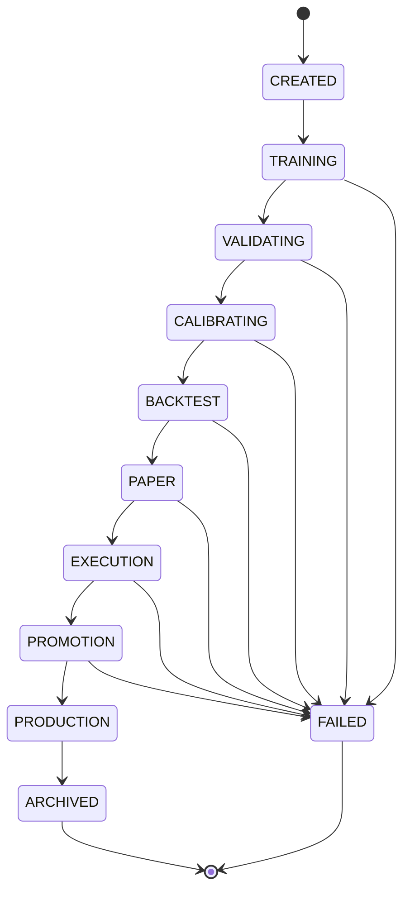
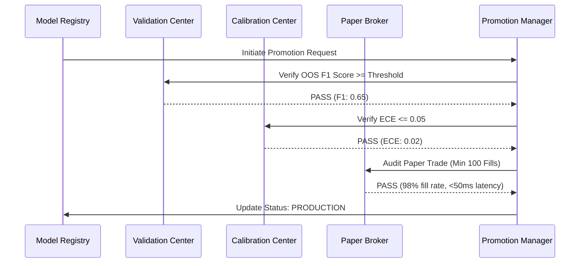

# Timeline State Machine Specification

**Sprint**: 4.7A  
**Status**: DESIGN COMPLETE  
**Auditor**: Antigravity

---

## 1. Lifecycle State Definitions

An institutional-grade quantitative model progresses through the following sequential states:

1.  **`CREATED`**: Run metadata registered; parameters locked.
2.  **`TRAINING`**: Walk-forward validation model estimation in progress.
3.  **`VALIDATING`**: Out-of-sample performance evaluation (F1, Precision, Recall).
4.  **`CALIBRATING`**: Probability calibration and ECE checking.
5.  **`BACKTEST`**: Historical strategy performance simulation.
6.  **`PAPER`**: Active paper trading deployment.
7.  **`EXECUTION`**: Latency, slippage, and execution analytics checks.
8.  **`PROMOTION`**: Stage-gate review and approval signature collection.
9.  **`PRODUCTION`**: Active live exchange trading deployment.
10. **`ARCHIVED`**: Model superseded by newer iteration.
11. **`FAILED`**: Abandoned due to metric failure or processing error.

---

## 2. State Machine Diagram

---

## 3. Promotion Verification Sequence

This diagram shows the sequence of checks executed before promoting a model candidate to production status.

