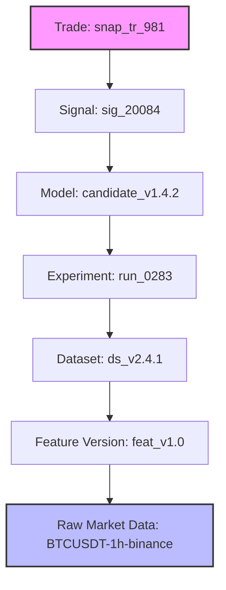

# Trade Lineage Design Specification

**Sprint**: 4.9A  
**Status**: DESIGN COMPLETE  
**Auditor**: Antigravity

---

## 1. Visual Provenance Path

Every trade snapshot details its complete history upstream to the source files:

---

## 2. Interactive Traceability Rules

1.  **Fully Clickable Nodes**: Clicking any lineage node opens its metadata window inside the Right Inspector.
2.  **Highlight Code State**: Clicking the *Model* node highlights the exact Git commit SHA in the inspector, with a click-to-open link targeting the GitHub repository.
3.  **Trace Raw Ingest**: Clicking *Raw Market Data* displays ingestion timestamps, verifying that no data leakage occurred during training folds.
