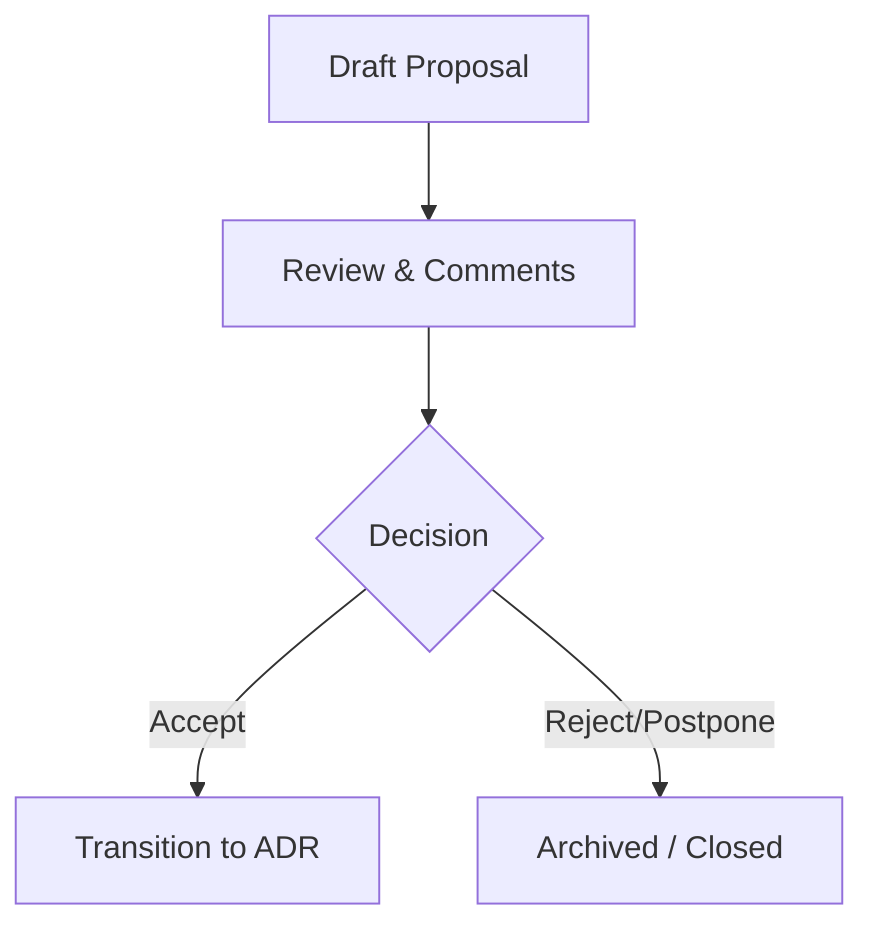

# MoroQuant Request For Comments (RFC) Directory

Welcome to the **MoroQuant RFC Directory**. This directory houses proposals for key design iterations, library introductions, or structural pivots.

## RFC Register

| RFC ID | Title | Status | Target Phase |
|---|---|---|---|
| [RFC-001](file:///home/zafka/trade-dashboard/docs/rfc/RFC-001-Hot-Reload-Models.md) | Hot Reloading ML Models | Proposed | Sprint 3.0 |
| [RFC-002](file:///home/zafka/trade-dashboard/docs/rfc/RFC-002-Risk-Engine.md) | Real-time Risk Engine Design | Proposed | Sprint 3.0 |
| [RFC-003](file:///home/zafka/trade-dashboard/docs/rfc/RFC-003-Portfolio-Optimization.md) | Portfolio Optimization Module | Proposed | Sprint 3.1 |
| [RFC-004](file:///home/zafka/trade-dashboard/docs/rfc/RFC-004-Rust-Execution-Engine.md) | Rust Execution Engine Integration | Proposed | Sprint 3.2 |

## Lifecycle of an RFC

To propose a new architecture decision or technology stack change, copy the RFC template and submit a Pull Request.
