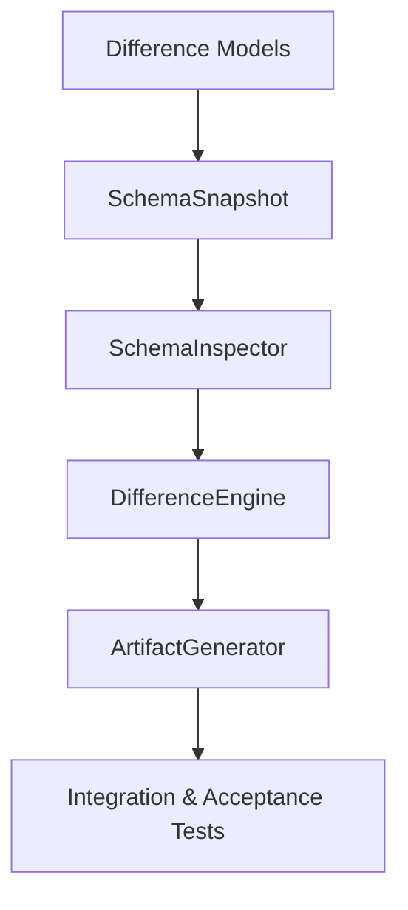

# Sprint 2.3A Implementation Plan: Schema Inspector & Difference Engine

**Status**: FROZEN / APPROVED  
**Contract ID**: MoroQuant-Sprint-2.3A-Execution-v1.0  
**Target Agent**: Claude Code  

---

## 1. Sprint Philosophy

To ensure reliability and safeguard database integrity, implementation must adhere to these five pillars:
1.  **Test-First Mindset**: Tests must be written alongside or immediately after structural interfaces are declared, prior to implementing business logic.
2.  **Strict Read-Only Enforcement**: Any database interaction must be explicitly forced into read-only transaction scopes. Write permissions must not be acquired.
3.  **Small Incremental Changes**: Components must be built and tested individually before being integrated.
4.  **Deterministic Serialization**: Object serialization to JSON must yield identical byte strings across all runs (e.g., sorted keys, uniform formatting).
5.  **Fail-Fast Execution**: The engine must fail immediately and raise explicit errors when encountering corrupted files or structural unknowns, rather than returning partial or guess-based states.

---

## 2. Dependency Graph

The execution path is linear, moving from structural models up to system validation:



---

## 3. Implementation Phases

### Phase 1: Models & Structures (`Difference Models` & `SchemaSnapshot`)
*   **Objectives**: Define the static data types and frozen structures representing the database.
*   **Deliverables**: 
    *   `ml_service/migrations/recovery/models.py` (frozen dataclasses for columns, indexes, tables, and differences).
    *   `ml_service/migrations/recovery/snapshot.py` (snapshot immutable properties).
*   **Dependencies**: None.
*   **Exit Criteria**: Successful compile/parse of model files; 100% typing coverage.
*   **Testing**: Basic object serialization tests (assert objects are immutable and serializable).
*   **Complexity**: Low.

### Phase 2: Read-Only Schema Capture (`SchemaInspector`)
*   **Objectives**: Query the catalog safely to build the snapshots.
*   **Deliverables**:
    *   `ml_service/migrations/recovery/inspector.py` (implements the PRAGMA parser).
*   **Dependencies**: Phase 1.
*   **Exit Criteria**: Snapshot capturing logic runs against a local SQLite file in under 100ms.
*   **Testing**: Mock schema unit tests, connection failure tests.
*   **Complexity**: Medium.

### Phase 3: Drift Analysis Logic (`DifferenceEngine`)
*   **Objectives**: Write the logic comparing compiled target migrations against captured snapshots.
*   **Deliverables**:
    *   `ml_service/migrations/recovery/engine.py` (contains matching and normalization routines).
*   **Dependencies**: Phase 2.
*   **Exit Criteria**: The engine correctly classifies known drift sets (e.g., missing index, duplicate column).
*   **Testing**: Unit tests simulating different types of database discrepancies.
*   **Complexity**: High.

### Phase 4: Output Rendering (`ArtifactGenerator`)
*   **Objectives**: Serialize reports to JSON and Markdown on disk.
*   **Deliverables**:
    *   `ml_service/migrations/recovery/generator.py` (generates the report payload).
*   **Dependencies**: Phase 3.
*   **Exit Criteria**: Valid schemas generated for `schema_snapshot.json` and `difference_report.json`.
*   **Testing**: Schema validation checks and file output permissions testing.
*   **Complexity**: Low.

### Phase 5: Pipeline & Regression Tests
*   **Objectives**: Verify execution robustness and regression safety.
*   **Deliverables**:
    *   `ml_service/tests/test_recovery_inspector.py` (complete suite).
*   **Dependencies**: Phase 4.
*   **Exit Criteria**: All tests pass; coverage is over 90%.
*   **Testing**: Golden snapshots and live test database migrations.
*   **Complexity**: Medium.

---

## 4. Implementation Order & Rationale

1.  **Models & Snapshots First**: Establishes the static types that act as the interface contract between the inspector, engine, and reporting components.
2.  **SchemaInspector Second**: Unlocks live testing capabilities by feeding real physical schema snapshots into development mock loops.
3.  **DifferenceEngine Third**: Focuses purely on logic analysis using structured inputs.
4.  **ArtifactGenerator Fourth**: Integrates output formatting and report serialization once logical structures are fully validated.

---

## 5. Chronological Testing Roadmap

```
+------------+     +-------------------+     +------------------+     +------------------+
| Unit Tests | --> |  Golden Snapshots | --> | Regression Tests | --> | Acceptance Tests |
+------------+     +-------------------+     +------------------+     +------------------+
```
1.  **Unit Tests**: Validate column normalizers, type conversions, and model immutability.
2.  **Golden Snapshot Tests**: Ensure `SchemaInspector` output matches static predefined physical SQLite structures exactly.
3.  **Regression Tests**: Re-create the Sprint 2.2B schema state and verify the engine detects and classifies it as a `Replay Conflict`.
4.  **Integration Tests**: Run the entire chain from DB capture to report output on disk.
5.  **Performance Tests**: Assert snapshot capture on 50 tables completes in <500ms.

---

## 6. Engineering Decisions & Rationale

*   **Immutable Objects**: Prevents runtime code from accidentally altering snapshot states or classifications during validation passes.
*   **Read-Only Interfaces**: Eliminates database writes by design. Connection parameters must raise sqlite authorizations exceptions if any write operation is attempted.
*   **Deterministic Serialization**: Guarantees output logs are reproducible and git-diff friendly (e.g., keys are sorted, timestamps are formatted uniformly).
*   **Normalized Comparison**: Allows columns like `INTEGER` and `INT` or defaults with varying whitespace to be recognized as matching, avoiding false drift reports.

---

## 7. Risk Register

| Risk | Impact | Severity | Mitigation |
| :--- | :--- | :--- | :--- |
| **Accidental Database Writes** | Data Corruption | CRITICAL | Enforce read-only SQLite configurations (`?mode=ro`) at connection initialization. |
| **SQLite Dialect Incompatibilities** | Failed comparisons | MEDIUM | Normalize datatypes and default constraints to standardized formats before comparisons. |
| **Slow Schema Queries on Large Catalogs** | Performance Latency | LOW | Restrict catalog searches to the main database schema, avoiding deep system checks. |

---

## 8. Definition of Ready (DoR)

*   [x] ADR-023 v1.1 is approved and frozen.
*   [x] Sprint-2.3A Design Specification is frozen.
*   [x] Static test SQLite DB file mimicking drift is available.

---

## 9. Definition of Done (DoD)

*   [ ] Python module implemented under `ml_service/migrations/recovery/`.
*   [ ] Read-only sqlite configuration enforced in production runtime code.
*   [ ] Standard report outputs written to `/storage/reports/`.
*   [ ] 100% test coverage for all classification categories.
*   [ ] PR build runs successfully without any compile warnings or errors.

---

## 10. Handoff Instructions for Claude Code

1.  **Scope Limit**: You must implement **ONLY** the read-only inspection and reporting modules.
2.  **Forbidden Operations**: 
    *   Do **NOT** write execution logic, database update functions, or interactive command confirm prompt loops.
    *   Do **NOT** write SQL queries that insert, update, or alter tables.
    *   Do **NOT** edit or rebuild `schema_migrations` table records.
3.  **Target Code Location**: Write all logic into `ml_service/migrations/recovery/`.
4.  **Verification**: Confirm execution by running python unit tests on read-only sqlite instances.
