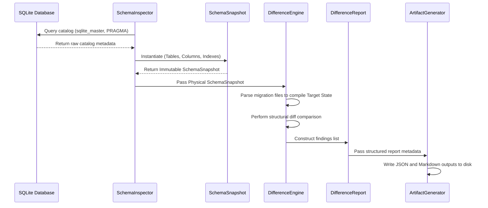

# Sprint 2.3A Design Specification: Schema Inspector & Difference Engine

**Status**: FROZEN / APPROVED  
**Role**: Principal Software Architect  
**Engineering Contract ID**: MoroQuant-Sprint-2.3A-Contract-v1.0  
**Target Implementation Agent**: Claude Code  

---

## 1. Architecture Overview

Sprint 2.3A implements the read-only inspection, diagnostic, and reporting capabilities of the Database Recovery Framework. It establishes the physical "Schema Truth" of the active SQLite database without performing any write, update, or migration actions.

```
+------------------+     +-----------------+     +-----------------------+
|  Active Database | --> | SchemaInspector | --> |    SchemaSnapshot     |
+------------------+     +-----------------+     +-----------+-----------+
                                                             |
                                                             v
+------------------+                             +-----------+-----------+
| Target Migration | --------------------------> |   DifferenceEngine    |
|   Files (AST)    |                             +-----------+-----------+
+------------------+                                         |
                                                             v
+------------------+                             +-----------+-----------+
| Artifacts Output | <-------------------------- |    DifferenceReport   |
+------------------+                             +-----------------------+
```

---

## 2. Component Specifications

### 2.1 SchemaSnapshot
*   **Purpose**: Represents the complete physical structure of a database at a specific instance.
*   **Immutability Rules**: Immutable post-initialization. All structures are represented by frozen dataclasses or read-only dictionaries.
*   **Properties**:
    *   `database_path`: System path to the evaluated `.db` file.
    *   `timestamp`: Epoch integer of snapshot capture.
    *   `tables`: Mapping of table name to `TableSchema` (columns, primary key, check constraints, foreign keys).
    *   `indexes`: Mapping of index name to `IndexSchema` (columns, expression, uniqueness, conditional constraints).

### 2.2 SchemaInspector
*   **Responsibilities**: Reads the system catalog using SQLite internal functions. It must use read-only transactions.
*   **Internal Workflow**:
    1. Open database connection in read-only mode (`sqlite3.connect(..., uri=True)` with `?mode=ro`).
    2. Query `sqlite_master` to retrieve all active tables and indexes.
    3. Iterate through tables and execute `PRAGMA table_info(table)`, `PRAGMA foreign_key_list(table)`, and `PRAGMA index_list(table)`.
    4. Construct and return a `SchemaSnapshot`.
*   **Check Constraints Architectural Decision**: SQLite does not provide a read-only structural API to query CHECK constraints (unlike columns, indexes, and foreign keys). Extracting them requires raw SQL string parsing of `sqlite_master`, which is out-of-scope for the Schema Inspector's pure structural extraction. Thus, `check_constraints` in `TableSchema` remain empty (`()`) by design.
*   **Public Interface**:
    ```python
    class SchemaInspector:
        def __init__(self, db_connection_or_path): ...
        def capture_snapshot(self) -> SchemaSnapshot: ...
    ```

### 2.3 DifferenceEngine
*   **Comparison Strategy**: Standardizes structural matching.
    *   **Table Comparison**: Identifies missing or unexpected tables.
    *   **Column Comparison**: Checks column existences, types, constraints, default values, and nullability.
    *   **Index Comparison**: Checks columns mapped, uniqueness flags, and conditional `WHERE` filters.
*   **Matching Rules**:
    *   Datatypes are normalized (e.g., `INTEGER` matches `INT`).
    *   Check constraints and default values must be parsed to ignore formatting differences (like whitespace or extra brackets).

### 2.4 Difference Models
*   **`SchemaDifference`**:
    *   `type`: Type of difference (e.g., `MISSING_COLUMN`, `EXTRA_COLUMN`, `CONSTRAINT_MISMATCH`).
    *   `severity`: `LOW`, `MEDIUM`, `HIGH`, `CRITICAL`.
    *   `classification`: Matches ADR-023 v1.1 types (e.g., `Replay Conflict`, `Schema Drift`).
    *   `recommendation`: Recommends `SAFE_SKIP`, `FORCE_RECORD`, `FORWARD_MIGRATION`, `MANUAL_PATCH`, `HALT`.
    *   `risk`: Risk score of fixing the difference.

---

## 3. Sequence Diagram



---

## 4. Output Artifacts & JSON Schemas

### 4.1 `schema_snapshot.json`
Stores the serialized snapshot structure.
```json
{
  "$schema": "http://json-schema.org/draft-07/schema#",
  "title": "SchemaSnapshot",
  "type": "OBJECT",
  "properties": {
    "database_path": { "type": "STRING" },
    "timestamp": { "type": "INTEGER" },
    "tables": {
      "type": "OBJECT",
      "additionalProperties": {
        "type": "OBJECT",
        "properties": {
          "name": { "type": "STRING" },
          "columns": { "type": "ARRAY", "items": { "type": "OBJECT" } },
          "indexes": { "type": "ARRAY", "items": { "type": "STRING" } }
        }
      }
    }
  }
}
```

### 4.2 `difference_report.json`
Details all deviations discovered.
```json
{
  "$schema": "http://json-schema.org/draft-07/schema#",
  "title": "DifferenceReport",
  "type": "ARRAY",
  "items": {
    "type": "OBJECT",
    "properties": {
      "target_migration": { "type": "STRING" },
      "difference_type": { "type": "STRING" },
      "classification": { "type": "STRING" },
      "severity": { "type": "STRING" },
      "risk": { "type": "STRING" },
      "recommended_action": { "type": "STRING" },
      "details": { "type": "OBJECT" }
    }
  }
}
```

---

## 5. Error & Non-Functional Requirements

### 5.1 Error Model
*   **Recoverable**: Unsupported custom index types (logged as Warnings; fallback to raw text matching).
*   **Fatal**: Database file is unreadable or corrupted (throws `CorruptedDatabaseError` and triggers immediate `HALT` recommendation).
*   **Incompatibilities**: Handled gracefully. SQLite type affinity differences (e.g., `NUMERIC` vs. `REAL`) are resolved using affinity equivalence mappings.

### 5.2 Non-Functional Requirements
*   **Read-Only Guarantee**: The inspector must open connection pools using read-only configuration attributes. If any write statement is executed, Python must raise an authorization exception.
*   **Performance**: Total execution time for capturing snapshots on up to 50 tables must be under **500ms** to prevent app startup latency.

---

## 6. Testing Strategy

*   **Unit Tests**:
    *   Test `SchemaSnapshot` creation under mock inputs.
    *   Verify normalization logic for SQLite default constraints.
*   **Golden Snapshot Tests**:
    *   Keep a pre-populated static `.db` file containing target tables. Verify `SchemaInspector` output matches the golden JSON snapshot exactly.
*   **Regression Tests**:
    *   Simulate the exact Sprint 2.2B drift state (where `execution_decisions` contains `029` columns but `schema_migrations` stops at `028`). Verify the output classifies this as a `Replay Conflict` with recommendation `FORCE_RECORD`.

---

## 7. Operational Guidelines for Claude Code

### Definition of Ready (DoR)
*   [x] ADR-023 v1.1 architecture document is frozen.
*   [x] Database connection helpers in `ml_service.data.database` are read-access validated.

### Definition of Done (DoD)
*   [ ] The module is written completely in Python under `ml_service/migrations/recovery/`.
*   [ ] Absolute read-only compliance verified (zero write permissions used during execution).
*   [ ] Code passes all linting, typing checks, and `npm run build` or project build processes.
*   [ ] Comprehensive unit tests cover duplicate column, missing table, and superseded migration scenarios.

### Handoff Instructions
1. Implement the engine classes under the directory `ml_service/migrations/recovery/`.
2. Connect the `SchemaInspector` to `Database.get_connection()` using a read-only flag.
3. Construct parsing helpers to compile targets from migrations files.
4. Output reports directly to `storage/reports/`.
5. Run tests to confirm correctness without writing database updates.
