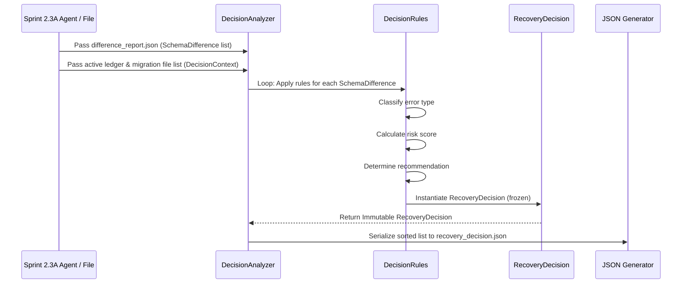

# Sprint 2.3B Design Specification: Decision Analyzer

**Status**: PROPOSED (Ready for Freeze Review)  
**Role**: Principal Database & Systems Architect  
**Engineering Contract ID**: MoroQuant-Sprint-2.3B-Contract-v1.0  
**Target Implementation Agent**: Claude Code  

---

## 1. Architecture Overview

Sprint 2.3B implements the decision-making engine of the MoroQuant Database Recovery Framework. Operating strictly out-of-band and in a completely **read-only** manner, the Decision Analyzer component transforms raw structural differences generated in Sprint 2.3A into actionable, graded recovery decisions.

```
                  +-----------------------------------+
                  |  Sprint 2.3A: Schema Inspector    |
                  +-----------------+-----------------+
                                    |
                                    v (difference_report.json)
                  +-----------------+-----------------+
                  |      [JSON / Stream of Diff]      |
                  +-----------------+-----------------+
                                    |
                                    v
+-----------------------------------+-----------------------------------+
|  Sprint 2.3B: Decision Analyzer (Pure Logic Pipeline)                |
|                                                                       |
|  +-----------------------+     +-------------------+                  |
|  |   DecisionContext     | --> | DecisionAnalyzer  |                  |
|  +-----------------------+     +---------+---------+                  |
|                                          |                            |
|                                          v                            |
|  +-----------------------+     +---------+---------+                  |
|  |  ClassificationRules  | --> |   DecisionEngine  |                  |
|  +-----------------------+     +---------+---------+                  |
|                                          |                            |
|                                          v                            |
|  +-----------------------+     +---------+---------+                  |
|  |     RiskModel         | --> |   DecisionRules   |                  |
|  +-----------------------+     +---------+---------+                  |
|                                          |                            |
|                                          v                            |
|  +---------------------------------------+-------------------------+  |
|  |                 Immutable RecoveryDecision List                 |  |
|  +---------------------------------------+-------------------------+  |
+-------------------------------------------|---------------------------+
                                            |
                                            v (recovery_decision.json)
                  +-------------------------+-------------------------+
                  |  Sprint 2.3C: CLI & Execution Controllers         |
                  +---------------------------------------------------+
```

### 1.1 Strict Isolation Boundaries
In accordance with ADR-023 and Sprint boundaries, the Decision Analyzer is a pure logical mapper. It has **no side effects** and **must not** perform any of the following operations:
*   Connect to databases or inspect physical schemas.
*   Execute SQL statements (DDL, DML, or queries).
*   Alter database tables, indexes, or metadata.
*   Write migration files or schema scripts.
*   Perform recovery plan execution.

---

## 2. Component Specifications & Interfaces

All structures are modeled as frozen Python dataclasses to enforce immutability during execution.

### 2.1 Enums for Decision Mapping
These enums directly match the taxonomy defined in ADR-023:

```python
from enum import Enum

class RecoveryClassification(str, Enum):
    METADATA_DRIFT = "METADATA_DRIFT"
    SCHEMA_DRIFT = "SCHEMA_DRIFT"
    REPLAY_CONFLICT = "REPLAY_CONFLICT"
    SUPERSEDED_MIGRATION = "SUPERSEDED_MIGRATION"
    MISSING_MIGRATION = "MISSING_MIGRATION"
    DESTRUCTIVE_MIGRATION = "DESTRUCTIVE_MIGRATION"
    MANUAL_DATABASE_MODIFICATION = "MANUAL_DATABASE_MODIFICATION"
    UNKNOWN_STATE = "UNKNOWN_STATE"

class RecoveryRisk(str, Enum):
    LOW = "LOW"
    MEDIUM = "MEDIUM"
    HIGH = "HIGH"
    CRITICAL = "CRITICAL"

class RecoveryRecommendation(str, Enum):
    SAFE_SKIP = "SAFE_SKIP"
    FORCE_RECORD = "FORCE_RECORD"
    FORWARD_MIGRATION = "FORWARD_MIGRATION"
    MANUAL_PATCH = "MANUAL_PATCH"
    HALT = "HALT"
```

### 2.2 Immutable Data Models

#### `RecoveryDecision`
Represents the final recovery action proposed for a specific schema discrepancy.

```python
from dataclasses import dataclass, field
from typing import Dict, Any, Optional
from ml_service.migrations.recovery.models import SchemaDifference

@dataclass(frozen=True)
class RecoveryDecision:
    """Immutable output representing a recovery decision for a single difference."""
    difference: SchemaDifference
    classification: RecoveryClassification
    risk: RecoveryRisk
    recommendation: RecoveryRecommendation
    rationale: str
    details: Dict[str, Any] = field(default_factory=dict)

    def to_dict(self) -> Dict[str, Any]:
        """Serialize recovery decision to deterministic dictionary."""
        return {
            "difference": self.difference.to_dict(),
            "classification": self.classification.value,
            "risk": self.risk.value,
            "recommended_action": self.recommendation.value,
            "rationale": self.rationale,
            "details": self.details
        }
```

#### `DecisionContext`
Encapsulates all static inputs required to determine recovery decisions, eliminating database calls.

```python
@dataclass(frozen=True)
class DecisionContext:
    """Immutable context containing metadata ledger and migration file information."""
    applied_migration_names: tuple[str, ...]
    available_migration_files: tuple[str, ...]
    migration_checksums: Dict[str, str]
```

### 2.3 `DecisionAnalyzer`
The core logic engine containing classification rules and risk evaluations.

```python
class DecisionAnalyzer:
    """Pure logical component that maps differences to recovery decisions."""
    
    def __init__(self, context: DecisionContext) -> None:
        self.context = context

    def analyze(self, differences: tuple[SchemaDifference, ...]) -> tuple[RecoveryDecision, ...]:
        """Process differences and return immutable recovery decisions."""
        pass
```

---

## 3. Recovery Decision Matrix & Classification Rules

The decision rules map combinations of `SchemaDifference`, `DecisionContext`, and structural rules to exact outcomes.

| Schema Difference Type | Ledger Status | Classification | Risk Level | Recommendation | Rationale Rule |
| :--- | :--- | :--- | :--- | :--- | :--- |
| `MISSING_TABLE` / `MISSING_COLUMN` | Applied in Ledger | `METADATA_DRIFT` | `CRITICAL` | `HALT` | Schema element has been recorded as applied, but is physically missing. Implies data corruption or unauthorized deletion. |
| `COLUMN_TYPE_MISMATCH` / `NULLABILITY_MISMATCH` | Applied / Any | `SCHEMA_DRIFT` | `HIGH` | `FORWARD_MIGRATION` | Column configuration does not match the target schema. Normalization requires forward migration. |
| `CONSTRAINT_MISMATCH` / `DEFAULT_VALUE_MISMATCH` | Applied / Any | `SCHEMA_DRIFT` | `MEDIUM` | `FORWARD_MIGRATION` | Constraints or defaults mismatch. Safe to fix via standard schema updates. |
| `EXTRA_TABLE` / `EXTRA_COLUMN` / `EXTRA_INDEX` | Not Applied (Statement satisfied) | `REPLAY_CONFLICT` | `LOW` | `FORCE_RECORD` | Migration was not marked applied, but elements exist and structure matches migration targets perfectly. |
| `EXTRA_TABLE` / `EXTRA_COLUMN` | No Matching Migration | `MANUAL_DATABASE_MODIFICATION` | `HIGH` | `MANUAL_PATCH` | Elements exist physically but are completely absent from migration files. Requires DBA manual reconciliation. |
| `MISSING_INDEX` | Ledger Applied | `SCHEMA_DRIFT` | `LOW` | `FORWARD_MIGRATION` | Safe to create index via forward-only patches. |
| Holes in Migration Numbers | N/A | `MISSING_MIGRATION` | `CRITICAL` | `HALT` | Intermediate migration ledger record is missing but subsequent ones exist. Blocks execution. |
| Parsing drops / Narrowing | Any | `DESTRUCTIVE_MIGRATION` | `CRITICAL` | `MANUAL_PATCH` | Migration files contain dropping statements or narrowing types. Automated execution forbidden. |
| Mismatched Checksums | N/A | `UNKNOWN_STATE` | `CRITICAL` | `HALT` | Active migration file contents do not match history checksums. State is unknown. |

---

## 4. Sequence & Pipeline Flow



---

## 5. Output Artifact: `recovery_decision.json`

This JSON payload is consumed by CLI controllers in Sprint 2.3C to prompt operators or halt execution.

```json
{
  "$schema": "http://json-schema.org/draft-07/schema#",
  "title": "RecoveryDecisionReport",
  "type": "ARRAY",
  "items": {
    "type": "OBJECT",
    "properties": {
      "difference": { "type": "OBJECT" },
      "classification": { "type": "STRING" },
      "risk": { "type": "STRING" },
      "recommended_action": { "type": "STRING" },
      "rationale": { "type": "STRING" },
      "details": { "type": "OBJECT" }
    },
    "required": ["difference", "classification", "risk", "recommended_action", "rationale"]
  }
}
```

---

## 6. Testing Strategy

Decision logic validation must be 100% deterministic and mock-driven.

*   **Unit Tests**:
    *   Test each classification mapping (Metadata Drift, Replay Conflict, manual modifications, etc.).
    *   Validate risk grading triggers for each specific schema discrepancy.
    *   Ensure immutability checks throw `FrozenInstanceError` when attempting modification of `RecoveryDecision` fields.
*   **Edge Case & Combinatorial Tests**:
    *   Metadata Hole scenarios (e.g. `001`, `003` applied, but `002` missing).
    *   MigrationChecksum mismatch scenarios (triggers `UNKNOWN_STATE`).
    *   Replay Conflicts where extra columns exist but their types mismatch (must escalate from `FORCE_RECORD` to `SCHEMA_DRIFT` with risk `HIGH`).
*   **No DB Pipeline Check**:
    *   A pipeline validation step checking that the `DecisionAnalyzer` module imports zero database driver components (e.g., `sqlite3`, `ml_service.data.database`) to ensure absolute decoupling.

---

## 7. Definition of Done (DoD)

*   [ ] The module is written completely in Python under `ml_service/migrations/recovery/decision/`.
*   [ ] Absolute decoupling verified: no database modules imported under the decision namespace.
*   [ ] Standard report outputs written deterministically to `/storage/reports/recovery_decision.json`.
*   [ ] Unit test coverage >= 95% for all decision rules.
*   [ ] Code builds successfully (`npm run build` or Python checks pass).
