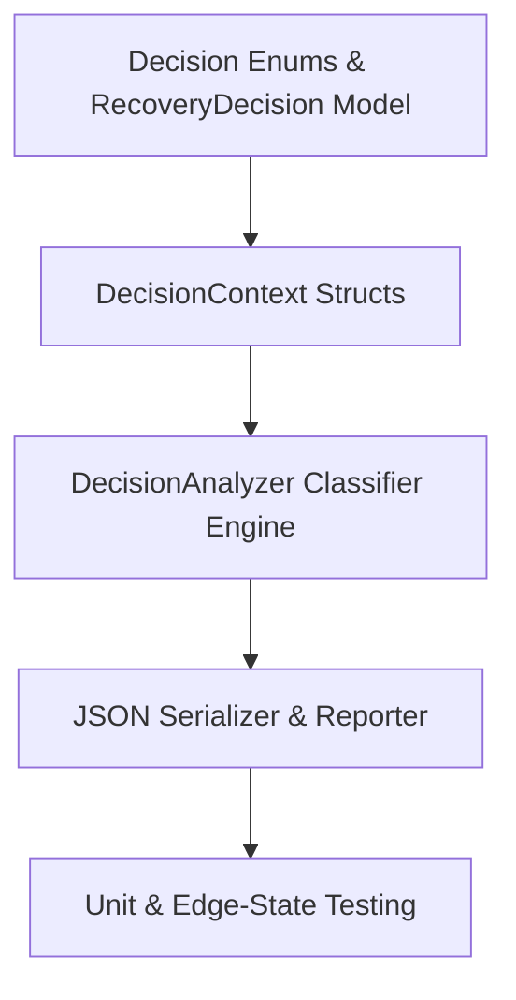

# Sprint 2.3B Implementation Plan: Decision Analyzer

**Status**: PROPOSED (Ready for Freeze Review)  
**Contract ID**: MoroQuant-Sprint-2.3B-Execution-v1.0  
**Target Agent**: Claude Code  

---

## 1. Sprint Philosophy

To ensure deterministic classification and protect metadata integrity, implementation must adhere to these five pillars:
1.  **Strict Read-Only Enforcement**: The decision analyzer operates purely as a data transformer. It must NOT import or use database drivers (e.g., `sqlite3`, `Database`).
2.  **Deterministic Mapping**: The conversion of structural diffs to classifications and risk levels must be rule-based and cover all 8 ADR-023 categories without heuristic ambiguity.
3.  **Immutability Guarantee**: All returned decisions, metadata contexts, and results must use frozen dataclasses or immutable collections.
4.  **Test-First validation**: Unit tests covering edge states (e.g. migration ledger holes, checksum mismatch) must be written alongside the core logic.
5.  **Clean Pipeline Separation**: Decision Analyzer consumes data produced in Sprint 2.3A and outputs structured logs for consumption in Sprint 2.3C.

---

## 2. Dependency Graph

The execution path is linear, moving from immutable structures up to system validation:



---

## 3. Implementation Phases

### Phase 1: Decision Models & Enums
*   **Objectives**: Define the static data types, enums, and frozen structures representing recovery decisions.
*   **Deliverables**:
    *   Add new enums to `ml_service/migrations/recovery/models.py` (`RecoveryClassification`, `RecoveryRisk`, `RecoveryRecommendation`).
    *   Implement `RecoveryDecision` and `DecisionContext` frozen dataclasses.
*   **Dependencies**: Sprint 2.3A models.
*   **Exit Criteria**: Clean parse of models, no syntax warnings, 100% type annotations coverage.
*   **Testing**: Serialization tests showing `RecoveryDecision` correctly formats to expected JSON schemas.
*   **Complexity**: Low.

### Phase 2: Classification Engine (`DecisionAnalyzer`)
*   **Objectives**: Write the logical pipeline that evaluates differences against context to produce recovery decisions.
*   **Deliverables**:
    *   Create `ml_service/migrations/recovery/decision/analyzer.py` (contains `DecisionAnalyzer` and decision rule mappings).
*   **Dependencies**: Phase 1.
*   **Exit Criteria**: Classifies all 8 database drift categories accurately based on target migrations and ledger states.
*   **Testing**: Unit tests simulating each category (e.g., metadata drift, manual modification, replay conflict).
*   **Complexity**: High.

### Phase 3: Serialization & Reporter
*   **Objectives**: Output deterministic reports to disk.
*   **Deliverables**:
    *   Create `ml_service/migrations/recovery/decision/reporter.py` (serializes decisions to `storage/reports/recovery_decision.json` with sorted keys).
*   **Dependencies**: Phase 2.
*   **Exit Criteria**: Generated report validates against the design schema.
*   **Testing**: Determinism checking (multiple runs yield exact same bytes).
*   **Complexity**: Low.

### Phase 4: Integration & Edge-State Tests
*   **Objectives**: Verify boundary execution safety.
*   **Deliverables**:
    *   Create `ml_service/tests/test_decision_analyzer.py` (complete suite).
*   **Dependencies**: Phase 3.
*   **Exit Criteria**: All tests pass; coverage is over 95%.
*   **Testing**: Test for checksum discrepancies, ledger hole handling, and non-db import validation.
*   **Complexity**: Medium.

---

## 4. Chronological Testing Roadmap

```
+---------------+     +--------------------+     +------------------+
| Model Tests   | --> | Rule Matrix Tests  | --> | Pipeline Checks  |
+---------------+     +--------------------+     +------------------+
```
1.  **Model Tests**: Verify immutability of context and decision structures.
2.  **Rule Matrix Tests**: Validate each mapped decision rule matches expected risk levels and recommendations.
3.  **Pipeline Checks**: Static check verifying that no file in `ml_service/migrations/recovery/decision/` performs database imports.

---

## 5. Risk Register

| Risk | Impact | Severity | Mitigation |
| :--- | :--- | :--- | :--- |
| **Accidental database imports** | Architectural regression | HIGH | Enforce static verification checking for `sqlite3` or `database.py` imports in CI pipelines. |
| **Undocumented drift combos** | Fallback to unsafe recommendations | MEDIUM | Map any unclassified drift to `UNKNOWN_STATE` with risk `CRITICAL` and action `HALT`. |
| **JSON Serialization drift** | Broken output compatibility | LOW | Enforce deterministic key ordering and standardized datetime strings in serializers. |

---

## 6. Definition of Ready (DoR)

*   [x] ADR-023 v1.1 database recovery framework is approved and frozen.
*   [x] Sprint 2.3A Schema Inspector implementation is frozen/released in v1.4.0.

---

## 7. Definition of Done (DoD)

*   [ ] Pure logical code implemented in Python under `ml_service/migrations/recovery/decision/`.
*   [ ] 100% decoupled from active database connections.
*   [ ] Decisions written to `/storage/reports/recovery_decision.json`.
*   [ ] Comprehensive unit tests cover checksum drift, missing migrations, and replay conflicts.
*   [ ] Code passes all linters and styling checkers.

---

## 8. Handoff Instructions for Claude Code

1.  **Scope Limit**: Implement **ONLY** the logical analyzer and JSON reporter.
2.  **Forbidden Operations**:
    *   Do **NOT** write database connections or queries.
    *   Do **NOT** perform any filesystem writes outside of `/storage/reports/`.
    *   Do **NOT** run schema migrations or repair executors.
3.  **Target Code Location**: Write all decision logic into `ml_service/migrations/recovery/decision/`.
