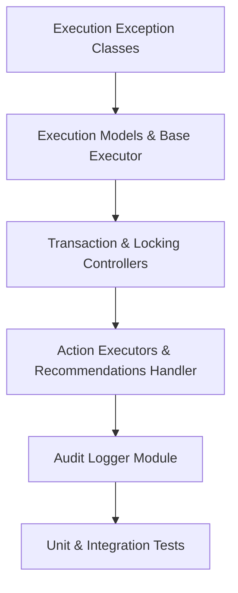

# Sprint 2.3C Implementation Plan: Recovery Executor

**Status**: PROPOSED (Ready for Freeze Review)  
**Contract ID**: MoroQuant-Sprint-2.3C-Execution-v1.0  
**Target Agent**: Claude Code  

---

## 1. Sprint Philosophy

To ensure transactional safety and strict operational control over database repairs:
1. **Isolation of Concerns**: The executor executes approved decisions without any evaluation logic.
2. **Transaction Integrity**: Every recovery step is run under transaction isolation (`BEGIN IMMEDIATE` / rollback).
3. **Auditability**: Every attempt, success, or failure writes a JSON audit trail to disk.
4. **Safety-First Bounds**: Automatic execution is restricted to low-risk actions; high/critical risk actions require active tokens.
5. **No Regressions**: Replay validation compatibility is verified on completion.

---

## 2. Dependency Graph

---

## 3. Implementation Phases & Commit Breakdown

This sprint is divided into small, sequential commits to ensure clean review tracking.

### Phase 1: Models, Exceptions, & Scaffolding
- **Commit 1**: Define Execution Exceptions and `ExecutionResult` dataclass.
  - *Files*: `ml_service/migrations/recovery/executor.py` (Exceptions, `ExecutionResult`).
  - *Exit Criteria*: Successful imports and zero type errors.
- **Commit 2**: Scaffolding of `RecoveryExecutor` with batch loop logic.
  - *Files*: `ml_service/migrations/recovery/executor.py` (add `RecoveryExecutor` skeleton, validation checking, token checks).
  - *Exit Criteria*: Batch loop passes validation but does not touch database yet.

### Phase 2: Transaction Management & Execution Pipeline
- **Commit 3**: Implement Transactional wrapper logic.
  - *Files*: `ml_service/migrations/recovery/executor.py` (Integrate sqlite `BEGIN IMMEDIATE`, `commit()`, and `rollback()`).
  - *Exit Criteria*: Ensures connection errors trigger rollback cleanly.
- **Commit 4**: Implement specific recommendations handling.
  - *Files*: `ml_service/migrations/recovery/executor.py` (Implement `FORCE_RECORD`, `SAFE_SKIP`, `FORWARD_MIGRATION`, `MANUAL_PATCH`).
  - *Exit Criteria*: The execution of each action triggers the correct DDL/DML update on database mocks.

### Phase 3: Logging & Audit Trail
- **Commit 5**: Implement Audit Logger/Reporter utility.
  - *Files*: `ml_service/migrations/recovery/reporter.py` (Implement `write_recovery_log` to serialize `ExecutionResult` lists to `/storage/reports/recovery_audit/` or `logs/`).
  - *Exit Criteria*: Deterministic JSON serialization of execution records with timestamp and operator name.

### Phase 4: Testing & CI Verification
- **Commit 6**: Add Test Suite.
  - *Files*: `ml_service/tests/test_recovery_executor.py`
  - *Exit Criteria*: Unit and integration tests cover lock failures, transaction rollbacks, invalid token validation, and successful executions. Coverage >= 95%.

---

## 4. Risk Register

| Risk | Impact | Severity | Mitigation |
| :--- | :--- | :--- | :--- |
| **Silent Rollback Failures** | Schema/Ledger Drift | CRITICAL | Put rollback statement under nested `finally` or `except` block; raise error if rollback itself fails. |
| **Deadlock under Concurrent Executions** | Application freeze | HIGH | Enforce SQLite write locks using `BEGIN IMMEDIATE` transactions. |
| **Missing Audit Trail** | Loss of operations history | MEDIUM | Ensure logging does not raise exception but fails-safe or alerts operator with standard warnings. |

---

## 5. Definition of Ready (DoR)
* [x] `Sprint-2.3B-Decision-Analyzer-Design` design document is reviewed and frozen.
* [x] `ml_service/migrations/recovery/decision/analyzer.py` is implemented and verified.

## 6. Definition of Done (DoD)
* [ ] Code implemented cleanly under `ml_service/migrations/recovery/executor.py`.
* [ ] Zero static/lint errors.
* [ ] 100% test coverage for rollback operations.
* [ ] `npm run build` or equivalent verification pipeline checks pass.
