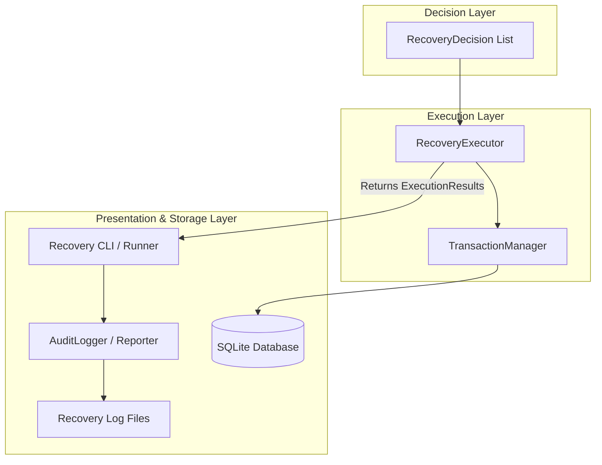
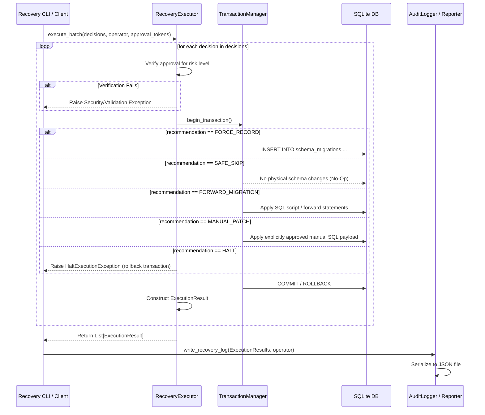

# Sprint 2.3C Design Specification: Recovery Executor

**Status**: PROPOSED (Ready for Freeze Review)  
**Role**: Principal Database & Systems Architect  
**Engineering Contract ID**: MoroQuant-Sprint-2.3C-Contract-v1.0  
**Target Implementation Agent**: Claude Code  

---

## 1. Responsibilities & Separation of Concerns

The `RecoveryExecutor` is the action-taking component of the MoroQuant Database Recovery Framework. It operates at the lowest level of the recovery pipeline, directly interacting with the physical database and the migration ledger.

### 1.1 Core Responsibilities
- **Consume Immutable Decisions**: Accept a sequence of read-only `RecoveryDecision` objects produced by the `DecisionAnalyzer`.
- **Enforce Layer Boundaries**: Rely strictly on incoming pre-calculated decisions. The executor does not perform any classification, analysis, or risk calculations.
- **Verify Approvals**: Ensure that high/critical-risk decisions possess the necessary manual approval tokens or explicit bypass confirmations before executing them.
- **Execute Transaction-Safe Operations**: Perform operations (such as metadata recording, SQL application, or schema skipping) inside controlled transactions.
- **Return Immutable Execution Results**: Return structured `ExecutionResult` dataclasses indicating the status and applied operations for each decision.
- **Raise Halt Actions**: Raise system-terminating errors when a decision recommendation is `HALT` or validation fails.

### 1.2 Forbidden Responsibilities
- **No Self-Analysis**: Must never decide *why* a migration is missing or *what* drift type exists.
- **No Risk Classification**: Must never compute or alter the risk level (`LOW`, `MEDIUM`, `HIGH`, `CRITICAL`) of any decision.
- **No Automatic Execution of High/Critical Actions**: Must never execute `HIGH` or `CRITICAL` risk actions unless explicit validation tokens are provided.
- **No Direct Schema Mutating Bypasses**: Must never execute raw SQL statements that bypass the defined database connection manager or transaction scope.
- **No File Serialization**: Must not directly handle JSON serialization or file system operations for audit logging/reporting.

---

## 2. Architecture & Pipeline Flow

The recovery pipeline follows a strict layered design:

```
+------------------+     +-------------------+     +-------------------+     +------------------+
| SchemaInspector  | --> | DifferenceEngine  | --> | DecisionAnalyzer  | --> | RecoveryExecutor |
+------------------+     +-------------------+     +-------------------+     +--------+---------+
                                                                                      |
                                                                                      v
                                                                             +--------+---------+
                                                                             |     Database     |
                                                                             +------------------+
```

### 2.1 Component Diagram



### 2.2 Sequence Diagram



---

## 3. Public API Specification

The implementation of `RecoveryExecutor` must export the following classes and methods in `ml_service/migrations/recovery/executor.py`.

```python
from dataclasses import dataclass
from typing import Dict, List, Any, Optional
from ml_service.data.database import Database
from ml_service.migrations.recovery.models import RecoveryDecision, RecoveryRecommendation, RecoveryRisk

class ExecutionError(Exception):
    """Base exception for all recovery execution failures."""
    pass

class ApprovalRequiredError(ExecutionError):
    """Raised when an action requires approval but no valid token is provided."""
    pass

class RecoveryHaltedError(ExecutionError):
    """Raised when a HALT recommendation is processed or execution is explicitly aborted."""
    pass

@dataclass(frozen=True)
class ExecutionResult:
    """Immutable record of a single recovery decision execution."""
    decision: RecoveryDecision
    success: bool
    applied_sql: Optional[str]
    error_message: Optional[str]
    timestamp: str

class RecoveryExecutor:
    """Handles the execution of recovery decisions against a database."""

    def __init__(self, db: Database) -> None:
        """Initialize the executor with a Database connection context."""
        self._db = db

    def execute_batch(
        self,
        decisions: List[RecoveryDecision],
        operator: str,
        approval_tokens: Optional[Dict[str, str]] = None
    ) -> List[ExecutionResult]:
        """Execute a series of recovery decisions sequentially.

        Args:
            decisions: List of immutable RecoveryDecision structures.
            operator: Identifier of the user or system executing recovery.
            approval_tokens: Map of Decision ID/Checksum to manual approval tokens.

        Returns:
            List of ExecutionResult records.

        Raises:
            ApprovalRequiredError: If high/critical risk is run without token.
            RecoveryHaltedError: If a decision is classified as HALT.
            ExecutionError: On transaction or SQLite query failure.
        """
        pass
```

---

## 4. Internal Pipeline & Action Execution

The executor maps each `RecoveryRecommendation` to a specific database function:

1. **`FORCE_RECORD`**:
   - Executes: `INSERT INTO schema_migrations (migration_name, applied_at) VALUES (?, CURRENT_TIMESTAMP)`
   - Context check: Verifies that the table `schema_migrations` exists before executing.
2. **`SAFE_SKIP`**:
   - Executes: No-Op on database.
   - Action: Writes the execution to the audit log trail indicating that the migration was bypassed due to physical satisfaction.
3. **`FORWARD_MIGRATION`**:
   - Executes: Runs statements associated with the forward migration from the codebase.
   - Safety: Statements must be run inside a transaction.
4. **`MANUAL_PATCH`**:
   - Executes: Runs a verified DBA patch SQL script supplied in the `approval_tokens` or `details`.
   - Security: Fails if the SQL script is empty or missing.
5. **`HALT`**:
   - Executes: Aborts transaction and raises `RecoveryHaltedError` to halt the runner.

---

## 5. Transaction & Rollback Strategy

- **Granular Isolation**: Each decision in a batch is executed in its own transaction block. If one decision fails, it rolls back that specific transaction and stops the rest of the batch, preserving the database in a clean intermediate state.
- **SQLite Locking**: SQLite requires transaction serialization. Use `BEGIN IMMEDIATE` to prevent deadlock states during schema writes.
- **Rollback Mechanics**: 
  ```python
  conn = self._db.get_connection()
  cursor = conn.cursor()
  cursor.execute("BEGIN IMMEDIATE")
  try:
      # Apply execution changes
      conn.commit()
  except Exception as e:
      conn.rollback()
      # Log and re-raise
  ```

---

## 6. Audit Logging & Verification

To maintain strict separation of concerns, the `RecoveryExecutor` does not perform file I/O or direct JSON serialization. It returns a list of `ExecutionResult` structures to the calling CLI/Runner layer.

The calling layer (or a dedicated `AuditLogger`/`ReportGenerator` component) is then responsible for serializing these results and writing them to the recovery audit directory (e.g., `/storage/reports/recovery_audit/` or `logs/`).

Log filenames are structured using the pattern `recovery_audit_<timestamp>_<migration_id>.json`.

### Log Structure (Generated by the AuditLogger component)
```json
{
  "timestamp": "2026-07-29T18:56:34Z",
  "operator": "zafka",
  "decision": {
    "difference_type": "EXTRA_TABLE",
    "table_name": "execution_decisions",
    "classification": "REPLAY_CONFLICT",
    "risk": "LOW"
  },
  "execution": {
    "recommendation": "FORCE_RECORD",
    "success": true,
    "applied_sql": "INSERT INTO schema_migrations ...",
    "error": null
  }
}
```

---

## 7. Failure Modes & Mitigations

- **Database Locked (`sqlite3.OperationalError: database is locked`)**:
  - *Mitigation*: Retries with exponential backoff on `BEGIN IMMEDIATE`. Maximum 3 retries before aborting execution.
- **Invalid/Expired Approval Token**:
  - *Mitigation*: Reject execution before opening any transaction, raising `ApprovalRequiredError`.
- **Ledger Inconsistency During Execution**:
  - *Mitigation*: Validate state right before DDL execution. If another process has updated the ledger, abort immediately.

---

## 8. Testing Strategy

- **Unit Tests**:
  - Mock database connections to verify that DDL statements and SQL updates are issued correctly for each recommendation.
  - Test validation rules for approval tokens across different risk levels (`LOW`, `MEDIUM`, `HIGH`, `CRITICAL`).
- **Integration Tests**:
  - Execute a simulated drift state against a real temporary SQLite database instance.
  - Verify that a `FORCE_RECORD` correctly updates the `schema_migrations` table.
  - Verify that a transaction rollback keeps the database pristine if execution fails.
- **Failure Assertions**:
  - Verify that processing a `HALT` decision raises `RecoveryHaltedError` and commits nothing.
