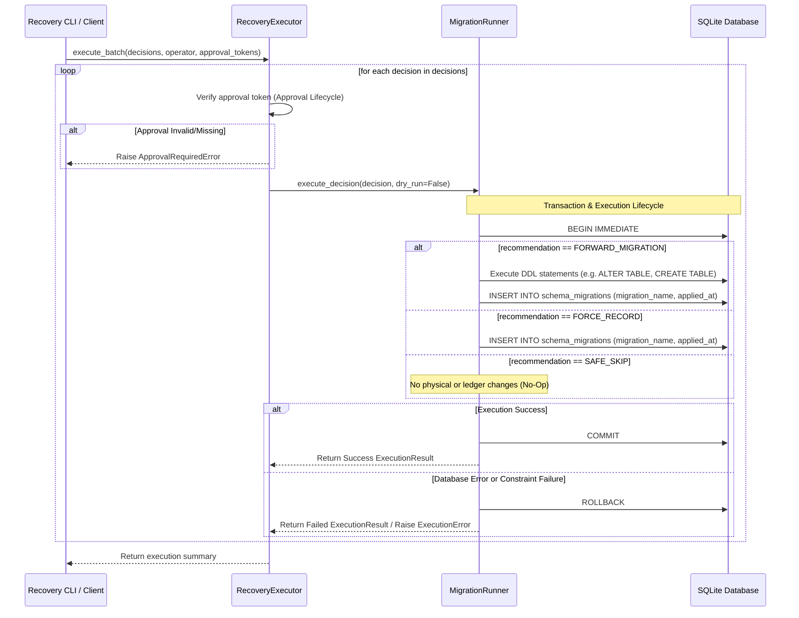

# Sprint 2.3D Design Specification: Migration Runner

**Status**: PROPOSED (Ready for Freeze Review)  
**Role**: Principal Database & Systems Architect  
**Engineering Contract ID**: MoroQuant-Sprint-2.3D-Contract-v1.0  
**Target Implementation Agent**: Claude Code  

---

## 1. Responsibilities & Separation of Concerns

The `MigrationRunner` is the execution engine of the MoroQuant Database Recovery Framework. It acts as a bridge between the orchestrated recovery plan managed by the `RecoveryExecutor` and the physical database instance.

### 1.1 RecoveryExecutor (Orchestrator)
- **Sequence Orchestration**: Loops through the list of `RecoveryDecision` objects.
- **Safety Checks**: Validates the approval tokens for high/critical decisions before calling the runner.
- **Reporter Delegation**: Passes the overall execution results to the `RecoveryReporter` for audit serialization.
- **Decision Engine Separation**: Does not touch the database connection directly or run SQL.

### 1.2 MigrationRunner (Executor)
- **SQL Execution**: Directly connects to SQLite and executes physical DDL/DML.
- **Transaction Boundaries**: Manages database connection, transaction isolation levels, and locking modes.
- **Ledger Verification & Mutation**: Responsible for checking the existence of `schema_migrations` and recording applied migrations.
- **Dry-Run Simulation**: Executes validation checks and outputs the SQL statements that *would* run, without modifying the database.
- **Error Propagation**: Handles low-level SQLite errors and translates them into structured execution exceptions.

---

## 2. Component Design & Architecture

```
                                  +------------------+
                                  |   CLI / Client   |
                                  +--------+---------+
                                           |
                                           v
                                  +------------------+
                                  | RecoveryExecutor |
                                  +--------+---------+
                                           |
                    +----------------------+----------------------+
                    |                                             |
                    v                                             v
          +------------------+                          +------------------+
          |  MigrationRunner |                          | RecoveryReporter |
          +--------+---------+                          +--------+---------+
                   |                                               |
                   v                                               v
        +----------+----------+                         +----------+----------+
        |   SQLite Database   |                         |  Audit Log File     |
        +---------------------+                         +---------------------+
```

### 2.1 Sequence Diagram



---

## 3. Lifecycles & Behaviors

### 3.1 Transaction Lifecycle
1. **Granularity**: Exactly one transaction is opened per recovery action.
2. **Locking Mode**: Every mutation transaction must begin with `BEGIN IMMEDIATE` to obtain an exclusive write lock immediately. This prevents concurrent deadlocks in SQLite environments.
3. **Retry Strategy**:
   - If SQLite returns `database is locked` (`sqlite3.OperationalError`), the runner implements an exponential backoff retry.
   - Max retries: 3 attempts (e.g., wait 100ms, 200ms, 400ms).
   - If it still fails, abort the transaction and raise `ExecutionError`.
4. **Commit Sequence**:
   - Ensure the physical schema changes (e.g., column addition, index creation) execute successfully.
   - Insert the migration record into `schema_migrations`.
   - Issue the `COMMIT` instruction.

### 3.2 Rollback Lifecycle
1. **Triggers**: Any raised exception during SQL execution (e.g., syntax error, constraint validation failure, lock timeout, connection failure) must trigger a rollback.
2. **Deterministic Cleanup**:
   - Issue `ROLLBACK` to SQLite.
   - Any secondary exception raised during the rollback attempt itself must be caught, logged, and suppressed to ensure the *original* database execution exception is propagated as the primary cause of failure.
   - Ensure the database cursor and connection are closed in a `finally` block.

### 3.3 Approval Lifecycle
1. **Risk Mapping**:
   - `LOW` / `MEDIUM` risk actions can be run programmatically or with standard confirmations.
   - `HIGH` / `CRITICAL` risk actions (e.g., structural tables modifications, metadata holes remediation) require a valid cryptographic or checksum-based approval token.
2. **Validation Rules**:
   - The token must match the SHA-256 hash of the target migration file concatenated with the operation code (e.g., `SHA256(migration_sql + "MANUAL_PATCH")`).
   - If the token is missing, malformed, or doesn't match, the `RecoveryExecutor` throws an `ApprovalRequiredError` before calling the runner, ensuring no transaction is ever opened.

### 3.4 Dry-Run Behavior
1. **Read-Only Lock**:
   - Runs validation queries to ensure structural satisfaction.
   - Compiles and logs the exact SQL statements that would be executed.
2. **No Side Effects**:
   - Does NOT open a write transaction.
   - Does NOT modify any table or ledger entry.
   - Emits an execution result marked as `status = SKIPPED` or `status = SUCCESS` with `rolled_back = False`, but with `executed_sql` filled for reporting verification.

### 3.5 Ledger Update Timing
1. **Strict Sequence**:
   ```
   [Step 1: Execute DDL/DML] ──► [Step 2: Write schema_migrations] ──► [Step 3: COMMIT Transaction]
   ```
2. **Rollback Bounds**: If Step 1 or Step 2 fails, the transaction is rolled back, preventing the ledger from drifting from the physical schema truth.

---

## 4. Public API & Interfaces

The following types and classes must be implemented in `ml_service/migrations/recovery/runner.py`.

```python
from dataclasses import dataclass
from typing import Tuple, Optional, Dict, Any
import sqlite3

from ml_service.migrations.recovery.models import (
    RecoveryDecision,
    ExecutionResult,
    ExecutionStatus,
    DecisionContext
)

class MigrationRunnerError(Exception):
    """Base exception for all MigrationRunner errors."""
    pass

class DatabaseLockError(MigrationRunnerError):
    """Raised when the database remains locked after maximum retries."""
    pass

class SQLParseException(MigrationRunnerError):
    """Raised when migration file cannot be parsed or contains syntax errors."""
    pass

class MigrationRunner:
    """Handles low-level execution of SQL statements and transaction safety."""

    def __init__(self, db_path: str, dry_run: bool = False) -> None:
        """Initialize the MigrationRunner.

        Args:
            db_path: Path to the SQLite database file.
            dry_run: If True, executes queries in validation/read-only mode.
        """
        self._db_path = db_path
        self._dry_run = dry_run

    def execute_sql_statements(self, statements: Tuple[str, ...]) -> Tuple[str, ...]:
        """Executes a tuple of raw SQL statements inside a single transaction.

        Args:
            statements: SQL strings to execute.

        Returns:
            Tuple of successfully executed SQL strings.

        Raises:
            DatabaseLockError: If write lock cannot be obtained.
            MigrationRunnerError: If execution fails and is rolled back.
        """
        pass

    def record_ledger(self, migration_name: str) -> str:
        """Appends a migration entry to schema_migrations ledger inside the active transaction.

        Args:
            migration_name: Name of the migration script.

        Returns:
            The SQL statement executed.
        """
        pass
```

The `RecoveryExecutor` signature is updated to delegate database mutation tasks to `MigrationRunner`:

```python
# Modified signature in ml_service/migrations/recovery/executor.py
class RecoveryExecutor:
    def __init__(self, context: DecisionContext, runner: MigrationRunner) -> None:
        """Initialize recovery executor with context and runner."""
        self._context = context
        self._runner = runner
```

---

## 5. Testing Strategy

### 5.1 Unit Tests
- **Mock Connection Failures**: Verify that database locked conditions execute up to 3 retries and raise `DatabaseLockError`.
- **SQL Parser Validation**: Test that SQL helper methods strip comments and extract individual queries accurately.
- **Token Verification Tests**: Assert that invalid/missing approval tokens trigger immediate `ApprovalRequiredError`.

### 5.2 Integration Tests
- **Pristine Rollback Assertion**: Write a test executing three SQL statements where the third fails. Assert that the table state remains completely unmodified (pristine rollback).
- **Ledger Invariant Check**: Assert that a `FORWARD_MIGRATION` update inserts into `schema_migrations` in the same transaction block as the schema change.
- **Dry-run Execution Isolation**: Run the database migrations in dry-run mode and inspect physical tables to ensure zero structural changes occur.

---

## 6. Definition of Done (DoD)

- [ ] `MigrationRunner` class defined in `ml_service/migrations/recovery/runner.py`.
- [ ] `RecoveryExecutor` integrated with `MigrationRunner` for execution execution.
- [ ] No regression on existing validation tests in `tests/test_recovery_executor.py` or equivalent suites.
- [ ] 100% test coverage for transaction rollbacks, retries, and dry-run boundaries.
- [ ] AST knowledge graph updated via `graphify update .`.
