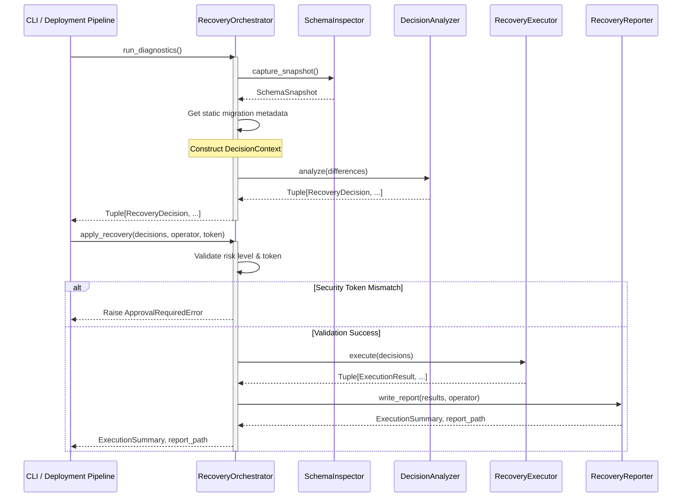

# Sprint 2.4A Design Specification: Recovery Orchestrator

**Status**: PROPOSED (Ready for Freeze Review)  
**Role**: Principal Software Architect  
**Engineering Contract ID**: MoroQuant-Sprint-2.4A-Orchestrator-v1.0  
**Target Implementation Agent**: Claude Code  

---

## 1. Executive Summary & Core Objective

The `RecoveryOrchestrator` serves as the central control plane of the MoroQuant Database Recovery Framework (ADR-023). It coordinates the lifecycle and operational sequence of the five existing core recovery components:
- [SchemaInspector](file:///home/zafka/trade-dashboard/ml_service/migrations/recovery/schema_inspector.py)
- [DecisionAnalyzer](file:///home/zafka/trade-dashboard/ml_service/migrations/recovery/decision/analyzer.py)
- [RecoveryExecutor](file:///home/zafka/trade-dashboard/ml_service/migrations/recovery/executor.py)
- [MigrationRunner](file:///home/zafka/trade-dashboard/ml_service/migrations/recovery/migration_runner.py)
- [RecoveryReporter](file:///home/zafka/trade-dashboard/ml_service/migrations/recovery/reporter.py)

To maintain strict separation of concerns, the orchestrator acts as a **pure coordinator**. It contains zero direct SQL execution, zero logic for diagnosing schema drift, zero direct filesystem manipulation, and zero structural analysis. It acts strictly as an orchestrator, chaining inputs and outputs between the underlying components.

---

## 2. Responsibilities

### 2.1 Orchestrator Responsibilities
- **Component Lifecycle Coordination**: Instantiate and configure inspection, analysis, execution, and reporting components.
- **Workflow State Management**: Govern the progression from read-only inspection/diagnostics to transaction-safe recovery execution and audit reporting.
- **CTO Token Enforcement**: Intercept recovery plans containing `HIGH` or `CRITICAL` risk classifications and block execution unless a matching CTO security token is supplied.
- **Execution Session Context Capture**: Aggregate session metadata (operator identity, host info, timestamp) and provide it to the reporting layer.
- **Unified Error Dispatching**: Standardize error propagation and rollbacks across execution phases.

### 2.2 Forbidden Responsibilities (Boundaries)
- **Zero SQL Execution**: Must never call database connections or execute query/update strings directly. All mutations belong to `RecoveryExecutor`/`MigrationRunner`.
- **Zero Filesystem Writes**: Must never serialize or persist files directly to disk. All report serialization and writing belong to `RecoveryReporter`.
- **Zero Schema Analysis**: Must never inspect physical tables or calculate schema differences. This belongs to `SchemaInspector` and its dependency models.
- **Zero Decision Reasoning**: Must never determine classification, risk level, or recommendations. This belongs strictly to `DecisionAnalyzer`.

---

## 3. Sequence Diagram

The following sequence diagram outlines the end-to-end workflow managed by the orchestrator:



---

## 4. Lifecycle & Orchestration Flow

The `RecoveryOrchestrator` implements two clear operational phases:

### 4.1 Diagnostic Phase (Read-Only)
1. Instantiate `SchemaInspector` using the database connection context.
2. Execute `SchemaInspector.capture_snapshot()` to retrieve the physical `SchemaSnapshot`.
3. Construct the immutable `DecisionContext` by loading the applied migration names from the ledger and computing SHA-256 checksums of local migration scripts.
4. Call `DecisionAnalyzer` with the calculated `DecisionContext` and schema differences.
5. Return the list of `RecoveryDecision` objects back to the caller (e.g., the CLI).

### 4.2 Recovery Execution Phase (Transactional)
1. Scan the list of incoming `RecoveryDecision` objects for risk levels.
2. If any decision risk matches `HIGH` or `CRITICAL`, verify that `approval_token` matches the system environment key (`MQ_CTO_APPROVAL_TOKEN`). If verification fails, raise `ApprovalRequiredError` and abort.
3. Instantiate `RecoveryExecutor` and delegate the decisions tuple.
4. Collect `ExecutionResult` structures returned by the executor.
5. Forward the execution results along with operator information to `RecoveryReporter.write_report()`.
6. Return the resulting `ExecutionSummary` and the generated report filepath.

---

## 5. Public Interface

```python
from typing import Tuple, Optional
from ml_service.migrations.recovery.models import (
    RecoveryDecision,
    ExecutionSummary,
    DecisionContext
)

class RecoveryOrchestrator:
    """Central orchestrator managing database inspection and recovery execution workflows."""

    def __init__(self, db_path: str, migrations_dir: str) -> None:
        """Initialize orchestrator dependencies.

        Args:
            db_path: Absolute file path to the target SQLite database.
            migrations_dir: Absolute directory path to local migrations repository.
        """
        self._db_path = db_path
        self._migrations_dir = migrations_dir

    def run_diagnostics(self) -> Tuple[RecoveryDecision, ...]:
        """Performs a read-only analysis of schema and metadata discrepancies.

        Returns:
            Tuple of calculated RecoveryDecision records.
        """
        pass

    def apply_recovery(
        self,
        decisions: Tuple[RecoveryDecision, ...],
        operator: str,
        approval_token: Optional[str] = None
    ) -> Tuple[ExecutionSummary, str]:
        """Coordinates risk checks, executes recovery decisions, and writes the audit trail.

        Args:
            decisions: Sequence of decisions to execute.
            operator: Identifier for the operator triggering the execution.
            approval_token: Manual validation token matching MQ_CTO_APPROVAL_TOKEN.

        Returns:
            Tuple containing the ExecutionSummary object and absolute path to audit log.

        Raises:
            ApprovalRequiredError: If HIGH/CRITICAL actions lack a valid token.
            RecoveryHaltedError: If a HALT recommendation is processed.
            ExecutionError: On SQL transaction errors.
        """
        pass
```

---

## 6. Transaction Boundary & Error Propagation

- **Atomic Scoping**: Although the orchestrator guides lifecycle steps, it remains outside transaction boundaries. Individual SQL transactions are controlled solely inside the `RecoveryExecutor`/`MigrationRunner` connection boundaries.
- **Fail-Fast Mechanics**: The orchestrator must process decisions in sequence. If any step fails during execution, the exception must propagate immediately, stopping downstream executions.
- **State Integrity**: In the event of a transaction rollback, the orchestrator guarantees that the exception is bubbled up to the caller with the details of the failed step, while ensuring the execution reporting captures the rolled-back status.

---

## 7. Deterministic Guarantees

- **No Shared Mutable State**: Orchestrator methods operate exclusively on immutable data structures (`SchemaSnapshot`, `DecisionContext`, `RecoveryDecision`, `ExecutionResult`).
- **Ordered Execution**: The orchestrator processes migration recovery sequentially by sorting targeted migrations numerically prior to routing to execution.
- **Consistent Telemetry**: Timestamps and execution durations are tracked deterministically using standard ISO-8601 UTC patterns, delegated to standard library definitions.

---

## 8. Testing Strategy

### 8.1 Mocking Strategy
Test coverage must use mocks for the underlying physical entities to avoid database and filesystem mutations during testing:
- **Inspect Testing**: Mock `SchemaInspector.capture_snapshot` to simulate mismatched physical states (e.g. missing tables).
- **Audit Logging Mocking**: Mock `RecoveryReporter.write_report` to verify parameters are compiled correctly without writing actual files during unit tests.

### 8.2 Unit Tests Cases
- **Bypass Token Logic**: Verify that low-risk actions execute successfully without an approval token.
- **CTO Token Gate**: Assert that `HIGH` or `CRITICAL` risk items raise `ApprovalRequiredError` when the token is missing or mismatched.
- **Pipeline Progression**: Assert that a `HALT` recommendation results in an early exit without hitting the execution layer.

---

## 9. Definition of Done (DoD)

- [ ] Implementation of `RecoveryOrchestrator` matches this interface specification exactly.
- [ ] Direct database writes and direct file serialization are completely absent from the orchestrator class.
- [ ] Integration tests verify coordination from physical inspect to final reporter invocation.
- [ ] Test coverage exceeds 95% for orchestrator routing paths.
- [ ] Zero static code validation warnings or linter errors.
- [ ] Graphify database structure is updated post-commit.
