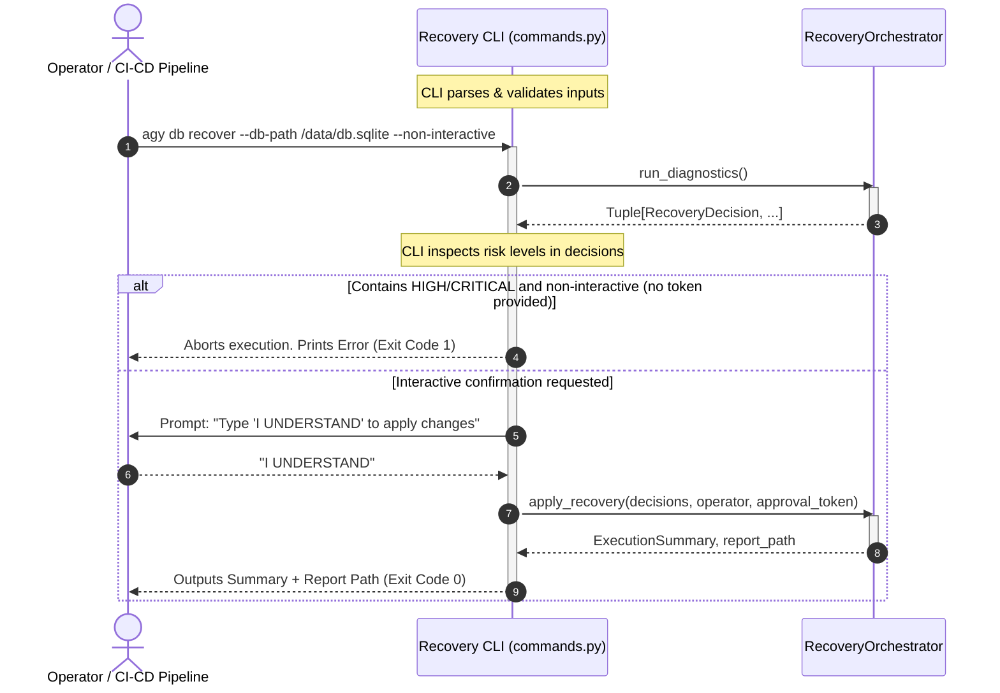

# Sprint 2.4B Design Specification: Database Recovery CLI

**Status**: PROPOSED (Ready for Freeze Review)  
**Role**: Principal Software Architect  
**Engineering Contract ID**: MoroQuant-Sprint-2.4B-Recovery-CLI-v1.0  
**Target Implementation Agent**: Claude Code  

---

## 1. Executive Summary & Core Objective

This specification details the design for the Database Recovery Command Line Interface (CLI) layer of the MoroQuant Database Recovery Framework (ADR-023).

The Recovery CLI acts as a pure presentation and orchestration-triggering layer. It exposes the capabilities of the underlying recovery engine to operators and automated deployment pipelines (such as GitHub Actions). 

To enforce a strict separation of concerns, the CLI contains **zero physical logic**. It does not write to the filesystem, execute SQL, parse database snapshots, evaluate drift classifications, or format audit report payloads. It validates command-line arguments, translates user configurations into parameters for `RecoveryOrchestrator`, presents human-readable or structured JSON outputs to `stdout`/`stderr`, and terminates with deterministic shell exit codes.

---

## 2. Boundary of Responsibilities

### 2.1 CLI Responsibilities
*   **Argument Parsing & Validation**: Validate basic command inputs, file path strings, formatting options, and environmental variables.
*   **Orchestrator Delegation**: Instantiate and delegate operational execution exclusively to `RecoveryOrchestrator`.
*   **Interactivity & Confirmation Prompts**: Manage interactive operator safety checks (e.g., prompting for `"I UNDERSTAND"` before running dangerous commands).
*   **Output Formatting**: Render operation logs to stdout/stderr in either structured ANSI-colored text (for humans) or parsed JSON (for automation pipelines).
*   **Deterministic Exit Codes**: Propagate appropriate system exit codes back to the parent shell.

### 2.2 Forbidden Responsibilities (Boundaries)
*   **Zero SQL Connection or Query Execution**: The CLI must never call SQLite APIs or issue SQL queries.
*   **Zero Direct Filesystem Operations**: The CLI must never write report logs or create audit trail directories on disk. All serialization and file writes are performed by `RecoveryReporter` via `RecoveryOrchestrator`.
*   **Zero Diagnostic Inspection**: The CLI must never analyze raw SQLite system structures. This is the responsibility of `SchemaInspector`.
*   **Zero Drift Classification & Risk Logic**: The CLI must never evaluate severity, risk, or recommendations. This is the responsibility of `DecisionAnalyzer`.

---

## 3. Command Hierarchy

The CLI commands are registered under the existing `agy` CLI namespace inside the `db` command group:

```
agy
└── db
    ├── inspect [OPTIONS]
    └── recover [OPTIONS]
```

### 3.1 `agy db inspect`
Inspects the physical database schema and compares it against migration declarations to report structural drift or metadata discrepancies without performing modifications.

*   **Options**:
    *   `--db-path PATH`: (Optional) Override path to the target SQLite database. Defaults to the database path defined in the workspace config.
    *   `--migrations-dir PATH`: (Optional) Override path to the local migration scripts directory. Defaults to the configured migrations directory.
    *   `--format [text|json]`: Toggle command output structure. Defaults to `text`.

### 3.2 `agy db recover`
Processes and applies the recommended recovery plan to reconcile physical schema drift and metadata ledger conflicts.

*   **Options**:
    *   `--db-path PATH`: (Optional) Override path to the target SQLite database.
    *   `--migrations-dir PATH`: (Optional) Override path to the local migration scripts directory.
    *   `--dry-run`: Evaluate recommended recovery decisions and output the proposed execution plan without applying changes.
    *   `--approve-token TOKEN`: Pass the required security token for `HIGH` and `CRITICAL` risk operations. Can also be read from the `MQ_CTO_APPROVAL_TOKEN` environment variable.
    *   `--interactive / --non-interactive`: Toggles CLI prompt confirmation. Defaults to `interactive` when running in a TTY, and `non-interactive` otherwise.
    *   `--format [text|json]`: Toggle command output structure. Defaults to `text`.

---

## 4. Sequence Diagram

The following diagram illustrates the CLI delegating workflows directly to `RecoveryOrchestrator` without bypassing the orchestrator boundary:



---

## 5. Public CLI Wrappers & Execution Interfaces

The click interface definitions will reside in `ml_service/cli/commands.py`:

```python
import click
import sys
from typing import Optional

@click.group()
def db():
    """Database administration and schema recovery commands."""
    pass

@db.command("inspect")
@click.option("--db-path", type=click.Path(exists=True), help="Override path to SQLite database.")
@click.option("--migrations-dir", type=click.Path(exists=True), help="Override migrations directory.")
@click.option("--format", type=click.Choice(["text", "json"]), default="text", help="Output format.")
def inspect(db_path: Optional[str], migrations_dir: Optional[str], format: str):
    """Inspect database schema integrity, identifying structural drift and metadata holes."""
    # Instantiated on call inside the click command scope
    pass

@db.command("recover")
@click.option("--db-path", type=click.Path(exists=True), help="Override path to SQLite database.")
@click.option("--migrations-dir", type=click.Path(exists=True), help="Override migrations directory.")
@click.option("--dry-run", is_flag=True, help="Display recovery decisions without executing them.")
@click.option("--approve-token", envvar="MQ_CTO_APPROVAL_TOKEN", help="CTO validation token for HIGH/CRITICAL risks.")
@click.option("--interactive/--non-interactive", default=True, help="Force confirmation prompts.")
@click.option("--format", type=click.Choice(["text", "json"]), default="text", help="Output format.")
def recover(
    db_path: Optional[str],
    migrations_dir: Optional[str],
    dry_run: bool,
    approve_token: Optional[str],
    interactive: bool,
    format: str
):
    """Reconcile database drift, applying safe updates or recording metadata state."""
    # Core CLI routing loop
    pass
```

---

## 6. Execution Flow Specification

### 6.1 Inspect Execution Flow
1. **Parameter Resolution**: Resolve configuration variables. If parameters `--db-path` or `--migrations-dir` are missing, fall back to global application configs.
2. **Orchestrator Call**: Instantiate `RecoveryOrchestrator(db_path, migrations_dir)`. Invoke `run_diagnostics()`.
3. **Analyze Output**:
    *   If the returned `Tuple[RecoveryDecision, ...]` is empty:
        *   **Text Mode**: Print green text: `Database schema matches the target migrations. No drift detected.`
        *   **JSON Mode**: Print `{"status": "CLEAN", "decisions": []}`.
        *   **Exit Code**: Terminate with `0`.
    *   If decisions are found:
        *   Analyze decision elements for classifications.
        *   **Text/JSON Formatting**: Render according to specifications (see Section 8).
        *   **Exit Code**: Determine based on the classification severity mapping (see Section 7).

### 6.2 Dry-Run Execution Flow
1. **Orchestrator Call**: Instantiate `RecoveryOrchestrator` and call `run_diagnostics()`.
2. **Evaluation**:
    *   Display all computed decisions.
    *   Mark execution logs with a clear dry-run header: `[DRY-RUN] proposed recovery operations`.
3. **Exit Code**: Terminate with code `0` if all recommendations are resolvable, or code `2` if a `HALT` condition exists. No mutations are performed.

### 6.3 Apply Execution Flow
1. **Orchestration Diagnostic**: Run `run_diagnostics()`.
2. **Pre-Flight Validation**:
    *   If the decisions list is empty, exit with code `0`.
    *   Check if any decision risk matches `HIGH` or `CRITICAL`.
3. **Safety Verification (Approval Flow)**:
    *   If a `HIGH` or `CRITICAL` risk is present:
        *   **Interactive Mode**: Verify the operator typed exactly `"I UNDERSTAND"`. If verified, pass `approve_token` to `apply_recovery()`. If mismatched or aborted by operator, fail with exit code `1`.
        *   **Non-Interactive Mode**: Ensure `approve_token` matches the backend environment variable `MQ_CTO_APPROVAL_TOKEN`. If the token is missing or mismatched, raise `ApprovalRequiredError` and terminate with exit code `1`.
4. **Execution Delegation**: Call `apply_recovery(decisions, operator, approve_token)`. Retrieve `ExecutionSummary` and `report_path`.
5. **Final Output Display**: Render formatting summary to standard output. Exit with code `0` on successful execution of all decisions.

---

## 7. Exit Code Mapping

Exit codes must be deterministic to support GitHub Actions and pipeline automation:

| Exit Code | Condition | Operational Lifecycle Meaning |
| :---: | :--- | :--- |
| **`0`** | No discrepancies OR recovery successfully applied. | Deployment pipeline can proceed safely. |
| **`1`** | Operational failure, lack of credentials, missing CTO token, interactive abort, or database connection error. | Deployment pipeline must fail immediately. |
| **`2`** | Drift detected during `inspect`, or a `HALT` recommendation is encountered. | Recovery actions are required before running subsequent standard migrations. |

---

## 8. Output Formats

### 8.1 Human-Readable Output Format (Format: `text`)
Outputs are structured to provide operators with clear visibility into risks.

#### `agy db inspect` Output Example:
```text
================================================================================
MOROQUANT DATABASE INSPECTION REPORT
================================================================================
Target Database: /home/zafka/trade-dashboard/trading.db
Status: DRIFT DETECTED

[DRIFT ID: 001]
--------------------------------------------------------------------------------
Table Name:      experiments
Difference Type: MISSING_COLUMN
Column Name:     hyperparameters
Classification:  SCHEMA_DRIFT
Risk Level:      MEDIUM
Recommendation:  FORWARD_MIGRATION
Rationale:       Physical column 'hyperparameters' is missing from 'experiments' table.
                 A forward migration is required to align table structure.
--------------------------------------------------------------------------------

[DRIFT ID: 002]
--------------------------------------------------------------------------------
Table Name:      positions
Difference Type: EXTRA_COLUMN
Column Name:     untracked_metric
Classification:  MANUAL_DATABASE_MODIFICATION
Risk Level:      HIGH
Recommendation:  MANUAL_PATCH
Rationale:       Column 'untracked_metric' exists physically but is not declared in any 
                 migration history. Manual DBA verification required.
--------------------------------------------------------------------------------

SUMMARY:
- Total Drift Mismatches: 2
- Risk Summary: 1 MEDIUM, 1 HIGH
- Recommended Action: 1 FORWARD_MIGRATION, 1 MANUAL_PATCH
================================================================================
```

#### `agy db recover` Output Example:
```text
================================================================================
MOROQUANT DATABASE RECOVERY EXECUTION SUMMARY
================================================================================
Operator Context: zafka@prod-deploy-01
Timestamp:        2026-07-30T08:20:00Z
Audit Report:     /home/zafka/trade-dashboard/storage/reports/recovery_audit/report_20260730_082000.json

RESULTS:
- Decision 001: SUCCESS [FORWARD_MIGRATION] -> Column 'hyperparameters' added.
- Decision 002: SUCCESS [MANUAL_PATCH]      -> Schema record updated.

METRICS:
- Total Processed: 2
- Successful:      2
- Failed:          0
- Skipped:         0
- Duration:        42.50 ms
================================================================================
```

### 8.2 JSON Output Format (Format: `json`)
JSON outputs are printed strictly on `stdout` (errors print to `stderr`) to allow direct parsing in Unix chains (e.g., `agy db inspect --format json | jq .`).

#### `agy db inspect --format json` Schema:
```json
{
  "status": "DRIFT_DETECTED",
  "summary": {
    "total_drift_items": 2,
    "risk_counts": {
      "LOW": 0,
      "MEDIUM": 1,
      "HIGH": 1,
      "CRITICAL": 0
    }
  },
  "decisions": [
    {
      "difference": {
        "difference_type": "MISSING_COLUMN",
        "target_migration": "031_add_hyperparameters.sql",
        "table_name": "experiments",
        "column_name": "hyperparameters",
        "index_name": null,
        "details": {}
      },
      "classification": "SCHEMA_DRIFT",
      "risk": "MEDIUM",
      "recommended_action": "FORWARD_MIGRATION",
      "rationale": "Physical column 'hyperparameters' is missing from 'experiments' table.",
      "details": {}
    },
    {
      "difference": {
        "difference_type": "EXTRA_COLUMN",
        "target_migration": null,
        "table_name": "positions",
        "column_name": "untracked_metric",
        "index_name": null,
        "details": {}
      },
      "classification": "MANUAL_DATABASE_MODIFICATION",
      "risk": "HIGH",
      "recommended_action": "MANUAL_PATCH",
      "rationale": "Column 'untracked_metric' exists physically but is not declared in any migration history.",
      "details": {}
    }
  ]
}
```

---

## 9. Error Handling & Safety Gates

*   **CTO Environment Token Isolation**: The CLI retrieves operator identity (via `getpass.getuser()`) and environment state. High-risk operations demand the presence of `MQ_CTO_APPROVAL_TOKEN`. If not matched, execution is terminated immediately without contacting the executor.
*   **Fail-Fast Execution**: The CLI processes return values from the orchestrator. If an exception occurs, the CLI logs the stack trace to `stderr` and exits with code `1`.
*   **HALT Recommendation Blocking**: If the diagnostic phase yields any decision with a `HALT` recommendation, the apply sequence is immediately blocked, and the CLI exits with code `2`.

---

## 10. Testing Strategy

### 10.1 Unit Testing
*   **Argument Parser Assertions**: Verify correct routing of options (`--db-path`, `--format`, `--dry-run`).
*   **Orchestrator Mocking**: Mock the `RecoveryOrchestrator` to return simulated tuples of `RecoveryDecision` objects and assert stdout formatting and exit codes.
*   **CTO Approval Token Gate Tests**: Mock environment states to verify that `HIGH`/`CRITICAL` plans fail with exit code `1` when invalid tokens are passed, and succeed when valid tokens are supplied.
*   **Prompt Interactive Simulation**: Simulate TTY and stdin inputs to verify interactive prompt requirements.

### 10.2 Integration Testing
*   **End-to-End CLI Pipeline**: Execute the `agy db inspect` and `agy db recover` CLI commands against a test SQLite database containing predefined drifted columns and tables.
*   **Exit Code Verifications**: Verify that real command invocations yield matching shell return codes (`$?` in bash) for clean states (`0`), failures (`1`), and drift detections (`2`).

---

## 11. Definition of Done (DoD)

*   [ ] CLI commands `inspect` and `recover` are registered successfully under the `agy db` command group.
*   [ ] The CLI code acts strictly as a wrapper around the `RecoveryOrchestrator`, containing no direct database connection, SQLite executions, or file serialization operations.
*   [ ] Strict CTO token validation is implemented and verified by automated unit tests.
*   [ ] The system returns appropriate deterministic exit codes (`0`, `1`, `2`) based on execution outcomes.
*   [ ] Standard output can be successfully toggled between ANSI-colored human-readable text and clean JSON formats.
*   [ ] Code builds cleanly and linter validation runs with zero errors.
*   [ ] Graphify database structure is updated post-commit.
