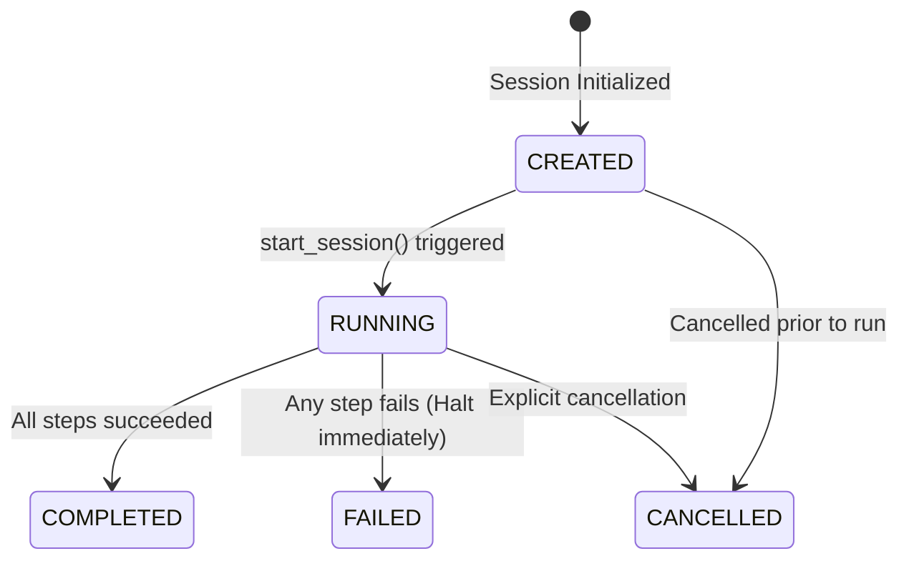
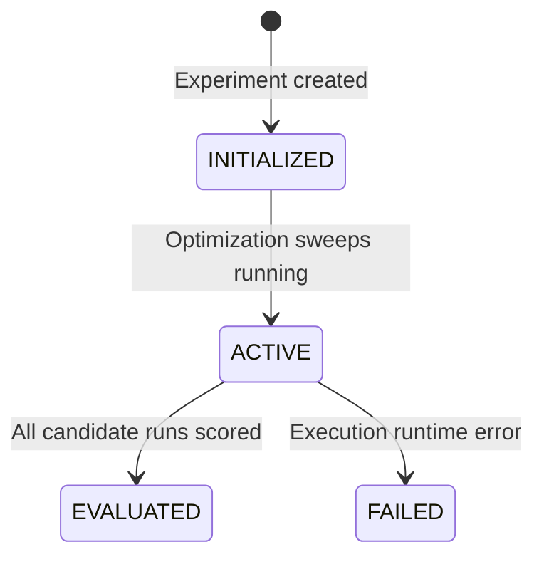
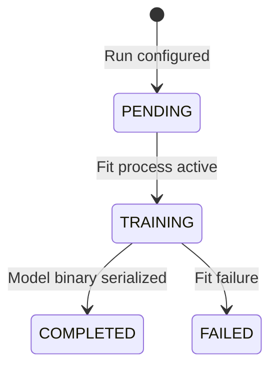
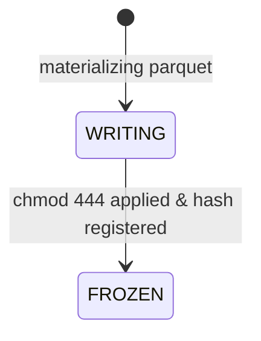
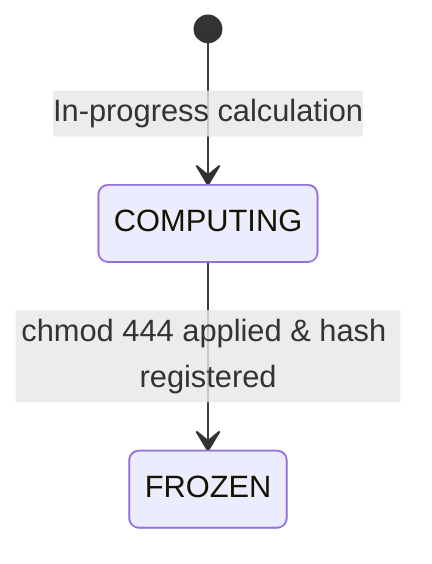
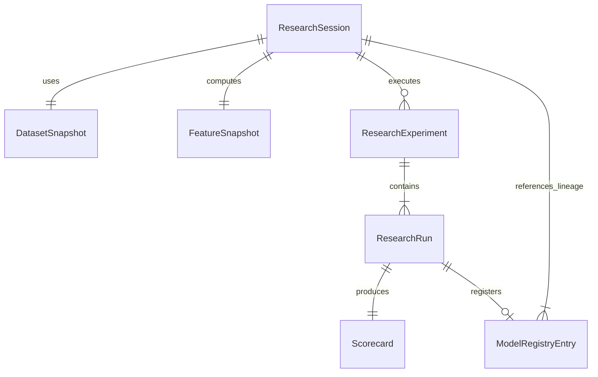
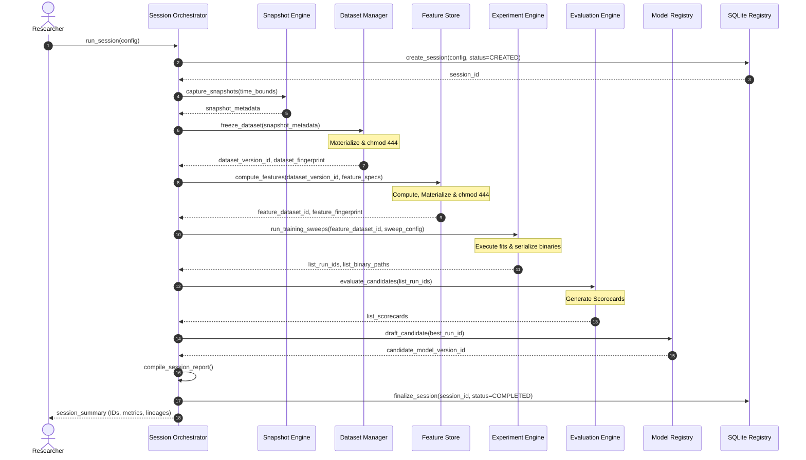

# Sprint 3.5A Design Specification: Research Foundation (Design Only)

**Status**: PROPOSED (Ready for Architecture Audit)  
**Role**: Principal Quant Architect  
**Engineering Contract ID**: MoroQuant-Sprint-3.5A-Contract-v1.0  
**Target Implementation Agent**: Claude Code  

---

## 1. Purpose

The purpose of Sprint 3.5A is to define the immutable foundation and architectural specifications for the **Quant Research Platform**. It establishes a session-bound orchestration layer above the existing individual quantitative components (Snapshot Engine, Dataset Manager, Feature Store, Experiment Engine, Evaluation Engine, and Model Registry). 

This design coordinates quantitative research, transforming fragmented scripts and manual processes into a deterministic, auditable, and traceably linked model generation pipeline. It eliminates data leakage, ensures 100% mathematical reproducibility, and introduces formal gatekeeping safeguards for model promotions.

---

## 2. Responsibilities

The platform separates execution coordination from core business logic:

* **Research Session Orchestrator**: Acts strictly as the coordinator. It manages the execution loop state machine, ensures correct downward step execution sequence, and validates input/output handshake metadata. It does *not* contain individual engine logic.
* **Core Services**: Contain the actual implementation logic:
  * **Snapshot Engine**: Captures exchange ticks into structured partition files.
  * **Dataset Manager**: Packages ticks into immutable dataset files.
  * **Feature Store**: Transforms frozen datasets using registered feature specs.
  * **Experiment Engine**: Runs hyperparameter sweeps and saves model binaries.
  * **Evaluation Engine**: Produces scorecards based on walk-forward testing.
  * **Model Registry**: Validates quality gates, signs candidate binaries, and promotes them.

---

## 3. Component Boundaries

We enforce a **strict downward/unidirectional data flow** with zero upward or cyclical imports. The flow of dependencies and data follows:

```
Snapshot/Replay ──> Dataset Manager ──> Feature Store ──> Experiment Engine ──> Evaluation Engine ──> Model Registry
```

### Dependency Rules:
1. **Orchestrator Isolation**: The orchestrator acts as a client to the core services. Core services (e.g., `FeatureStore`, `ModelRegistry`) must remain completely oblivious to `ResearchSessionOrchestrator` and consume only raw configs or metadata payloads.
2. **Left-to-Right Boundaries**: The `FeatureStore` depends on outputs from the `DatasetManager`, but the `DatasetManager` must never import or know about the `FeatureStore` or feature definitions.
3. **Read-Only Separation**: Benchmark and comparison engines must be strictly read-only and never mutate models, session states, or database registries.

---

## 4. Immutable Data Model Overview

All generated research assets (Datasets, Feature tables, Model binaries) are **immutable**. Once written, their raw bytes must never be modified.

* **Filesystem Isolation**: Materialized Parquet/binary payloads are written to designated directories:
  * `/storage/datasets/`
  * `/storage/features/`
  * `/storage/models/`
* **OS Lock Enforcement**: Files are set immediately to read-only status (`chmod 444` on POSIX systems).
* **Metadata Splitting**: The actual data payloads reside on the filesystem, while reference structures, cryptographic hashes, version info, and lineage links are stored in the SQLite registry database.

---

## 5. ResearchSession Lifecycle

A `ResearchSession` coordinates a single quantitative research pipeline sequence.

### State Transitions:


### Lifecycle Rules:
* **Fail-Fast**: If any pipeline step fails, execution halts immediately. No subsequent stages are executed.
* **No Rollback of Frozen Artifacts**: Any dataset or feature file written and frozen during earlier successful steps of a failed session **must not be deleted**. They remain frozen in storage to prevent redundant calculations on retry.

---

## 6. ResearchExperiment Lifecycle

A `ResearchExperiment` represents a logical modeling hypothesis containing multiple hyperparameter configurations or training iterations within a session.

### State Transitions:


---

## 7. ResearchRun Lifecycle

A `ResearchRun` represents an individual model training instance (a single hyperparameter combination) under an experiment.

### State Transitions:


---

## 8. DatasetSnapshot Lifecycle

A `DatasetSnapshot` is the frozen, materialized raw data source.

### State Transitions:


* Once in `FROZEN` status, the database triggers prevent updates to the record (`is_frozen = 1`).

---

## 9. FeatureSnapshot Lifecycle

A `FeatureSnapshot` is the computed and frozen feature table derived from a source dataset.

### State Transitions:


---

## 10. Metadata Relationships

The SQLite schema maintains strict relational integrity via Foreign Keys.



---

## 11. Sequence Diagrams

This sequence details the orchestrator executing a research session:



---

## 12. Public Interfaces

The public API boundaries for all research services are defined as follows:

```python
from typing import Dict, List, Optional, Tuple
from dataclasses import dataclass

@dataclass(frozen=True)
class SessionConfig:
    session_id: str
    symbol: str
    time_bounds: Tuple[str, str]
    feature_specs: List[Dict]
    model_config: Dict
    sweep_config: Dict

@dataclass(frozen=True)
class DatasetMetadata:
    dataset_version_id: str
    fingerprint: str
    file_path: str
    created_at: str

@dataclass(frozen=True)
class FeatureDatasetMetadata:
    feature_dataset_id: str
    source_dataset_id: str
    fingerprint: str
    file_path: str
    created_at: str

@dataclass(frozen=True)
class Scorecard:
    run_id: str
    sharpe: float
    max_drawdown: float
    ece: float
    brier: float
    trade_count: int
    is_passing: bool

class ResearchSessionOrchestrator:
    def create_session(self, config: SessionConfig) -> str:
        """Registers a session in the metadata ledger with status CREATED."""
        ...
        
    def start_session(self, session_id: str) -> Dict:
        """Executes the pipeline stages sequentially. Implements fail-fast logic."""
        ...

class DatasetManager:
    def freeze_dataset(self, session_id: str, time_bounds: Tuple[str, str]) -> DatasetMetadata:
        """Saves and freezes parquet dataset under chmod 444. Registers in DB."""
        ...

    def verify_fingerprint(self, dataset_version_id: str) -> bool:
        """Re-calculates SHA-256 and asserts against DB metadata."""
        ...

class FeatureStore:
    def compute_features(self, dataset_version_id: str, specs: List[Dict]) -> FeatureDatasetMetadata:
        """Generates, saves, and locks feature parquet files."""
        ...

class ExperimentEngine:
    def run_training_sweeps(self, feature_dataset_id: str, sweep_config: Dict) -> List[str]:
        """Runs optimization sweeps, logging parameters and runs to the DB."""
        ...

class EvaluationEngine:
    def evaluate_run(self, run_id: str) -> Scorecard:
        """Generates the walk-forward evaluation metrics scorecard."""
        ...

class ModelRegistry:
    def register_candidate(self, run_id: str) -> str:
        """Creates registry entry in Candidate state, capturing full lineage."""
        ...

    def promote_to_validated(self, model_version_id: str, architect_signature: str) -> bool:
        """Applies promotion validation checks (Sharpe, ECE, Brier, Drawdown)."""
        ...

    def promote_to_production(self, model_version_id: str) -> bool:
        """Promotes validated model, demoting the current active production model."""
        ...
```

---

## 13. Storage Architecture

We split storage responsibilities cleanly:

1. **Structured SQLite Metadata Ledger**:
   * Stores schemas for `research_sessions`, `dataset_snapshots`, `feature_snapshots`, `experiments`, `runs`, `scorecards`, and `model_registry`.
   * Enforces referential integrity.
2. **Immutable Filesystem Volumes**:
   * Files saved in standard directories `/storage/datasets/`, `/storage/features/`, and `/storage/models/`.
   * Filesystem-level permissions write lock applied (`chmod 444`).

---

## 14. Versioning Rules

We enforce semantic versioning across all components:

### 1. Dataset Versioning (`DS_[Major].[Minor].[Patch]`)
* **Major**: Structural changes (e.g. sample intervals 1m vs 5m, or label definition logic).
* **Minor**: Schema modifications (e.g. adding columns).
* **Patch**: Temporal windows or filters.

### 2. Feature Dataset Versioning (`FDS_[Major].[Minor].[Patch]`)
* **Major**: Core formula logic updates (e.g. RSI formula calculation).
* **Minor**: Hyperparameter configuration updates (e.g. changing period bounds).
* **Patch**: Performance optimizations yielding identical outputs.

### 3. Model Versioning (`M_[Symbol]_[ModelType]_[Major].[Minor].[Patch]`)
* **Major**: Model architecture switches (e.g. XGBoost to LSTM).
* **Minor**: Hyperparameter bounds adjustments.
* **Patch**: Retraining on updated temporal ranges with identical parameters.

---

## 15. Reproducibility Guarantees

To ensure 100% mathematical reproducibility, the platform enforces:

* **Canonical Ordering**: All dataframes must have rows sorted chronologically by primary index and columns sorted alphabetically before calculating signatures.
* **Fixed Float Serialization**: Numeric fields are serialized to standard string representations with fixed precision (`%.8f`) prior to computing the SHA-256 hash.
* **Library Lockstep**: Active environment dependency states (`requirements.txt`) are captured and logged to identify variance in third-party library computations.
* **Load-time Signature Check**: Serialized model load sequences verify the file binary hash matches the recorded registry fingerprint; execution aborts if a mismatch is detected.

---

## 16. Testing Strategy

1. **Unit Testing**:
   * Mock the execution engines and verify orchestrator state transitions (`CREATED` -> `RUNNING` -> `COMPLETED`/`FAILED`).
   * Test the SHA-256 canonical hash generators with synthetic DataFrames (verifying ordering constraints).
   * Verify model promotion validation rules (ensure threshold breaches trigger rejection).
2. **Integration Testing**:
   * Run end-to-end dry sessions on minimal mock datasets, validating SQLite schema foreign keys.
   * Verify that fail-fast execution leaves created artifacts locked on the filesystem.
3. **Parity Assertions**:
   * Implement automated check suites verifying that rebuilding features sequentially matches the original hash.

---

## 17. Definition of Done (DoD)

* [x] Design specification complete and written to `docs/sprints/Sprint-3.5A-Research-Foundation-Design.md`.
* [x] Structural alignment verified against `ADR-024` and preceding architecture records (`ADR-009`, `ADR-010`, `ADR-011`, `ADR-013`, `ADR-014`).
* [x] Unidirectional boundaries, immutable rules, and lifecycle states formally documented.
* [x] Codebase graph index (`graphify-out/graph.json`) updated via `graphify update .`.
* [x] No code implementation, schema modifications, or external dependencies introduced.
* [x] Ready for CTO/Architect validation review.
