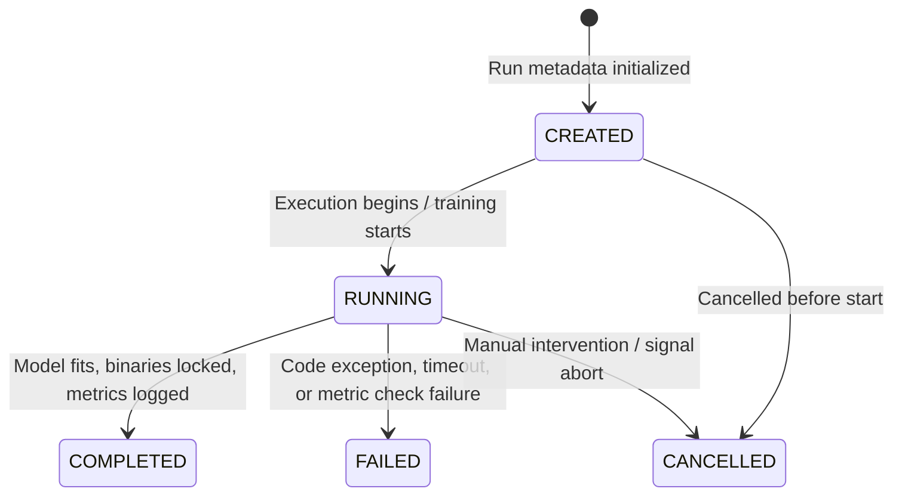
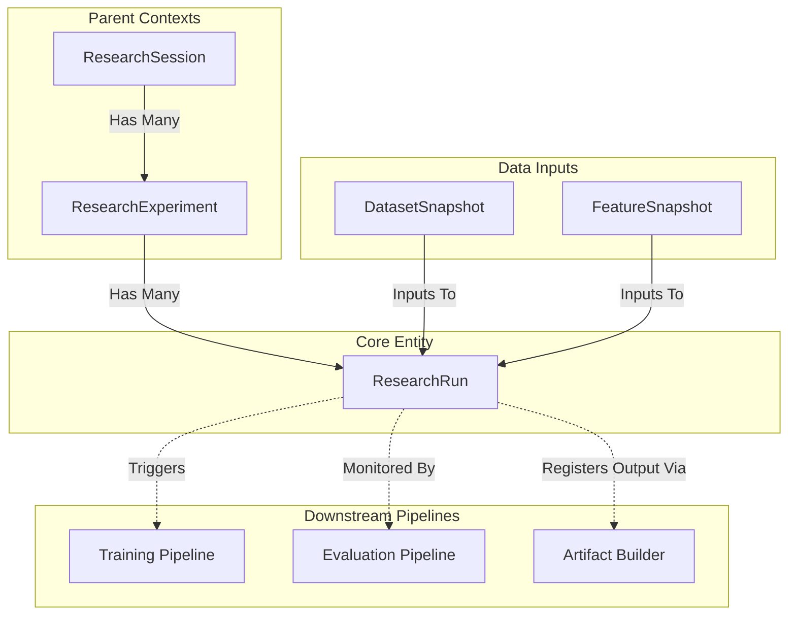
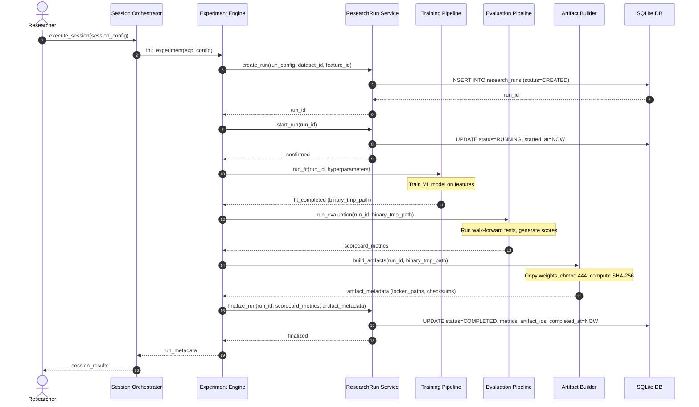

# Sprint 3.5B.1 Design Specification: Research Run Subsystem (Design Only)

**Status**: PROPOSED (Ready for Architecture Audit)  
**Role**: Principal Quant Architect  
**Engineering Contract ID**: MoroQuant-Sprint-3.5B.1-Contract-v1.0  
**Target Implementation Agent**: Claude Code  

---

## 1. Problem Statement

Quantitative research at MoroQuant requires executing multiple hyperparameter configurations, feature variations, and model architectures. Currently, while `ResearchSession` and `ResearchExperiment` manage the parent contexts, there is no formalized, granular entity tracking individual training runs. 

Without a dedicated, structured `ResearchRun` subsystem, the platform suffers from:
* **Traceability Gaps**: Inability to link a specific trained model binary back to its exact hyperparameter set, dataset/feature snapshot version, and execution log.
* **Telemetry Fragmentation**: Lacking a uniform ledger for recording training and validation metrics (e.g., Sharpe, Brier/ECE, drawdowns) across multiple runs under a single experiment hypothesis.
* **Orchestration Ambiguity**: Difficulty managing run state transitions (e.g., resuming interrupted sweeps, cancelling active runs, or auditing failed execution steps).
* **Reproducibility Gaps**: No cryptographically validated configuration fingerprint linking data inputs to training runs.

---

## 2. Goals

* **Granular Traceability**: Model each run as a first-class relational entity linked to its parent experiment, session, and input data snapshots.
* **Deterministic Execution Fingerprinting**: Store a configuration hash (`config_hash`) representing the hyperparameter dictionary and software environment, ensuring idempotency.
* **Robust Lifecycle Tracking**: Define a strict state machine to manage run lifecycles, preventing state corruption.
* **Standardized Telemetry Schema**: Provide a structured schema to hold execution performance metrics, log timestamps, and generated artifact references.

---

## 3. Non-Goals

* **Model Training Implementation**: This design does not write training loops, fit procedures, or neural network training code.
* **Model Evaluation Implementation**: No logic for calculating metrics (ECE, Brier, Sharpe) is implemented here.
* **Database Migration Execution**: Designing schema structures only; no migration runners are executed.
* **Active Execution or Inference**: The run object does not perform real-time predictions, paper trading, or live signal generation.
* **Filesystem Mutation**: The run metadata does not write Parquet files or binary weights; it only stores the filesystem paths/URIs and checksums.

---

## 4. Lifecycle

A `ResearchRun` tracks its execution state using a strict, unidirectional state machine:



### Transition Specifications

| Source State | Destination State | Trigger | Action / Side Effect |
| :--- | :--- | :--- | :--- |
| `None` | `CREATED` | `orchestrator.create_run()` | Allocate `run_id` (UUID), record `experiment_id`, compute and verify `config_hash`, set `created_at` timestamp. |
| `CREATED` | `RUNNING` | `executor.start_run()` | Set `started_at` timestamp, acquire system resource tokens. |
| `CREATED` | `CANCELLED` | `executor.abort_run()` | Record `completed_at` timestamp, mark status as `CANCELLED`. |
| `RUNNING` | `COMPLETED` | `executor.finalize_run()` | Assert model artifact exists, store generated metrics, write-lock artifact files (`chmod 444`), record `completed_at` timestamp. |
| `RUNNING` | `FAILED` | Exception raised | Capture and store traceback logs in run metadata, release system resource tokens, set `completed_at` timestamp. |
| `RUNNING` | `CANCELLED` | `executor.abort_run()` | Send SIGTERM to training process, release system resource tokens, set `completed_at` timestamp. |

---

## 5. Data Model

The `ResearchRun` entity is structured as follows. All metadata resides in the SQLite database, referencing heavy payloads on the filesystem.

| Field Name | Data Type | Nullability | Constraints | Description |
| :--- | :--- | :--- | :--- | :--- |
| `run_id` | UUID / TEXT | NOT NULL | PRIMARY KEY | Unique identifier for this specific execution run. |
| `experiment_id` | UUID / TEXT | NOT NULL | FOREIGN KEY | References parent `ResearchExperiment`. |
| `session_id` | UUID / TEXT | NOT NULL | FOREIGN KEY | References active `ResearchSession`. |
| `dataset_snapshot_id`| TEXT | NOT NULL | FOREIGN KEY | References the immutable `DatasetSnapshot` used. |
| `feature_snapshot_id`| TEXT | NOT NULL | FOREIGN KEY | References the immutable `FeatureSnapshot` used. |
| `status` | VARCHAR | NOT NULL | CHECK IN (Enum) | Current state: `CREATED`, `RUNNING`, `COMPLETED`, `FAILED`, `CANCELLED`. |
| `created_at` | TIMESTAMP | NOT NULL | Default CURRENT_TIMESTAMP | Wall-clock time of initialization. |
| `started_at` | TIMESTAMP | NULL | - | Time execution transition to `RUNNING` was triggered. |
| `completed_at` | TIMESTAMP | NULL | - | Time execution reached terminal state. |
| `metrics` | JSON / TEXT | NULL | - | Structured map of computed validation scores (ECE, Sharpe, Brier, drawdown). |
| `artifact_ids` | JSON / TEXT | NULL | - | List of URIs/paths to serialized weights and checkpointed parameters. |
| `config_hash` | VARCHAR(64) | NOT NULL | UNIQUE per Exp | SHA-256 fingerprint of hyperparameters and environment configuration. |
| `metadata` | JSON / TEXT | NULL | - | Extensible payload for debug logs, hardware info, and runtime metrics. |

---

## 6. Responsibilities

To avoid circular dependencies and architectural bloat, strict boundaries are enforced for `ResearchRun`:

* **WHAT IT DOES**:
  * Acts as a ledger entries coordinator in the database.
  * Tracks and validates state transitions.
  * Maintains referential links between dataset hashes, feature store versions, and output binaries.
  * Stores configuration configurations to prevent duplicate executions (idempotency checks).

* **WHAT IT MUST NOT DO**:
  * **No Model Training**: Must not load TensorFlow/PyTorch, invoke model layers, or run optimization algorithms.
  * **No Model Evaluation**: Must not process tick logs or calculate Sharpe ratios directly.
  * **No Direct FS Manipulation**: Must not create folders or write weights files.
  * **No Inference Execution**: Must not serve predictions to the paper trading engine or execution system.
  * **No Direct DB Connection**: Access must be mediated strictly through the Repository and Service Layers.

---

## 7. Relationships



### Relationship Specifications

* **ResearchSession**: Aggregates the run under a single orchestrator session. The run inherits environmental settings and session constraints.
* **ResearchExperiment**: Coordinates hyperparameters sweeps. The experiment spawns runs, compares their scores, and selects the optimal run.
* **DatasetSnapshot & FeatureSnapshot**: Immutable input records. A run cannot execute without linking to exactly one dataset and feature snapshot hash to guarantee reproducibility.
* **Future Training Pipeline**: The system that consumes the run configuration, loads data, fits the model, and reports metrics.
* **Future Evaluation Pipeline**: A service that evaluates the trained model out-of-sample and attaches a `Scorecard` JSON to the run registry.
* **Future Artifact Builder**: Handles filesytem serialization, sets permissions (`chmod 444`), generates SHA-256 file fingerprints, and registers artifact paths in the run record.

---

## 8. Sequence Diagram



---

## 9. Failure Handling

### Retry Policies
* If a run transitions to `FAILED`, the parent `ResearchExperiment` may schedule a retry.
* A retry does *not* reuse the existing `run_id`. A new `ResearchRun` record must be created with a new UUID, linking to the same experiment parameters while logging an incremented retry counter in metadata.

### Cancellation
* Triggering a cancel request sends a cancel token / signal to the active Training Pipeline runner.
* The run status transitions to `CANCELLED` instantly, recording the timestamp.
* Partial artifact outputs must be deleted by the pipeline runner to avoid storage pollution.

### Crash Recovery
* Upon system restart or orchestrator boot, the `ResearchRun` service scans for runs stuck in the `RUNNING` state.
* Stale runs are automatically transitioned to `FAILED` with metadata indicating an abrupt recovery shutdown.
* Orphaned files in temporary storage must be systematically garbage-collected.

### Partial Execution
* Runs must adhere to transactional updates. Intermediate metrics must be buffered in-memory or in draft metadata.
* The transition to `COMPLETED` is an atomic commit. It succeeds only if *both* metrics schema validation and artifact write-locks are verified.

### Idempotency
* Before creation, the orchestrator asserts the `config_hash` (computed from sorted, serialized hyperparameters and snapshot paths).
* If a run with an identical `config_hash` already exists in `COMPLETED` state, the orchestrator can bypass execution and reference the cached run artifacts, preventing redundant resource consumption.

---

## 10. Roadmap

The `ResearchRun` subsystem serves as the tracking cornerstone for subsequent Phase B and Phase C sprints:

```
Sprint 3.5B.1 (Design) 
      │
      ▼
Sprint 3.5B.2 (Repository Schema) 
      │
      ▼
Sprint 3.5B.3 (Orchestration Engine) 
      │
      ▼
Sprint 3.5B.4 (Metrics Integration) 
      │
      ▼
Sprint 3.5B.5 (Model Promotion Gatekeeping)
```

* **Sprint 3.5B.2 (Schema & Repo implementation)**: Write the SQLite database migrations to create the `research_runs` table, implement ORM entities, and establish index definitions for lookup performance.
* **Sprint 3.5B.3 (Lifecycle Engine)**: Implement state machine transitions, validating transition paths and locking status columns against direct modifications.
* **Sprint 3.5B.4 (Instrumentation & Telemetry)**: Connect the python training wrapper. Support parsing configuration inputs into `config_hash`, and logging step losses and scorecard metrics to the DB.
* **Sprint 3.5B.5 (Promotion Gatekeeping)**: Integrate the validation checks. Use run telemetry scorecards (ECE, Sharpe limits) to verify promotion eligibility in the Model Registry.

---

## 11. Definition of Done (DoD)

* [x] Design specification complete and written to `docs/sprints/Sprint-3.5B.1-ResearchRun-Design.md`.
* [x] Problem Statement, Goals, Non-Goals, Lifecycles, and Data Model definitions included.
* [x] Unidirectional data boundaries and responsibilities clearly delineated.
* [x] Failure scenarios, recovery, and idempotency rules formalised.
* [x] Codebase graph index updated via `graphify update .`.
* [x] Zero code implementation or DB migrations executed.
* [x] Prepared for principal architect audit review.
