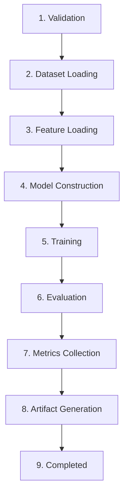
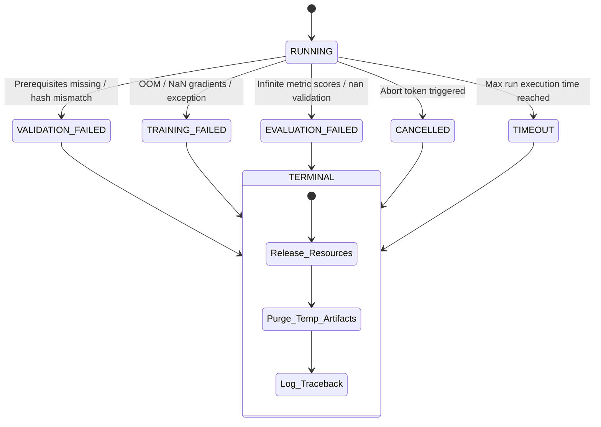
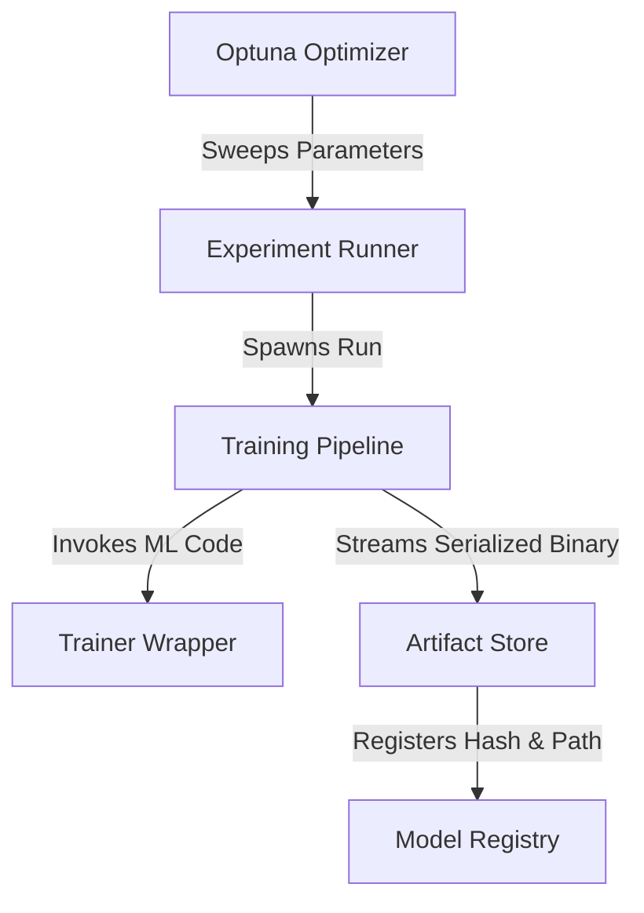

# Sprint 3.5B.5 Design Specification: Training Pipeline Architecture (Design Only)

**Status**: PROPOSED (Ready for Architecture Audit)  
**Role**: Principal Quant Architect  
**Engineering Contract ID**: MoroQuant-Sprint-3.5B.5-Contract-v1.0  
**Target Implementation Agent**: Claude Code  

---

## 1. Problem Statement

At MoroQuant, the machine learning models must be trained with absolute mathematical reproducibility and strict auditability. The transition from raw market data features to finalized model binaries requires a reliable, isolated execution engine. 

Without a dedicated **Training Pipeline** design, the platform faces:
* **Side-Effect Pollution**: Code executing model training directly invoking SQL, mutating filesystem states, or communicating with external networks, violating service isolation principles.
* **Non-Deterministic Outputs**: Variations in dataset ordering, unseeded libraries (PyTorch, TensorFlow, NumPy, random), and untracked execution parameters causing model weight divergence across identical runs.
* **Fragile Error Boundaries**: Lack of specialized error containment during training crashes (e.g., OOM, gradient explosion, driver timeouts), resulting in orphaned processes, locked resources, or database state desynchronization.

---

## 2. Responsibilities

To maintain clean architecture boundaries, the Training Pipeline operates under a strict "Functional Core, Imperative Shell" boundary model. It functions purely as an in-memory execution pipeline and does not interact directly with external persistent storage or networks.

### What the Training Pipeline DOES:
* **Orchestrate Model Training**: Manages the step-by-step execution flow of dataset loading, training iterations, and evaluation checks.
* **Validate Prerequisites**: Inspects data inputs, shapes, column availability, and configuration parameters before starting the model compilation.
* **Create Immutable Artifacts**: Wraps trained weights and hyperparameter checkpoints into structured byte streams, defining the format for storage.
* **Report Training Results**: Compiles metrics scorecards, timing statistics, and output specifications into a standard data structure returned to the caller.

### What the Training Pipeline MUST NOT Do:
* **No SQL Execution**: Must not import database clients, execute queries, or persist its own run state to the relational database. Relational writes are delegated to the calling Service Layer (e.g., `ResearchRunService`).
* **No Direct Filesystem Writes**: Must not directly write parquet files, model weight files, or log logs to arbitrary disk locations. It must stream raw bytes or delegate writing to an isolated `ArtifactStore` service.
* **No Model Persistence Logic**: Must not dictate how or where models are stored. It only generates the serialized payloads and metadata.
* **No External API Calls**: Must not trigger HTTP requests, notify Slack/Telegram, or download data packages over the network.
* **No Repository Ownership**: Must not hold references to ORM sessions, database connections, or repository classes.
* **No Session Lifecycle Management**: Must not create, start, or finalize `ResearchSession` contexts.

---

## 3. Inputs

The pipeline consumes a single, strongly-typed configuration block and references to pre-fetched dataset descriptors:

| Input Entity | Data Type / Format | Description |
| :--- | :--- | :--- |
| **ResearchRun** | `ResearchRun` Context / Entity | Relational metadata representing the current run ID, experiment ID, and target config hash. |
| **DatasetSnapshot** | `DatasetSnapshot` Reference | Paths and cryptographic hashes of the resampled tick dataframe (read-only input). |
| **FeatureSnapshot** | `FeatureSnapshot` Reference | Reference mapping calculated columns and feature definitions to ensure correct dataset transformation. |
| **TrainingConfig** | JSON / Dictionary | Configuration specifying batch size, epochs, learning rate, loss functions, metrics, and early stopping. |
| **Random Seed** | Integer (`uint32`) | The global random seed to initiate all pseudo-random number generators (PRNGs). |
| **Model Parameters** | JSON / Dictionary | Architecture hyperparameters (e.g., layers, node counts, dropout rates, activation functions). |

---

## 4. Outputs

Upon completion (successful or failed), the pipeline returns an output record containing:

* **ResearchRun (Updated)**: The run entity structure updated with terminal status (`COMPLETED` or `FAILED`), referencing the generated artifacts and metrics.
* **TrainingResult**: An execution payload stating:
  * Final status (`SUCCESS`, `FAILED_VALIDATION`, `FAILED_TRAINING`, `FAILED_EVALUATION`, `CANCELLED`, `TIMEOUT`).
  * Detailed traceback logs and error contexts if failed.
  * Runtime metrics (elapsed times per stage).
* **TrainingMetrics**:
  * Training loss and validation loss history arrays per epoch.
  * In-sample and out-of-sample performance matrices (ECE, Brier, Sharpe, Drawdown, Profit Capture).
* **ArtifactMetadata**:
  * Cryptographic signatures (`SHA-256`) of the serialized model parameters and weights.
  * Manifest describing files, paths, sizes, and file permissions.

---

## 5. Pipeline Stages

The Training Pipeline executes as a sequential execution flow. Each stage must succeed before transitioning to the next:



### Stage Detail Specifications

1. **Validation**: Check that all input references exist, input parameters are within bounds, the hardware targets (CPU/GPU) are available, and the environment matches dependencies.
2. **Dataset Loading**: Open the referenced `DatasetSnapshot` Parquet files in read-only mode, validating that the file hashes match the metadata records.
3. **Feature Loading**: Construct the feature matrix by aligning the dataset with `FeatureSnapshot` schemas, resolving missing values or inf values according to strict isolation rules.
4. **Model Construction**: Instantiate the model architecture dynamically using the provided model parameters. Compile optimizer, loss functions, and hardware-accelerated computation graphs.
5. **Training**: Execute the training loop. Propagate forward-backward passes, step optimizers, calculate epoch loss, and assess early stopping parameters.
6. **Evaluation**: Perform inference using out-of-sample test splits to evaluate model generalizations under simulated historical regimes.
7. **Metrics Collection**: Structure final scoring arrays (Sharpe, ECE, Brier, Drawdown) and format epoch history logs.
8. **Artifact Generation**: Serialize model weights, metadata headers, and parameter files into a locked, read-only package format, calculating cryptographic hashes.
9. **Completed**: Return the populated execution manifest to the calling orchestrator.

---

## 6. Failure Handling

Training processes run inside isolated execution environments to prevent system-wide crashes.



### Failure Specifications
* **Validation Failure**: Triggers immediately if hashes do not match, or configuration is malformed. No modeling libraries are loaded. 
* **Training Failure**: Catches machine learning runtime anomalies (e.g., `NaN` loss, CUDA Out of Memory, Python exceptions). The pipeline intercepts the exception, releases GPU memory, and records a structured error payload.
* **Evaluation Failure**: Triggered if validation metrics output infinite values, division-by-zero, or missing indicators. The model weights are marked as unvalidated.
* **Cancellation**: Pipeline regularly polls a cancellation token. If triggered, execution halts immediately, partial processes are terminated, and temporary arrays are swept from RAM.
* **Timeout**: A watchdog timer monitors execution. If elapsed limit is exceeded, the pipeline aborts the process gracefully, logs a timeout status, and releases resources.
* **Retry Policy**: Retries are never managed internally by the pipeline itself. The calling `ExperimentRunner` decides if a retry is warranted, spawning a new, separate `ResearchRun` with a incremented retry suffix.

---

## 7. Determinism Rules

To guarantee that any training run produces identical weights down to the exact float byte representation, the following determinism constraints are enforced:

### Seed Management
* The input `Random Seed` is explicitly set across all active libraries at the beginning of validation:
  ```python
  random.seed(seed)
  np.random.seed(seed)
  torch.manual_seed(seed)
  torch.cuda.manual_seed_all(seed)
  ```
* Force deterministic algorithms in backend libraries:
  ```python
  torch.backends.cudnn.deterministic = True
  torch.backends.cudnn.benchmark = False
  ```

### Sorting and Alignment
* Dataframe rows must be sorted chronologically by timestamp (`time_index`) and sorted alphabetically by feature column name before matrix conversion.
* Dynamic iteration over dictionary keys during compilation must be sorted explicitly.

### Hashing and Integrity
* The training pipeline asserts that the `SHA-256` hash of loaded dataset files exactly matches the hash linked to the input `DatasetSnapshot`.
* Output artifacts (model binaries) are hashed using `SHA-256`. If the computed hash does not match, the run fails validation.

### Reproducibility Verification
* The environment metadata is recorded including Python version, CUDA version, library version stamps (`requirements.txt`), and CPU/GPU hardware details.

---

## 8. Future Integration

The Training Pipeline functions as the computational engine inside the wider research framework, integrating with these core platform components:



* **Trainer**: The concrete model wrapper (e.g., `PyTorchTrainer`, `XGBoostTrainer`) that translates the `Model Parameters` config into specific library instructions.
* **Optuna**: The hyperparameter sweep framework. Optuna acts as a loop controller, spawning individual `Training Pipeline` runs with different parameter inputs, comparing the returned evaluation scorecards.
* **Model Registry**: The final storage directory index. Promotes the generated artifact path to production states once validation scores pass the audit checklists.
* **Artifact Store**: A service that writes the raw byte payload outputted by the pipeline to local disk volumes, setting OS-level read-only permissions (`chmod 444`).
* **Experiment Runner**: The core orchestrator that fetches input metadata snapshots, compiles the pipeline inputs, handles failures, and updates database records with pipeline outputs.

---

## 9. Definition of Done (DoD)

* [x] Design specification complete and written to `docs/sprints/Sprint-3.5B.5-TrainingPipeline-Design.md`.
* [x] Input parameters (`ResearchRun`, snapshots, seeds, parameters) defined.
* [x] Output records (updated entities, training metrics, artifact metadata) specified.
* [x] All 9 sequential pipeline stages mapped and detailed.
* [x] Robust isolation, determinism, and failure patterns designed.
* [x] Zero code implementation or database migration executions performed.
* [x] Sandbox updated via codebase graph indexing.
